# 在线客服 · 消息分页响应修复 · 方案与任务清单（临时）

> **文档类型**：问题分析 / 修复方案 / 任务拆分（非正式 PRD）  
> **编写日期**：2026-06-15  
> **适用项目**：`pet-app-admin-web`（Web 管理端）· `pet-app-backend`（后端）  
> **关联文档**：[项目开发说明-Web前端.md](../pet-app-admin-web/docs/项目开发说明-Web前端.md) §2.13 · §5.9 · [项目开发说明-后端.md](../pet-app-backend/docs/项目开发说明-后端.md) §5.28 · [联系客服功能-方案与任务清单.md](../requirements/联系客服功能-方案与任务清单.md)

---

## 1. 问题概述

### 1.1 现象

在 Web 管理端打开 **「在线客服」**（`/customer-service`），从左侧选择用户会话进入聊天区后，消息区域出现红色告警：

```text
Cannot read properties of undefined (reading 'has_more')
```

并提供「重新加载」按钮；输入框被禁用，无法发送回复。

### 1.2 影响范围

| 功能 | 是否受影响 | 说明 |
|------|------------|------|
| 左侧会话列表 | ❌ 正常 | `GET /admin/service/conversations` 仅使用 `list` |
| 会话详情 / 顶部用户信息 | ❌ 正常 | `GET /admin/service/conversations/{id}` 独立成功 |
| 右侧订单上下文 | ❌ 正常 | 依赖详情接口 |
| **首次加载消息** | ✅ **失败** | `loadConversation` 抛错 |
| **向上加载历史** | ✅ **失败** | `loadMoreMessages` 同样访问 `pagination.has_more` |
| **发送回复** | ✅ **失败** | `ChatInput` 在 `messagesLoadError` 存在时禁用 |
| 5s 轮询 / SSE 增量 | ⚠️ 部分 | `useServicePolling` 仅用 `list`，不读 `pagination` |

### 1.3 联调关联

本问题阻塞联系客服联调验收项：

| ID | 场景 | 状态 |
|----|------|------|
| QA-902 | 用户发文字/图片 → 商户 Web 标签页可看到消息 | ❌ 被阻塞 |
| QA-903 | 商户回复 → 小程序收到 | ❌ 被阻塞（无法发送） |
| QA-905 | Web 多标签切换无串消息 | ⚠️ 首次进入即报错 |

---

## 2. 根因分析

### 2.1 出错代码位置

**文件**：`src/views/customer-service/Index.vue`

| 函数 | 行号（约） | 问题代码 |
|------|------------|----------|
| `loadConversation` | 141 | `messageResult.pagination.has_more` |
| `loadMoreMessages` | 248 | `result.pagination.has_more` |

```typescript
// loadConversation 片段
const [detail, messageResult] = await Promise.all([
  getAdminServiceConversationDetail(conversationId),
  getAdminServiceMessages(conversationId, { page_size: 50 }),
])
detailMap.value.set(conversationId, detail)
messagesMap.value.set(conversationId, messageResult.list)
hasMoreMap.value.set(conversationId, messageResult.pagination.has_more) // ← 抛错
```

异常被 `catch` 捕获后，经 `getErrorMessage(error, '加载会话失败')` 写入 `messagesLoadError`，由 `ChatPanel` 展示原始 JS 错误文案。

### 2.2 前端预期结构

Web 端按统一类型 `PaginatedList<T>`（`src/types/pagination.ts`）解析消息列表：

```typescript
interface PaginatedList<T> {
  list: T[]
  pagination: {
    page: number
    page_size: number
    total: number
    has_more: boolean
  }
}
```

期望 `GET /admin/service/conversations/{id}/messages` 响应：

```json
{
  "code": 0,
  "message": "ok",
  "data": {
    "list": [ /* ServiceMessage[] */ ],
    "pagination": {
      "page": 1,
      "page_size": 50,
      "total": 12,
      "has_more": false
    }
  }
}
```

### 2.3 后端实际结构（推断）

从报错 `reading 'has_more'`（而非 `reading 'list'`）可推断：

| 字段 | 状态 |
|------|------|
| `data` | 存在 |
| `data.list` | 很可能存在 |
| `data.pagination` | **undefined** |

消息接口采用 **游标分页**（`before_id` / `after_id` + `page_size`，互斥），与 Admin 其他列表的 **页码分页**（`page` / `page_size` / `total`）不同。后端更可能返回根级 `has_more`，例如：

```json
{
  "code": 0,
  "data": {
    "list": [ ... ],
    "has_more": true
  }
}
```

小程序 C 端文档记载 `services/serviceChat.js` 会对响应做 **normalize**，说明后端格式与 Web 标准 `PaginatedList` 不完全一致；**Web 管理端缺少同等适配层**。

### 2.4 为何部分 UI 仍正常

`loadConversation` 使用 `Promise.all` 并行请求：

1. 详情接口成功 → 顶部用户手机、右侧订单面板有数据  
2. 消息接口 HTTP 200，`list` 可能已写入 `messagesMap`  
3. 访问 `pagination.has_more` 抛错 → 进入 `catch`，设置 `messagesLoadError`  
4. `ChatInput` 绑定 `:disabled="!!messagesLoadError"` → 无法发送  

---

## 3. 选定方案：方案 C（A + B）

| 阶段 | 方案 | 目标 | 优先级 |
|------|------|------|--------|
| **Phase 1** | **A · 前端兼容** | 快速恢复聊天、发送、加载更多 | **P0 · 立即** |
| **Phase 2** | **B · 后端契约统一** | 三端 API 一致，消除技术债 | **P1 · 短期** |
| **持续** | **回归防护** | `verify:service` + 文档更新 | **P1** |

**原则**：Phase 1 不阻塞 Phase 2；Phase 2 完成后 Phase 1 的 normalize 仍保留作防御性兼容，直至确认三端均稳定再评估是否简化。

---

## 4. 统一 API 契约（Phase 2 目标）

### 4.1 涉及接口

| 方法 | 路径 | 说明 |
|------|------|------|
| GET | `/admin/service/conversations/{id}/messages` | Admin 消息分页 |
| GET | `/service/conversations/{id}/messages` | C 端消息分页（Admin 同结构） |

**查询参数**（不变）：`before_id` / `after_id` + `page_size`（`before_id` 与 `after_id` 互斥）。

### 4.2 响应 `data` 规范

```json
{
  "list": [
    {
      "message_id": 1,
      "conversation_id": 10,
      "sender_role": "user",
      "content_type": "text",
      "content": "再确认一下发货时间，谢谢",
      "related_order_id": null,
      "related_order_no": null,
      "create_time": "2026-06-15T10:00:00.000Z"
    }
  ],
  "pagination": {
    "page": 1,
    "page_size": 50,
    "total": null,
    "has_more": true
  }
}
```

| 字段 | 类型 | 说明 |
|------|------|------|
| `list` | `ServiceMessage[]` | 按 `message_id` 升序 |
| `pagination.page` | `number` | 游标模式下固定 `1` 或省略语义（前端不依赖） |
| `pagination.page_size` | `number` | 与请求 `page_size` 一致 |
| `pagination.total` | `number \| null` | 游标分页可 **`null`**（不做全量 count） |
| `pagination.has_more` | `boolean` | **必填**；`list.length === page_size` 且库中仍有更早/更新消息时为 `true` |

### 4.3 与现有 Admin 列表对齐

与用户列表、反馈列表等 Admin 分页 envelope 一致（见 [用户管理-需求分析与方案-临时.md](../requirements/用户管理-需求分析与方案-临时.md) §6.1 示例），仅 `total` 在游标场景允许为 `null`。

---

## 5. Web 前端任务清单 · `pet-app-admin-web`

### 5.1 Phase 1 · 前端兼容（P0）

| ID | 任务 | 交付物 | 依赖 | 优先级 |
|----|------|--------|------|--------|
| **FE-CS-FIX-01** | 新增消息分页 normalize 工具 | `src/utils/serviceChat.ts` 或 `src/api/customerService.ts` 内 `normalizeServiceMessagePage()` | — | P0 |
| **FE-CS-FIX-02** | API 层接入 normalize | `getAdminServiceMessages()` 返回标准 `PaginatedList<ServiceMessage>` | FE-CS-FIX-01 | P0 |
| **FE-CS-FIX-03** | 页面层防御性访问 | `Index.vue`：`pagination?.has_more ?? false`（或仅依赖 normalize 后字段） | FE-CS-FIX-02 | P0 |
| **FE-CS-FIX-04** | 本地验证 | 进入会话无报错；消息展示；发送；向上加载更多 | FE-CS-FIX-03 | P0 |

**FE-CS-FIX-01 normalize 逻辑要点**：

```typescript
// 伪代码 · 兼容 Phase 1 后端与 Phase 2 统一格式
function normalizeServiceMessagePage(data: unknown): PaginatedList<ServiceMessage> {
  const raw = data as Record<string, unknown>
  const list = (raw.list ?? raw.messages ?? []) as ServiceMessage[]
  const pagination = raw.pagination as PaginationMeta | undefined
  const hasMore =
    pagination?.has_more ??
    (raw.has_more as boolean | undefined) ??
    false
  const pageSize =
    pagination?.page_size ??
    (raw.page_size as number | undefined) ??
    list.length
  return {
    list,
    pagination: {
      page: pagination?.page ?? 1,
      page_size: pageSize,
      total: pagination?.total ?? null,
      has_more: hasMore,
    },
  }
}
```

**涉及文件（预估）**：

| 文件 | 变更 |
|------|------|
| `src/utils/serviceChat.ts` | 新增 `normalizeServiceMessagePage` |
| `src/api/customerService.ts` | `getAdminServiceMessages` 调用 normalize |
| `src/views/customer-service/Index.vue` | 可选：`?.` 防御（双保险） |
| `src/types/pagination.ts` | 可选：`total` 改为 `number \| null` |

### 5.2 Phase 2 · 契约对齐与文档（P1）

| ID | 任务 | 交付物 | 依赖 | 优先级 |
|----|------|--------|------|--------|
| **FE-CS-FIX-05** | 联调验证统一格式 | Phase 2 后端部署后，确认 normalize 仍正确解析 | BE-CS-FIX-02 | P1 |
| **FE-CS-FIX-06** | 更新 Web 开发说明 | `项目开发说明-Web前端.md` §5.9 补充 messages 响应示例 | BE-CS-FIX-03 | P1 |
| **FE-CS-FIX-07** | 更新联系客服任务清单 | `../pet-app-common/docs/requirements/联系客服功能-方案与任务清单.md` §12 QA-902 标记进展 | QA 通过 | P1 |

### 5.3 Web 验收标准

| # | 场景 | 预期 |
|---|------|------|
| 1 | 打开待回复会话 | 无红色 JS 报错；消息列表展示 |
| 2 | 发送文字回复 | 成功；滚底；列表未读更新 |
| 3 | 消息 > 50 条，滚顶 | 触发加载更多；无报错 |
| 4 | 切换标签页 | 各会话消息隔离 |
| 5 | 刷新页面 | localStorage 恢复标签；活跃会话可加载 |
| 6 | Network：`messages` 响应 | Phase 1：兼容根级 `has_more`；Phase 2：含 `pagination.has_more` |

---

## 6. 后端任务清单 · `pet-app-backend`

### 6.1 Phase 2 · 契约统一（P1）

| ID | 任务 | 交付物 | 依赖 | 优先级 |
|----|------|--------|------|--------|
| **BE-CS-FIX-01** | 确认当前 messages 响应结构 | 记录 Admin / C 端实际 JSON（Devbox 或本地） | — | P0 |
| **BE-CS-FIX-02** | 统一 Admin messages 响应 | `adminServiceConversationService`（或等价模块）：`data` 含 `list` + `pagination.has_more` | BE-CS-FIX-01 | P1 |
| **BE-CS-FIX-03** | 统一 C 端 messages 响应 | `serviceConversationService`：与 Admin 同 envelope | BE-CS-FIX-02 | P1 |
| **BE-CS-FIX-04** | 扩展自测脚本 | `scripts/verify-service-api.js`：断言 `data.pagination.has_more` 为 boolean | BE-CS-FIX-02 | P1 |
| **BE-CS-FIX-05** | 更新后端开发说明 | `项目开发说明-后端.md` §5.28 补充 messages 响应 JSON 示例 | BE-CS-FIX-02 | P1 |
| **BE-CS-FIX-06** | Sealos 部署 | 云端 API 与文档一致 | BE-CS-FIX-02~04 | P1 |

**BE-CS-FIX-02 实现要点**：

| 项 | 说明 |
|----|------|
| `has_more` 计算 | 查询 `page_size + 1` 条，多出的截断并置 `has_more: true`（与现有游标逻辑一致） |
| `before_id` | 向更早消息翻页 |
| `after_id` | 轮询/增量新消息 |
| `pagination.total` | 游标模式返回 `null`，避免全表 count |
| 根级 `has_more` | Phase 2 起 **不再** 作为正式字段；可短期双写便于过渡 |

**涉及文件（预估 · 后端仓库）**：

| 文件 | 变更 |
|------|------|
| `services/adminServiceConversationService.js` | Admin messages 序列化 |
| `services/serviceConversationService.js` | C 端 messages 序列化 |
| `scripts/verify-service-api.js` | 新增 pagination 断言 |
| `docs/项目开发说明-后端.md` | §5.28 响应示例 |

### 6.2 后端验收标准

| # | 场景 | 预期 |
|---|------|------|
| 1 | `GET /admin/service/conversations/{id}/messages?page_size=50` | `data.pagination.has_more` 为 boolean |
| 2 | 同上 C 端路径 | 结构一致 |
| 3 | `npm run verify:service` | 全绿（项数随断言增加） |
| 4 | 空会话 | `list: []`，`has_more: false` |
| 5 | 恰好 50 条且有第 51 条 | `has_more: true` |

---

## 7. 执行顺序与依赖

```mermaid
flowchart LR
  subgraph Phase1["Phase 1 · P0"]
    FE01[FE-CS-FIX-01 normalize]
    FE02[FE-CS-FIX-02 API 接入]
    FE03[FE-CS-FIX-03 Index 防御]
    FE04[FE-CS-FIX-04 本地验证]
    FE01 --> FE02 --> FE03 --> FE04
  end

  subgraph Phase2["Phase 2 · P1"]
    BE01[BE-CS-FIX-01 确认现状]
    BE02[BE-CS-FIX-02 Admin 统一]
    BE03[BE-CS-FIX-03 C 端统一]
    BE04[BE-CS-FIX-04 verify 断言]
    BE05[BE-CS-FIX-05~06 文档部署]
    FE05[FE-CS-FIX-05~07 联调文档]
    BE01 --> BE02 --> BE03 --> BE04 --> BE05
    BE05 --> FE05
  end

  FE04 --> BE01
```



| 顺序 | 负责端 | 任务 | 说明 |
|------|--------|------|------|
| 1 | Web | FE-CS-FIX-01 ~ 04 | **可独立发版**，立即 unblock 客服工作台 |
| 2 | 后端 | BE-CS-FIX-01 | 用 Network 或脚本确认真实 JSON |
| 3 | 后端 | BE-CS-FIX-02 ~ 06 | 统一契约 + 自测 + 部署 |
| 4 | Web | FE-CS-FIX-05 ~ 07 | 联调 + 文档 |
| 5 | 三端 | QA-902 ~ QA-905 | 全量联系客服验收 |

---

## 8. 风险与缓解

| 风险 | 缓解 |
|------|------|
| 后端字段名非 `has_more`（如 `hasMore`） | Phase 1 normalize 在 BE-CS-FIX-01 确认后补分支 |
| C 端 normalize 与后端双改冲突 | Phase 2 后端改完后，小程序可简化 normalize，但保留兜底 |
| Phase 2 延迟 | Phase 1 已可生产使用，不阻塞业务 |
| `total: null` 与 TS 类型 | Web `PaginationMeta.total` 改为 `number \| null` |

---

## 9. 排查备忘（实施前可选）

在浏览器 DevTools → Network 查看：

```http
GET /api/v1/admin/service/conversations/{id}/messages?page_size=50
```

记录 `response.data` 的键名：`list` / `messages`、`pagination`、`has_more` 等，供 BE-CS-FIX-01 与 FE-CS-FIX-01 精确对齐。

---

## 10. 文档维护

| 变更 | 负责更新 |
|------|----------|
| 修复完成 | 本临时文档顶部状态改为「已实施」或归档至 `yjm_daily` |
| API 契约 | `项目开发说明-后端.md` §5.28 · `项目开发说明-Web前端.md` §5.9 |
| 联调结果 | `../pet-app-common/docs/requirements/联系客服功能-方案与任务清单.md` §12 QA 表 |

---

## 11. 任务 ID 速查

| ID | 端 | 简述 |
|----|-----|------|
| FE-CS-FIX-01 | Web | normalize 工具 |
| FE-CS-FIX-02 | Web | API 接入 |
| FE-CS-FIX-03 | Web | Index 防御 |
| FE-CS-FIX-04 | Web | 本地验证 |
| FE-CS-FIX-05 | Web | Phase 2 联调 |
| FE-CS-FIX-06 | Web | Web 文档 |
| FE-CS-FIX-07 | Web | QA 清单 |
| BE-CS-FIX-01 | 后端 | 确认现状 |
| BE-CS-FIX-02 | 后端 | Admin 统一响应 |
| BE-CS-FIX-03 | 后端 | C 端统一响应 |
| BE-CS-FIX-04 | 后端 | verify 断言 |
| BE-CS-FIX-05 | 后端 | 后端文档 |
| BE-CS-FIX-06 | 后端 | Sealos 部署 |

---

**状态**：✅ 已实施（Web FE-CS-FIX-01~06 · 2026-06-15；后端 BE-CS-FIX ✅）