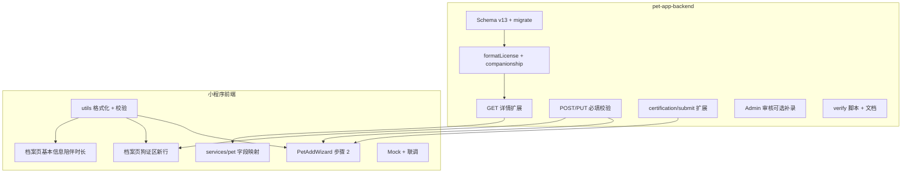

# 宠物陪伴时长 — 数据库与接口方案（临时）

> **文档类型**：可行性评估 + 增量设计方案（未实施）  
> **编写日期**：2026-06-10  
> **最近更新**：2026-06-10（产品决策已确认）  
> **状态**：**后端已实施（BE-ADP-01~10 ✅）**；**小程序前端已实施（MP-ADP-01~10 ✅）**  
> **关联模块**：宠物档案、`pet_license` 狗证、小程序 `pages/pet/info` · `PetAddWizard` 步骤 2

---

## 1. 需求摘要

小程序新增 **宠物陪伴时长** 展示能力，基准为狗证上的 **领养/入籍日期**。

| 项 | 说明 |
|----|------|
| 计算基准 | **领养/入籍日期**（`adoption_date`，存于 `pet_license`） |
| 数据来源 | 狗证（犬只登记证）证面信息；**不以** `valid_from`（有效期）代替 |
| 录入时机 | 用户**填写狗证信息时必填**（添宠步骤 2、档案页补交狗证） |
| 展示 — 狗证区 | 档案页狗证信息下新增一行「领养/入籍日期」 |
| 展示 — 基本信息 | 档案页**只读模式**基本信息区新增一行「陪伴时长」；无日期时显示 **`-`** |
| 计算方式 | `今天 - adoption_date`（自然日；展示文案由前端格式化，如「6 年 87 天」） |

**本期范围外**：宠物 Tab 列表卡片不展示陪伴时长（无需扩展 `GET /pets` 列表）。

---

## 2. 现状核查结论

### 2.1 结论：**当前库表与接口不能直接支撑该功能**

现有 Schema 与 API **没有「领养时间 / 陪伴时长」语义字段**，也无法从已有字段可靠推导。

### 2.2 已部署相关表项（节选）

#### `pet` — 宠物主表

| 字段 | 类型 | 当前语义 | 能否作陪伴基准 |
|------|------|----------|----------------|
| `birthday` | DATE | 宠物生日 | ❌ |
| `create_time` | DATETIME | 档案在 App 内创建时间 | ❌ 产品确认不使用兜底 |
| 其余 | — | 名称、品种、最近状态等 | ❌ |

#### `pet_owner` — 归属关系

| 字段 | 类型 | 当前语义 | 能否作陪伴基准 |
|------|------|----------|----------------|
| `create_time` | DATETIME | 用户与宠物绑定时间 | ❌ |

#### `pet_license` — 狗证（0..1）

| 字段 | 类型 | 当前语义 | 能否作陪伴基准 |
|------|------|----------|----------------|
| `license_no` | VARCHAR(64) | 证号 | ❌ |
| `license_type` | VARCHAR(32) | 证件类型（前端固定「犬只登记证」） | ❌ |
| `valid_from` | DATE | **证件有效期起** | ❌ 与领养日语义不同 |
| `valid_to` | DATE | **证件有效期止** | ❌ |
| `license_status` | VARCHAR(32) | 证件状态（前端按有效期推算） | ❌ |
| `cert_status` | TINYINT | 认证四态 missing/pending/rejected/approved | ❌ |
| `body_photo_urls` / `license_photo_url` | — | 认证材料 | ❌ 仅存 URL，未结构化日期 |
| `submitted_at` / `reviewed_at` | DATETIME | 提交 / 审核时间 | ❌ |

> **特别注意**：不可将 `valid_from` 复用为领养时间。前端 `petLicense.js` 已用 `valid_from`/`valid_to` 推算 **狗证有效期状态**，混用会导致档案页与陪伴时长两处逻辑冲突。

### 2.3 现有接口能力

| 接口 | 与陪伴时长相关的能力 | 缺口 |
|------|----------------------|------|
| `GET /api/v1/pets/{pet_id}` | 返回 `license`（含 `valid_from`/`valid_to` 等） | **无** `adoption_date` / `companionship` |
| `POST /api/v1/pets` | 创建时可带 `license` 对象 | 无领养字段；无必填校验 |
| `PUT /api/v1/pets/{pet_id}` | 可更新 `license`（`approved` 后锁定） | 同上 |
| `POST /api/v1/pets/{id}/certification/submit` | 仅 `license_no` + 照片 | **不采集** `adoption_date` |
| `PUT /api/v1/admin/pets/{id}/certification` | 审核通过/拒绝 | 通过时 **不写入** 证面日期 |

### 2.4 代码佐证（当前格式化输出）

`utils/petFormatters.js` 中 `formatLicense` 仅输出证号、有效期、认证状态等，无领养相关键：

```javascript
// 现有返回字段（节选）
{
  license_no, license_type, valid_from, valid_to, license_status,
  cert_status, body_photo_urls, license_photo_url, reject_reason,
  submitted_at, reviewed_at
}
```

---

## 3. 产品已确认决策（2026-06-10）

| # | 决策 | 说明 |
|---|------|------|
| **D1** | 日期取值 | 以狗证证面 **领养/入籍日期** 为准，映射为 `adoption_date`；**不使用** `valid_from`、**不使用** `pet.create_time` 兜底 |
| **D2** | 录入必填 | 用户**一旦填写狗证信息**（非整段跳过），`adoption_date` **必填**，适用场景：<br>① 添宠向导 **步骤 2**（证件认证卡片）<br>② 档案页 `pages/pet/info` **补交 / 编辑狗证**（含 `PetCertSubmit` 提交前） |
| **D3** | 狗证区展示 | 档案页「狗证信息」分区下，**新增一行**展示「领养/入籍日期」（只读/编辑态均展示；编辑态为日期选择器） |
| **D4** | 陪伴时长展示 | 档案页 **只读模式**「基本信息」分区下，**新增一行**「陪伴时长」 |
| **D5** | 空态策略 | 无可用 `adoption_date` 时，陪伴时长显示 **`-`**（不展示引导文案、不用建档时间估算） |
| **D6** | 展示范围 | **仅**档案详情页只读基本信息区；宠物 Tab 列表、其他页面本期不做 |
| **D7** | 跳过狗证 | 添宠步骤 2 仍可**整步跳过**（与现网一致）；跳过后无 `pet_license` 行 → 陪伴时长为 `-` |

### 3.1 页面交互示意

```
pages/pet/info · mode=view（只读）
┌─ 基本信息 ─────────────────────┐
│ 名称        小狗                │
│ 品种        萨摩耶              │
│ 生日        2020-01-01          │
│ 陪伴时长    6 年 87 天   ← 新增 │  无日期时：-
└────────────────────────────────┘
┌─ 狗证信息 ─────────────────────┐
│ 证号        A000001             │
│ 类型        犬只登记证          │
│ 领养/入籍日期  2020-03-15  ← 新增│  无狗证时：该区空态/引导
│ 有效期      2024-01-01 ~ …      │
│ 状态        正常                │
└────────────────────────────────┘
```

---

## 4. 推荐方案：Schema v13 增量

### 4.1 表结构变更

在 **`pet_license`** 增加领养日期：

```sql
ALTER TABLE `pet_license`
  ADD COLUMN `adoption_date` DATE DEFAULT NULL
    COMMENT '领养/入籍日期，来源于狗证证面，陪伴时长计算基准'
  AFTER `valid_to`;
```

| 字段 | 类型 | 约束 | 说明 |
|------|------|------|------|
| `adoption_date` | DATE | NULL（库层） | 有狗证行时由业务层校验必填；无狗证行时为 `NULL` |

**不新建独立表**；**不改动** `valid_from` / `valid_to`。

### 4.2 后端代码变更清单（文件级）

| 文件 | 变更 |
|------|------|
| `models/PetLicense.js` | 增加 `adoption_date` |
| `scripts/schema.sql` | 同步 DDL |
| `scripts/migrate-schema-v13-pet-adoption-date.js` | 新增迁移 |
| `scripts/verify-db.js` | 期望列增加 `adoption_date` |
| `utils/petFormatters.js` | `formatLicense` 输出 `adoption_date`；`formatPet` 附加 `companionship` |
| `utils/petCompanionship.js` | **新建**：自然日差计算（`available`、`days`、`years`、`remaining_days`） |
| `services/petService.js` | 创建/更新 `license` 时写入；`getPetDetail` 附带 `companionship` |
| `services/petCertificationService.js` | `LICENSE_FIELD_KEYS` 增加 `adoption_date`；submit 时校验已存 `adoption_date` 或随请求传入 |
| `services/adminPetCertService.js` | 审核 `approve` 时可补录 `adoption_date`（向后兼容） |
| `package.json` | 注册 `migrate:v13` |

迁移命令：`npm run migrate:v17`（注：v13 已被用户反馈占用，领养日期使用 **Schema v17**）。历史数据 `adoption_date` 默认 `NULL`，陪伴时长展示为 `-`，待用户补填或运营审核补录。

---

## 5. 接口方案

### 5.1 读接口 — `GET /api/v1/pets/{pet_id}`

#### `license` 扩展

| 字段 | 类型 | 说明 |
|------|------|------|
| `adoption_date` | `YYYY-MM-DD` \| `null` | 领养/入籍日期 |

#### 根级 `companionship`（建议后端计算，前端只读展示）

| 字段 | 类型 | 说明 |
|------|------|------|
| `adoption_date` | string \| `null` | 同 `license.adoption_date` |
| `days` | number \| `null` | 自然日差：`today - adoption_date`（不含首日，与常见「已陪伴 N 天」一致） |
| `years` | number \| `null` | 完整年数（`Math.floor(days / 365)` 或按周年，**前后端统一一种**） |
| `remaining_days` | number \| `null` | 扣除整年后的余天 |
| `available` | boolean | `adoption_date` 非空为 `true` |
| `display_text` | string \| `null` | 可选：服务端预格式化，如 `"6 年 87 天"`；前端亦可本地格式化 |

**有日期示例**：

```json
{
  "license": {
    "license_no": "A000001",
    "adoption_date": "2020-03-15",
    "valid_from": "2024-01-01",
    "valid_to": "2025-12-31",
    "cert_status": "approved"
  },
  "companionship": {
    "adoption_date": "2020-03-15",
    "days": 2274,
    "years": 6,
    "remaining_days": 87,
    "available": true,
    "display_text": "6 年 87 天"
  }
}
```

**无日期（D5 空态）**：

```json
"companionship": {
  "adoption_date": null,
  "days": null,
  "years": null,
  "remaining_days": null,
  "available": false,
  "display_text": null
}
```

前端只读「陪伴时长」：`available === true` 时展示 `display_text` 或本地格式化；否则展示 **`-`**。

---

### 5.2 写接口 — 用户侧录入（D2 必填）

**统一规则**：请求体出现 `license` 对象且含任意证字段（`license_no`、`adoption_date`、照片相关等），则 **`adoption_date` 必填**；否则返回 `40001`。

| 校验 | 说明 |
|------|------|
| 必填 | `adoption_date` 格式 `YYYY-MM-DD` |
| 上限 | 不得晚于今天 |
| 下限 | 若 `pet.birthday` 已填，不得早于生日 |
| `cert_status = approved` | **不可改** `license`（含 `adoption_date`）→ `42215` |
| `missing` / `pending` / `rejected` | 允许写入或更新 |

#### 路径 A：`POST /api/v1/pets`（添宠步骤 1 后 / 步骤 2 前落库）

```json
{
  "name": "小狗",
  "breed": "萨摩耶",
  "license": {
    "license_no": "A000001",
    "license_type": "狗证",
    "adoption_date": "2020-03-15"
  }
}
```

#### 路径 B：`PUT /api/v1/pets/{pet_id}`（档案页补交 / 编辑狗证）

```json
{
  "license": {
    "license_no": "A000001",
    "adoption_date": "2020-03-15"
  }
}
```

#### 路径 C：`POST /api/v1/pets/{id}/certification/submit`（扩展）

用户从 `PetCertSubmit` 提交认证时，须已存在 `adoption_date`（经路径 A/B 写入），**或** 本次 body 携带：

```json
{
  "license_no": "A000001",
  "adoption_date": "2020-03-15",
  "body_photo_urls": ["https://..."],
  "license_photo_url": "https://..."
}
```

| 规则 | 说明 |
|------|------|
| 提交前校验 | 无 `adoption_date` → `40001`「请填写领养/入籍日期」 |
| 写入 | submit 成功时同步更新 `pet_license.adoption_date` |

> 推荐前端流程：步骤 2 用户填写证号 + 领养日期 + 选图后，**先** `PUT` 写入 `license`（含 `adoption_date`），**再** `POST certification/submit`；或单次 submit 携带 `adoption_date`（后端一并落库）。

---

### 5.3 写接口 — 管理端审核补录（可选增强）

#### `PUT /api/v1/admin/pets/{pet_id}/certification`

审核通过时可补录（向后兼容，均可选）：

```json
{
  "action": "approve",
  "adoption_date": "2020-03-15",
  "valid_from": "2024-01-01",
  "valid_to": "2025-12-31"
}
```

用于历史数据或用户漏填、运营从证面照片补录。

---

### 5.4 空态策略（已确认）

| 场景 | 行为 |
|------|------|
| 无 `pet_license` 行 | `companionship.available = false`；陪伴时长 **`-`** |
| 有证行但 `adoption_date` 为空（历史数据） | 同上 |
| **不采用** | `pet.create_time`、`valid_from` 等任何兜底 |

---

## 6. 任务划分总览



**建议实施顺序**：后端 P0（Schema + 读接口）→ 前端 UI 与校验（可并行 Mock）→ 后端 P1（写接口 + submit）→ 联调 → 文档归档。

---

## 7. 后端任务清单（pet-app-backend）

| ID | 任务 | 优先级 | 依赖 | 验收标准 |
|----|------|--------|------|----------|
| **BE-ADP-01** ✅ | `pet_license.adoption_date` DDL + `migrate:v17` + `verify-db` | P0 | — | Sealos 已执行；`verify-db` 49/49 通过 |
| **BE-ADP-02** ✅ | `models/PetLicense.js` 增加字段 | P0 | BE-ADP-01 | Model 与表一致 |
| **BE-ADP-03** ✅ | 新建 `utils/petCompanionship.js` + `utils/petLicenseValidation.js` | P0 | BE-ADP-02 | 计算与校验逻辑已落地 |
| **BE-ADP-04** ✅ | `formatLicense` / `formatPet` 输出 `adoption_date`、`companionship` | P0 | BE-ADP-03 | `GET /pets/{id}` 响应含新字段 |
| **BE-ADP-05** ✅ | `POST /pets`：`license` 存在时校验 `adoption_date` 必填 + 日期规则 | P1 | BE-ADP-02 | 缺日期返回 `40001` |
| **BE-ADP-06** ✅ | `PUT /pets/{id}`：同上；`approved` 锁定不变 | P1 | BE-ADP-05 | 42215 行为兼容 |
| **BE-ADP-07** ✅ | `POST /pets/{id}/certification/submit` 支持/校验 `adoption_date` | P1 | BE-ADP-06 | body 或库中已有日期 |
| **BE-ADP-08** ✅ | `PUT /admin/pets/{id}/certification` approve 可写 `adoption_date` | P2 | BE-ADP-02 | 可补录 `valid_from`/`valid_to` |
| **BE-ADP-09** ✅ | `verify-pet-adoption-api.js` + 更新 `verify-pet-cert` / `verify-pet-family` | P1 | BE-ADP-07 | **22/22** + pet-cert **14/14** |
| **BE-ADP-10** ✅ | 合并至 `docs/项目开发说明-后端.md` §5.15（v0.9.28） | P2 | — | 正式文档已更新 |

**后端不涉及**：`GET /pets` 列表扩展（D6 本期不做）。

---

## 8. 小程序前端任务清单

> 代码仓：小程序前端项目（本文档位于后端仓，便于联调对照）。页面与组件命名对齐 `docs/项目开发说明-小程序前端.md` §4.5a / §4.5b。

| ID | 任务 | 优先级 | 依赖 | 验收标准 |
|----|------|--------|------|----------|
| **MP-ADP-01** ✅ | 新建或扩展 `utils/petCompanionship.js`（或合入 `petLicense.js`） | P0 | — | `formatCompanionshipDisplay(companionship)` → 有值 `"N 年 M 天"` / 无值 `"-"` |
| **MP-ADP-02** ✅ | 扩展 `utils/petProfileValidation.js` | P0 | — | 填写狗证任意字段时，`adoption_date` 必填；与名称/品种校验并列 |
| **MP-ADP-03** ✅ | `services/pet.js` 映射 `adoption_date`、`companionship` | P0 | BE-ADP-04 | GET 详情后页面可读新字段 |
| **MP-ADP-04** ✅ | **`PetAddWizard` 步骤 2**：增加「领养/入籍日期」日期选择器 | P1 | MP-ADP-02 | 填写证号/照片时未选日期不可下一步；整步跳过不受影响 |
| **MP-ADP-05** ✅ | 步骤 2 提交链：`PUT license`（含 `adoption_date`）+ `certification/submit` | P1 | BE-ADP-07 | 实网提交后详情页可见日期与陪伴时长 |
| **MP-ADP-06** ✅ | **`pages/pet/info` 狗证区**：新增一行「领养/入籍日期」 | P1 | MP-ADP-03 | 只读：格式化日期；编辑：日期选择器；`approved` 只读 |
| **MP-ADP-07** ✅ | **`pages/pet/info` 基本信息区（只读）**：新增一行「陪伴时长」 | P1 | MP-ADP-01 | 有 `companionship.available` 显示文案；否则 **`-`** |
| **MP-ADP-08** ✅ | 档案页补交狗证：`PetCertSubmit` 前校验并写入 `adoption_date` | P1 | MP-ADP-02、BE-ADP-06 | 补交流程与步骤 2 规则一致 |
| **MP-ADP-09** ✅ | `constants/pet.js` Mock 数据补充 `adoption_date` / `companionship` | P0 | — | 游客/离线模式档案页可预览新行 |
| **MP-ADP-10** ✅ | 更新 `docs/项目开发说明-小程序前端.md` §4.5a / §4.5b | P2 | 联调完成 | 表格行与变更记录同步 |

**前端不涉及**：宠物 Tab 卡片、记一餐页、消息中心（D6）。

### 8.1 前端文案约定

| 位置 | 标签文案 | 值展示 |
|------|----------|--------|
| 狗证信息区 | 领养/入籍日期 | `YYYY-MM-DD` 或本地化（与生日 `formatBirthdayDisplay` 风格一致） |
| 基本信息区（只读） | 陪伴时长 | `6 年 87 天` 或 `-` |
| 步骤 2 / 编辑校验 Toast | — | 「请填写领养/入籍日期」 |

### 8.2 与现有认证四态的关系

| `cert_status` | 领养日期 editable | 陪伴时长 |
|---------------|-------------------|----------|
| `missing` | ✅ 可填 | 无日期则 `-` |
| `pending` | ❌ 只读展示 | 有日期则展示 |
| `rejected` | ✅ 可改（保存档案时） | 同左 |
| `approved` | ❌ 只读 | 展示已存日期计算结果 |

---

## 9. 联调与测试检查表

| # | 场景 | 预期 |
|---|------|------|
| 1 | 添宠步骤 2 填写证号+照片+领养日期并提交 | 详情狗证区有日期；基本信息陪伴时长非 `-` |
| 2 | 添宠步骤 2 整步跳过 | 无狗证区数据；陪伴时长 `-` |
| 3 | 步骤 2 填证号但不选领养日期 | 前端拦截；若直调 API 返回 `40001` |
| 4 | 档案页补交狗证（原 `missing`） | 必填领养日期后可提交认证 |
| 5 | `approved` 后尝试改 `adoption_date` | `42215`；前端不展示编辑控件 |
| 6 | 历史宠物无 `adoption_date` | 陪伴时长 `-`；狗证区日期空或 `-` |
| 7 | 领养日期 = 今天 | 陪伴时长 `0 天` 或 `今天`（前后端统一一种） |
| 8 | 领养日期早于生日 | API `40001` |

---

## 10. 风险与边界

| 风险 | 缓解 |
|------|------|
| 证面日期与有效期混淆 | UI 文案区分「领养/入籍日期」与「有效期」；独立字段存储 |
| 历史宠物无日期 | 展示 `-`；Admin 审核补录（BE-ADP-08） |
| 步骤 2 跳过与必填冲突 | D7：仅「填写狗证」时必填，整步跳过不校验 |
| 多用户共养 / 家庭组 | 陪伴时长按宠物维度，组内成员一致 |
| 时区 | 统一业务日 `DATE`，与 `daily_record.record_date` 一致 |

---

## 11. 附录：与现有字段对照总表

| 需求 | 现有是否满足 | 动作 |
|------|--------------|------|
| 领养时间存储 | ❌ | `pet_license.adoption_date` |
| 填写狗证时必填 | ❌ | 前后端校验（D2） |
| 狗证区展示领养日期 | ❌ | MP-ADP-06 |
| 基本信息陪伴时长 | ❌ | BE `companionship` + MP-ADP-07 |
| 无日期空态 `-` | ❌ | D5 |
| 证件有效期 | ✅ | 保持不变 |
| Tab 列表展示 | — | 本期不做（D6） |

---

**文档维护**：§4–§5 已合并至 `docs/项目开发说明-后端.md` §5.15（v0.9.28）。§8 已合并至 `docs/项目开发说明-小程序前端.md` §4.5a / §4.5b（v0.9.67）。