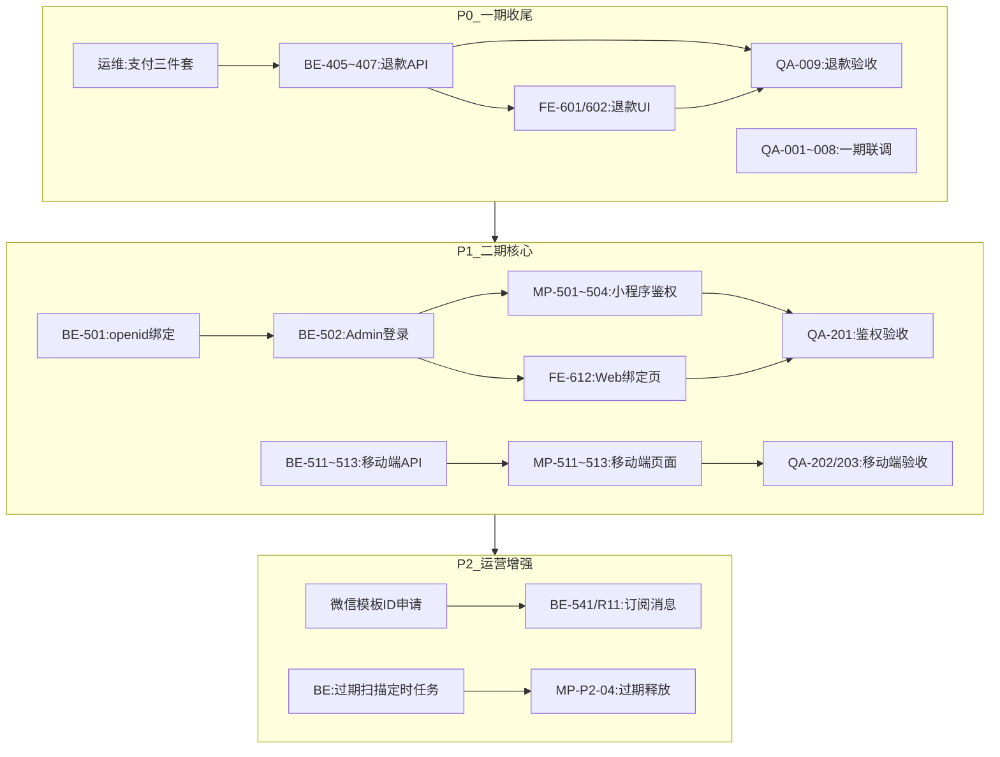

# 下一阶段开发计划 (2026-08-13)

> **文档类型**：阶段规划与任务调度
> **创建日期**：2026-08-13
> **当前状态**：阶段一执行中（BE-405/406/407 已完成 ✅，等待 FE 联调 + 运维三件套）
> **关联文档**：
> - [商户管理端-二期任务清单.md](./商户管理端-二期任务清单.md)
> - [进销存系统-功能完善任务清单-2026-07-22.md](./进销存系统-功能完善任务清单-2026-07-22.md)
> - [项目开发说明-后端.md](../../pet-app-backend/docs/项目开发说明-后端.md) §1.6
> - [微信退款-BE405-407-Mock前置-API规范.md](../api-specs/微信退款-BE405-407-Mock前置-API规范.md)
> - [后端开发记录-2026-08-14](../../pet-app-backend/docs/yjm_daily/2026-08-14.md)
> - [管理端开发记录-2026-08-14](../../pet-app-admin-web/docs/yjm_daily/2026-08-14.md)

---

## 1. 计划概述

本计划旨在统筹执行商户管理端二期及进销存完善的后续任务。核心目标是完成一期收尾、交付二期核心能力（移动端轻量管理）及上线运营增强功能。

### 1.1 执行原则

1.  **依赖驱动**：严格按照任务依赖关系排序，优先解决阻塞性依赖。
2.  **并行协同**：后端 API 就绪后，前端（Web/小程序）可立即并行开发。
3.  **验收闭环**：每个阶段结束后必须完成对应 QA 验收项，方可进入下一阶段。
4.  **外部先行**：需由运维/商户配合的配置项（如支付密钥、订阅消息模板）必须作为第一优先级启动。

### 1.2 关键风险与阻塞点

| 风险项 | 影响范围 | 应对策略 |
|--------|----------|----------|
| **微信支付三件套未就绪** | 仅阻塞真实退款调用与生产验收 QA-009 | **无需阻塞开发**（详见 §1.3「外部配置未就绪时的开发前置方案」）。立即启动运维申请，代码端走 Mock/Sandbox 先行开发与联调。 |
| **订阅消息模板 ID 未申请** | 阻塞 P2 阶段订阅消息真实推送 (BE-541, BE-R11) | 与微信公众平台协同提前申请，代码端预留配置位与 Mock 推送，可并行开发。 |
| **订单过期自动释放逻辑** | 阻塞 MP-P2-04 场景验证 | 需后端先实现定时任务（扫描逻辑独立于密钥），小程序端才能集成测试；定时任务框架可先行开发。 |

---

### 1.3 外部配置未就绪时的开发前置方案（推荐）

> **核心原则**：所有与外部密钥/凭证相关的接入点，都通过 `.env` 注入 + **运行时 Mock 降级**实现，确保"配置未写一行代码先跑 90%"。

#### 1.3.1 可行吗？—— 结论：完全可行

阶段一 P0 的任务中，**真正依赖生产三件套的只有两处**：
- **真实调用微信退款 API** 这一行代码本身
- **QA-009 生产环境真实退款端到端验收**

其余任务（状态流转、审计日志、UI 改动、回调路由框架、一期联调 QA-001~008）均不依赖密钥，均可先行完成。

#### 1.3.2 各任务可拆分清单

| 原任务 | 可先行开发部分（无需密钥） | 依赖密钥部分（待配置就绪） | 前置方案 |
|--------|---------------------------|---------------------------|----------|
| **BE-405** 退款 API | ✅ 业务流程：售后 `audit`「同意退款」→ 写退款记录 → 流转状态机 → 审计埋点 → 响应前端 | ❌ 实际调用 `wechatpay.refunds.create()` | 新增 `.env` 开关 `WECHAT_REFUND_MODE=mock|real`；`mock` 时不调微信，按概率或参数直接返回「成功/失败」模拟结果，状态机与审计照常写入 |
| **BE-406** 回调/轮询 | ✅ 回调路由 `/payments/refund/notify` 框架 + 幂等键 + 状态机流转代码；定时补偿 cron 脚本与调度 | ❌ 微信支付**验签**（需平台证书）与真实回调 | 新增 `WECHAT_REFUND_SKIP_SIGN_VERIFY=true` 开关；mock 模式下用工具脚本模拟 POST 一条回调 payload 触发流转，验签分支跳过 |
| **BE-407** 审计日志 | ✅ 全部：审计写 `admin_audit_log` 的基础设施进销存已建好（`BE-P1-01~02` ✅），仅需在退款链路 3~4 个节点埋点 | ❌ 无 | 与密钥 0 依赖，立即开发 |
| **FE-601/602** 退款 UI | ✅ 全部：弹窗区分「仅标记退款」/「微信原路退款」、进度展示、失败重试入口 UI | ❌ 真实点击「微信退款」并观察真实进度 | 新增后端 `GET /admin/payments/config-status` 返回 `{ refundReady: boolean }`；前端未就绪时按钮置灰 + 提示「微信支付配置未就绪」，UI 样式与交互先调通 |
| **QA-001~008** 一期联调 | ✅ 全部：8 项验收与退款无关 | ❌ 无 | **立即启动**，不阻塞 |
| **QA-101~109** M5 增量验收 | ✅ 全部：9 项验收与退款无关 | ❌ 无 | **立即启动**，不阻塞 |
| **QA-009** 退款真实验收 | ✅ mock/sandbox 环境全流程走通 | ❌ 生产三件套真实链路 | 先用沙箱密钥或 mock 模式走通所有交互；密钥就绪后补做一次真实退款 |
| **FE-611 / QA-010** 生产上线 | ✅ 预生产/测试环境部署与域名配置 | ❌ 生产域名 HTTPS 与运维审批 | 部署文档与流程先跑通 Devbox；生产上线排期与运维并行 |

#### 1.3.3 推荐的 Mock 模式设计（后端接入点示意）

```javascript
// services/wechatRefundService.js 接入点示意
const { WECHAT_REFUND_MODE, WECHAT_MCH_ID, WECHAT_API_V3_KEY } = process.env;
const isMock = WECHAT_REFUND_MODE !== 'real' || !WECHAT_MCH_ID || !WECHAT_API_V3_KEY;

async function submitWechatRefund(orderMain, amount, transactionId) {
  // 1. 写退款单 & 状态流转 —— 始终执行（不依赖密钥）
  const refundRecord = await Refund.create({ ... });
  await afterSales.update({ status: 'refunding' });
  await writeAdminAudit('refund_submit', { order_id: orderMain.order_id });

  // 2. 真实调用微信退款 —— 仅 real 模式 + 密钥齐备时执行
  if (!isMock) {
    return await callWechatRefundApi(orderMain, amount, transactionId, refundRecord);
  }

  // 3. Mock 模式：立即返回模拟结果（支持通过 payload 参数强制成功/失败）
  logger.warn('[WechatRefund] Mock mode, skip real WeChat Pay call.', {
    out_refund_no: refundRecord.out_refund_no,
    amount,
  });
  return {
    status: Math.random() > 0.05 ? 'SUCCESS' : 'FAIL',   // 95% 模拟成功
    amount,
    transaction_id,
    mock: true,
  };
}
```

#### 1.3.4 建议的开发顺序（无需等运维）

```
W1:
  ├── 立即启动 QA-001~008 / QA-101~109 联调（与密钥完全无关）
  ├── 后端：搭建 Refund Model + 状态机字段 + 审计埋点（BE-405/406/407 非敏感部分）
  ├── 后端：实现 Mock 模式下的 submitWechatRefund / 回调处理 / 定时补偿框架
  ├── 前端：FE-601/602 UI 开发 + 配置未就绪降级展示
  └── 前端：FE-611 部署文档梳理 + 预生产部署
      ↓
W2（如运维仍未配齐密钥）:
  ├── 后端：用 Mock 回调脚本自测状态机与审计（替代真实微信回调）
  ├── 前端：用 Mock 模式联调「申请退款 → 展示进度 → 成功/失败」全 UI 链路
  └── 同步运维：确认三件套进度（若拿到沙箱密钥，优先切 sandbox 模式）
      ↓
W3（密钥就绪后 1~2 天）:
  ├── 后端：切 `WECHAT_REFUND_MODE=real`，验证真实微信退款 1 笔
  ├── 后端：启用真实签名验签，关闭 SKIP_SIGN_VERIFY
  └── QA-009 / QA-010 生产实际补验收
```

**收益**：即使三件套申请延期 1~2 周，P0 阶段 90% 的开发工作仍可如期推进并在 mock/sandbox 下联调闭环，密钥就绪后仅需 1~2 天的「实网切换」与最终验收，不会阻塞整体排期。

---

## 2. 阶段拆解与执行计划

### 阶段一：一期收尾 (P0)

**目标**：完成微信原路退款全链路、生产环境上线及全量功能验收。

**前置条件**：
- [ ] **运维**：生产微信支付三件套（商户号/API密钥/证书）配置完成。（**不阻塞开发**，详见 §1.3 Mock 前置方案；BE-405~407 已在 Mock 模式下完成 ✅）

**执行顺序**：

1.  **后端开发** (并行启动)
    - [x] **BE-405**: 实现微信原路退款 API（售后 audit 联动） — ✅ 2026-08-14 完成，`verify:refund-mock` QA-001~007 通过
    - [x] **BE-406**: 实现退款结果回调/轮询机制 — ✅ 2026-08-14 完成，含回调幂等 + 补偿 cron
    - [x] **BE-407**: 实现退款审计日志（敏感信息脱敏） — ✅ 2026-08-14 完成，4 节点埋点 + transaction_id 脱敏
    - [ ] 启动 `QA-001~008`: 一期全链路联调验收（API 已就绪，集中走查） — 🟡 退款相关 QA-001~008 已通过；非退款项待走查

2.  **管理端 Web 开发** (与后端并行)
    - [ ] **FE-601/602**: 售后审核 UI 增加「微信原路退款」选项及进度展示 — 🔓 后端 API 已就绪，可启动
    - [ ] **FE-611**: Sealos 生产环境 `admin.` 域名实际上线部署验收

3.  **验收** (依赖上述开发完成)
    - [ ] **QA-009**: 微信原路退款端到端验收 — ⛔ 依赖运维三件套 + FE-601/602
    - [ ] **QA-010**: Sealos 生产环境登录与功能验收
    - [ ] **QA-101~109**: M5 增量功能验收（宠物认证/导出/预览对照） — 🔓 与退款无关，可并行启动

**交付标准**：
- 生产环境支持完整的订单-发货-退款闭环。
- 所有一期功能在生产环境可用。

---

### 阶段二：二期核心能力 (P1)

**目标**：交付小程序隐藏入口鉴权机制及移动端轻量管理能力。

**前置条件**：
- [x] 阶段一完成。

**执行顺序**：

1.  **M6: 小程序隐藏入口鉴权**
    - **后端开发**:
      - [ ] **BE-501**: 实现 `admin_user.openid` 绑定接口
      - [ ] **BE-502~504**: 实现小程序 Admin 微信登录流程（白名单校验 + JWT 签发）
    - **小程序前端开发** (依赖 BE-502):
      - [ ] **MP-501**: 实现「我的」页版本区连点 7 次隐藏入口
      - [ ] **MP-502~504**: 实现管理分包登录页及 403 强校验逻辑
    - **管理端 Web 开发** (依赖 BE-501):
      - [ ] **FE-612**: 实现 openid 绑定引导页
    - **验收**:
      - [ ] **QA-201**: 非管理员 openid 连点隐藏入口 → 403 验证

2.  **M7: 移动端轻量管理**
    - **后端开发**:
      - [ ] **BE-511**: 实现待发货精简列表 API (`view=mobile`)
      - [ ] **BE-512**: 实现扫码发货 API
      - [ ] **BE-513**: 实现售后待审精简列表及快捷 audit API
    - **小程序前端开发** (依赖上述 API):
      - [ ] **MP-511**: 实现待发货列表分包页
      - [ ] **MP-512**: 实现扫码发货功能
      - [ ] **MP-513**: 实现售后快捷审批分包页
    - **验收**:
      - [ ] **QA-202/203**: 移动端发货及售后审批闭环验收

**交付标准**：
- 小程序仅管理员可通过隐藏入口进入管理分包。
- 管理员可通过小程序完成待发货查看、扫码发货、售后审核。

---

### 阶段三：运营增强 (P2)

**目标**：实现微信订阅消息推送、浏览统计及订单过期处理等增强功能。

**前置条件**：
- [x] 阶段二完成。

**执行顺序**：

1.  **微信订阅消息推送**
    - **后端开发**:
      - [ ] **BE-541**: 接入微信发货/售后订阅消息模板（需模板 ID）
      - [ ] **BE-R11**: 接入日常提醒订阅消息通道
    - **小程序前端协同**:
      - [ ] MP 端配合 `wx.requestSubscribeMessage` 授权时机调整

2.  **浏览统计报表**
    - **后端开发**: (BE-531~532 已完成)
    - **小程序前端开发**:
      - [ ] **MP-521**: 实现 C 端 `browse-log` PV 上报
    - **管理端 Web 开发**:
      - [ ] **FE-631**: 实现浏览统计 PV 报表页
    - **验收**:
      - [ ] 验证 PV 数据上报及报表展示准确性

3.  **订单过期自动释放**
    - **后端开发**:
      - [ ] 实现订单过期扫描定时任务（扫描超时未支付订单，触发库存释放）
    - **小程序前端开发**:
      - [ ] **MP-P2-04**: 集成订单过期自动释放逻辑（验证场景）

4.  **批量发货** (可选)
    - **后端开发**:
      - [ ] **BE-521**: 实现批量发货 CSV 解析与 API
    - **管理端 Web 开发**:
      - [ ] **FE-621**: 实现批量发货 UI 导入页

**交付标准**：
- 订单状态变更（发货/售后）可通过微信订阅消息推送给用户。
- 订单过期未支付自动释放预占库存。
- 管理端可查看 PV 浏览统计报表。

---

## 3. 附录

### 3.1 依赖关系图



### 3.2 修订记录

| 版本 | 日期 | 修订内容 | 修订人 |
|------|------|----------|--------|
| v1.0.0 | 2026-08-13 | 创建初始版本，基于现状分析制定三阶段实施计划 | AI 协作生成 |
| v1.1.0 | 2026-08-14 | 阶段一 P0 后端 BE-405/406/407 全部完成（Mock 前置方案落地，`verify:refund-mock` 28/28 通过）；标记状态为「阶段一执行中」；FE-601/602 解锁可启动；详见 [后端开发记录-2026-08-14](../../pet-app-backend/docs/yjm_daily/2026-08-14.md) | yjm |
| v1.2.0 | 2026-08-14 | 阶段一 P0 前端 FE-601/602 完成（退款方式选择 + 配置查询 + Mock 注入 + 退款进度列 + Popover 详情；`vue-tsc` 零错误 + `vite build` 通过）；详见 [管理端开发记录-2026-08-14](../../pet-app-admin-web/docs/yjm_daily/2026-08-14.md) | yjm |

