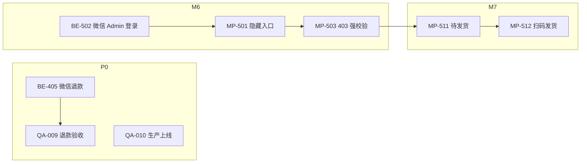

# 商户管理端 · 二期任务清单

> **文档类型**：开发任务拆分（正式版）  
> **编制日期**：2026-06-04  
> **依据**：[商户管理端-需求分析与方案.md](./商户管理端-需求分析与方案.md) v1.6  
> **范围**：一期收尾（微信原路退款、联调验收、生产上线）+ 二期新能力（小程序隐藏入口、移动端轻量管理等）  
> **一期归档**：一期任务已全部完成并归档，完成明细见 [附录 A](#附录-a一期完成情况摘要)

---

## 状态图例

| 标记 | 含义 |
|------|------|
| ✅ | 已完成 |
| ❌ | 未开始 |
| 🟡 | 进行中 / 部分完成 |
| P0 | 必须先完成，阻塞验收或上线 |
| P1 | 二期必须交付 |
| P2 | 二期建议交付（可略晚于 P1） |
| 📋 | 三期及以后 |
| 🔗 | 存在跨端/跨模块依赖 |

---

## 0. 总览

### 0.1 一期完成情况（2026-06-04）

| 端 | 里程碑 | 状态 | 说明 |
|----|--------|------|------|
| 后端 | M0~M4 | ✅ **45/46** | BE-001~404 ✅；**BE-405 微信退款 ❌** |
| Web | M0~M4 | ✅ **35/35** | FE-000~404 ✅ |
| Web | M5 增量 | ✅ **16/16** | FE-501~516（预览 / 宠物 / 认证） |
| C 端 | MP-001~004 | 🟡 已合入 | 心跳 / 封面，**端到端联调待测** |
| 联调 | QA-001~008、QA-101~109 | 🟡 待测 | 见 §4 |
| 部署 | FE-401 Sealos | 🟡 文档就绪 | 控制台实际上线待运维 |

> 一期任务 ID 与交付明细见 [附录 A](#附录-a一期完成情况摘要)；实现说明见 [项目开发说明-后端.md](../pet-app/docs/项目开发说明-后端.md) §5.20–§5.24、[项目开发说明-Web前端.md](../pet-app-admin-web/docs/项目开发说明-Web前端.md)。

### 0.2 二期涉及仓库

| 仓库（GitHub 同名 · Private） | 职责 |
|------------------------------|------|
| `pet-app-backend` | 微信退款 API、隐藏入口鉴权、浏览统计、RBAC（按需） |
| `pet-app-admin-web` | 退款 UI 联动、生产部署验收 |
| `pet-app`（C 端小程序） | 隐藏入口分包、移动端轻量管理页、browse-log 上报（按需） |

### 0.3 建议实施顺序（里程碑）

```
P0 一期收尾（BE-405 微信退款 + QA 联调 + Sealos 上线）
    ↓
M6 小程序隐藏入口 + 服务端强校验（openid 白名单）
    ↓
M7 移动端轻量能力（待发货 / 扫码填单 / 售后审批）
    ↓
M8 运营增强（批量发货、微信订阅消息、浏览统计）【P2 可选】
    ↓
M9 平台扩展（多管理员 RBAC、数据库物理清洗）【📋 按需】
```

### 0.4 任务统计（二期新增）

| 端 | P0 | P1 | P2 | 合计 |
|----|----|----|----|------|
| 后端 | 3 | 12 | 8 | 23 |
| `pet-app-admin-web` | 2 | 4 | 2 | 8 |
| C 端小程序 | 0 | 8 | 3 | 11 |
| 联调/验收 | 8 | 4 | — | 12 |
| **合计** | **13** | **28** | **13** | **54** |

---

## 1. 一期收尾 · 微信原路退款 【P0】

> 一期 BE-405 未实现；售后「退款成功」当前仅改状态，未调用微信退款 API。

| ID | 任务 | 交付物 | 依赖 | 状态 |
|----|------|--------|------|------|
| BE-405 | 微信退款 API：售后 audit「同意退款」联动微信支付退款 | `services/wechatRefundService.js`；audit 流程内调用 | 生产支付三件套（商户号 / API 密钥 / 证书） | ❌ |
| BE-406 | 退款结果回调或轮询：更新 `after_sales` / 订单状态；失败重试与错误码 | 回调路由或定时补偿 | BE-405 | ❌ |
| BE-407 | 退款审计：写 `admin_audit_log`；敏感金额字段脱敏日志 | service 层钩子 | BE-405、BE-401 | ❌ |
| FE-601 | 售后审核 UI：区分「仅标记退款成功」与「微信原路退款」；展示退款进度/失败原因 | `/after-sales` 审核弹窗增强 | BE-405 | ❌ |
| FE-602 | 退款失败 Toast + 重试入口（若后端支持） | 同上 | BE-406 | ❌ |

**前置条件**：微信支付商户平台配置完成；沙箱或生产环境密钥写入 Sealos 密钥管理（**禁止**提交仓库）。

---

## 2. 后端任务 · 隐藏入口与移动端 【P1】

### 2.1 M6 · 小程序隐藏入口鉴权

| ID | 任务 | 交付物 | 依赖 | 状态 |
|----|------|--------|------|------|
| BE-501 | `admin_user.openid` 绑定接口（PC 端扫码或小程序预绑定） | `POST /admin/auth/bind-wechat` | M0 admin_user 表 | ❌ |
| BE-502 | 小程序 Admin 登录：`code` → openid → 比对 `admin_user` 白名单 → 签发 Admin JWT | `POST /admin/auth/wechat-login` | BE-501 | ❌ |
| BE-503 | 非白名单 openid 返回 **403**；不缓存 token；审计登录失败 | 中间件 / service | BE-502 | ❌ |
| BE-504 | Admin JWT payload 含 `role: admin`、`source: mp`（可选，便于审计） | `utils/adminJwt.js` 扩展 | BE-502 | ❌ |

> 鉴权标准见 [商户管理端-需求分析与方案.md](./商户管理端-需求分析与方案.md) §7.2「二期隐藏入口鉴权说明」。

### 2.2 M7 · 移动端轻量 API（复用现有 Admin 路由）

| ID | 任务 | 交付物 | 依赖 | 状态 |
|----|------|--------|------|------|
| BE-511 | 待发货精简列表：字段裁剪（订单号、商品摘要、地址、留言） | `GET /admin/orders?status=20&view=mobile` 或专用路径 | M1 BE-102 | ❌ |
| BE-512 | 扫码发货：校验单号格式；可选快递公司码表 | 复用 `POST /logistics` | M1 BE-105 | ❌ |
| BE-513 | 售后待审精简列表 + 快捷 audit | 复用 M1 售后 API | M1 BE-107~108 | ❌ |

---

## 3. 管理端 Web 任务 【P1 / P2】

| ID | 任务 | 交付物 | 依赖 | 状态 |
|----|------|--------|------|------|
| FE-601~602 | 见 §1 退款 UI | — | BE-405 | ❌ |
| FE-611 | 生产环境 Sealos **实际上线**验收（非仅文档） | 可访问 `admin.` 子域名；HTTPS | FE-401 部署包 | 🟡 文档就绪 |
| FE-612 | openid 绑定引导页（若采用 PC 扫码绑定方案） | `/settings/bind-wechat` | BE-501 | ❌ |
| FE-621 | 批量发货 CSV 导入（二期可选） | `/shipments/batch` | BE-521 | 📋 P2 |
| FE-631 | 浏览统计 PV 报表页（二期可选） | `/stats/browse` | BE-531~532 | 📋 P2 |

---

## 4. C 端小程序任务

### 4.1 一期最小配合 · 联调收尾 【P0】

| ID | 任务 | 交付物 | 依赖 | 状态 |
|----|------|--------|------|------|
| MP-001 | 无感心跳：`POST /presence/heartbeat` | 已合入，**QA-006 待测** | BE-301 | 🟡 |
| MP-002 | 首页封面读 `GET /shop-config/public` | 已合入，**QA-004 待测** | BE-208 | 🟡 |
| MP-003 | 移除封面点击跳转 | 已合入 | — | 🟡 |
| MP-004 | 封面加载失败回退默认图 | 已合入 | MP-002 | 🟡 |

### 4.2 M6 · 隐藏入口 【P1】

| ID | 任务 | 交付物 | 依赖 | 状态 |
|----|------|--------|------|------|
| MP-501 | 「我的」版本区连点 7 次 → 跳转管理分包登录页 | 隐藏入口 UI | — | ❌ |
| MP-502 | 管理分包：微信登录 → `POST /admin/auth/wechat-login` | 分包 `pages/admin/login` | BE-502 | ❌ |
| MP-503 | 鉴权失败：403 Toast + 立即 `navigateBack` 首页；**不渲染**管理 UI | 登录页逻辑 | BE-503 | ❌ |
| MP-504 | Admin Token 独立存储；与 User JWT 隔离；退出清除 | `utils/adminAuth.js` | MP-502 | ❌ |

### 4.3 M7 · 移动端轻量管理页 【P1】

| ID | 任务 | 交付物 | 依赖 | 状态 |
|----|------|--------|------|------|
| MP-511 | 待发货列表（精简字段） | 分包页 | BE-511、MP-504 | ❌ |
| MP-512 | 扫码 / 手填快递单号发货 | 调用 `POST /logistics` | BE-512 | ❌ |
| MP-513 | 售后待审列表 + 同意/拒绝 | 分包页 | BE-513 | ❌ |

### 4.4 M8 · 浏览统计（可选）【P2】

| ID | 任务 | 交付物 | 依赖 | 状态 |
|----|------|--------|------|------|
| MP-521 | C 端 `browse-log` 上报（页面 PV） | `utils/browseLog.js` | BE-531 | 📋 |
| MP-522 | 管理端 PV 报表只读（Web 或小程序） | 对接 BE-532 | BE-532 | 📋 |

---

## 5. 后端任务 · 运营增强与平台扩展 【P2 / 📋】

| ID | 任务 | 交付物 | 优先级 | 状态 |
|----|------|--------|--------|------|
| BE-521 | 批量发货：CSV 解析 + 批量 `POST /logistics` + 失败行报告 | `POST /admin/logistics/batch` | P2 | 📋 |
| BE-531 | `browse_log` 表 + 上报接口 `POST /browse-log` | Schema 迁移 | P2 | 📋 |
| BE-532 | 管理端 PV 聚合报表 API | `GET /admin/stats/browse` | P2 | 📋 |
| BE-541 | 微信订阅消息：发货/售后模板（受模板与授权限制） | message 扩展 | P2 | 📋 |
| BE-551 | 多管理员：角色表 + RBAC 中间件 | Schema + 路由守卫 | 📋 | 📋 |
| BE-561 | 软删数据物理清洗 / 归档工具（需备份流程评审） | 管理脚本 | 📋 | 📋 |

---

## 6. 联调与验收任务

### 6.1 一期收尾验收 【P0】

| ID | 任务 | 负责 | 依赖 | 状态 |
|----|------|------|------|------|
| QA-001 | Admin 登录 → 仪表盘数据与 DB 一致 | 全员 | M0 | 🟡 待测 |
| QA-002 | 待发货 → 录入物流 → C 端订单 30 + 消息 | 后端+Web | M1 | 🟡 待测 |
| QA-003 | C 端申请售后 → 管理端审核 → 状态闭环 | 后端+Web | M1 | 🟡 待测 |
| QA-004 | 商品/资讯软删、CMS/封面 C 端生效 | 三端 | M2、MP-002 | 🟡 待测 |
| QA-005 | 广播二次确认 → job 进度 → C 端消息中心 | 后端+Web | M3 | 🟡 待测 |
| QA-006 | 小程序心跳 → 管理端 5 分钟内在线人数 | 三端 | BE-301、MP-001 | 🟡 待测 |
| QA-007 | User Token 调用 `/admin/*` 返回 403 | 后端 | BE-010 | 🟡 待测 |
| QA-008 | `npm run verify:admin` 通过 | 后端 | BE-402 | 🟡 待测 |
| QA-009 | 微信原路退款：audit 同意 → 微信退款成功 → 订单/售后状态一致 | 后端+Web | BE-405~407 | ❌ |
| QA-010 | Sealos 生产：`admin.` 域名 HTTPS 可登录并完成发货 | 运维+Web | FE-611 | 🟡 |

### 6.2 M5 增量验收 【P0】

| ID | 任务 | 负责 | 依赖 | 状态 |
|----|------|------|------|------|
| QA-101~104 | C 端证件提交 → 管理端认证审核 → C 端状态/消息闭环 | 三端 | FE-513~515 | 🟡 待测 |
| QA-105 | 宠物导出 CSV：owner 名称+手机号 | Web+后端 | FE-510 | 🟡 待测 |
| QA-106 | 资讯/CMS 预览与 C 端真机截图对照 | Web | FE-501~505 | 🟡 待测 |
| QA-109 | 宠物详情日记录 Tab 餐食明细 | Web+后端 | FE-512 | 🟡 待测 |

### 6.3 二期功能验收 【P1】

| ID | 任务 | 负责 | 依赖 | 状态 |
|----|------|------|------|------|
| QA-201 | 非管理员 openid 连点隐藏入口 → 403，无管理 UI 缓存 | 小程序+后端 | MP-501~503 | ❌ |
| QA-202 | 管理员 openid 登录 → 待发货列表 → 扫码发货闭环 | 三端 | M7 | ❌ |
| QA-203 | 小程序售后快捷审批与 PC 端状态一致 | 三端 | MP-513 | ❌ |

---

## 7. 依赖关系图（简）



---

## 8. 建议排期（参考 4–6 周）

| 周次 | 后端 | Web | C 端 | 验收 |
|------|------|-----|------|------|
| W1 | BE-405~407（支付就绪则启动） | FE-601~602 | — | QA-001~008 一期联调 |
| W2 | BE-405 联调 | 退款 UI | MP 联调 | QA-009、QA-101~109 |
| W3 | BE-501~504 | FE-611 上线 | MP-501~504 | QA-010、QA-201 |
| W4 | BE-511~513 | — | MP-511~513 | QA-202、QA-203 |
| W5~6 | BE-521~532（P2 可选） | FE-621、FE-631 | MP-521~522 | 缓冲 / 二期演示 |

---

## 9. 二期明确排除（勿纳入本清单）

- 一期已交付的 PC Web 全功能重复开发
- 数据库物理清洗（无备份评审前不做，BE-561 📋）
- 多管理员 RBAC（业务扩展后再做，BE-551 📋）

---

## 附录 A：一期完成情况摘要

> 原《商户管理端-一期任务清单-临时》已归档删除（2026-06-04）；以下为冻结的一期完成快照。

| 里程碑 | 后端 | Web | C 端 |
|--------|------|-----|------|
| **M0** 基础设施与鉴权 | ✅ 13/13（BE-001~013） | ✅ 9/9（FE-000~008） | — |
| **M1** 订单与履约 | ✅ 10/10（BE-101~110） | ✅ 9/9（FE-101~109） | — |
| **M2** 内容与店铺 | ✅ 9/9（BE-201~209） | ✅ 10/10（FE-201~210） | 🟡 MP-002~004 已合入 |
| **M3** 运营与统计 | ✅ 6/6（BE-301~306） | ✅ 5/5（FE-301~305） | 🟡 MP-001 已合入 |
| **M4** 增强与验收 | ✅ 4/5（BE-401~404 ✅ · **BE-405 ❌**） | ✅ 4/4（FE-401~404） | — |
| **M5** 预览/宠物/认证 | （见后端宠物 API 文档） | ✅ 16/16（FE-501~516） | — |

**一期明确未完成项**：BE-405 微信原路退款 → 已纳入本清单 §1。

---

**编制**：依据 [商户管理端-需求分析与方案.md](./商户管理端-需求分析与方案.md) v1.6；一期任务清单归档合并  
**下次更新**：BE-405 支付配置就绪，或 QA-001~010 联调完成后