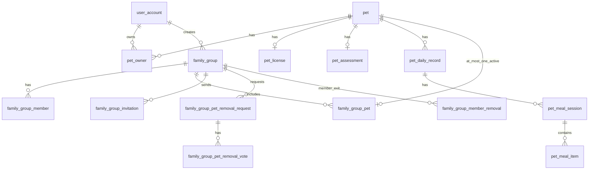

# 宠物档案与家庭组 — 数据库表项设计

> **文档类型**：数据库设计规划（Schema v3）  
> **文档版本**：v0.2.1  
> **更新日期**：2026-05-28  
> **状态**：**Schema v3 已落库**（`npm run migrate:v3`）；API 待开发  
> **依据样本**：[宠物信息的数据格式.json](../shared-resources/宠物信息的数据格式.json)  
> **关联现有表**：`user_account`（`user_id`）

---

## 1. 设计目标与原则

### 1.1 业务目标

| 目标 | 说明 |
|------|------|
| 宠物档案 | 存储样本 JSON 中的档案、狗证、评估、每日状态、分时段餐食等结构化数据 |
| 一用户多宠物 | 通过 `pet` + `pet_owner` 表达 |
| 多用户共养 | 通过 `pet_owner` 多行记录同一 `pet_id` 的不同 `user_id` |
| 家庭组 | 组内成员对组内宠物**权限一致**；入组/出组、成员移除、宠物软删等有明确流程 |
| 默认所属用户 | `pet.default_owner_user_id` **不可变**，作为归属锚点及出组后回退依据 |

### 1.2 已确认的产品决策（2026-05-28）

| # | 决策 |
|---|------|
| D1 | 一只宠物**不能且不允许**同时属于多个家庭组 |
| D2 | 创建者宠物自动入组时，`manager_user_id` = `default_owner_user_id`（创建者场景下二者为同一用户） |
| D3 | 成员被移出家庭组时，**询问**该用户是否将其带入的宠物一同出组：确认则宠物出组、归属该用户；拒绝则宠物**保留在组内**，且**不修改** `default_owner_user_id` |
| D4 | 体重统一为 **数值（kg）**，固定单位 kg，不使用字符串 |
| D5 | 宠物软删除时，**自动**从当前家庭组出组（因 D1，至多一个组） |
| D6 | 操作审计日志：后续做，**本阶段不建表** |

### 1.3 组内权限与通知（产品备注，主要由应用层实现）

| 备注 | 规则 |
|------|------|
| R1 | 宠物入组后，**组内所有成员**对该宠物拥有一致的操作权限；操作时通知组内相关用户 + **默认所属用户（仅当其仍在组内时）** |
| R2 | 组内所有成员可**修改**宠物信息，且均有发起**移出家庭组**的权限 |
| R3 | 移出家庭组：通知操作者、创建者、默认所属用户（若在组内）；向**除操作者外**的在组创建者、在组默认所属用户征求同意，**全部同意**方可出组；出组后见 §4.7 |

> 通知、询问 UI 由消息/推送模块承载；数据库通过「申请 + 多人表决」表支撑待办状态。

### 1.4 与现有工程对齐的约定

- 数据库：MySQL 8.0+，`utf8mb4` / `utf8mb4_unicode_ci`，InnoDB  
- 命名：`snake_case`；主键 `{实体}_id` `BIGINT AUTO_INCREMENT`  
- 时间：`create_time` / `update_time`（`DATETIME`）  
- 状态：`TINYINT` + 中文 `COMMENT`  
- 体重：`DECIMAL(6,2)`，单位 **kg**（API 与 JSON 样本亦为数值，如 `18.3`）

---

## 2. 实体关系总览



---

## 3. 宠物档案相关表项

### 3.1 `pet` — 宠物主表

| 字段 | 类型 | 约束 | 说明 |
|------|------|------|------|
| `pet_id` | BIGINT | PK, AI | |
| `name` | VARCHAR(64) | NOT NULL | 名称 |
| `avatar_url` | VARCHAR(255) | NULL | 头像 |
| `breed` | VARCHAR(64) | NULL | 品种 |
| `birthday` | DATE | NULL | 生日 |
| `default_owner_user_id` | BIGINT | NOT NULL, FK→`user_account` | **默认所属用户**，创建后不可修改 |
| `preferences` | VARCHAR(500) | NULL | 喜好 |
| `medical_history` | TEXT | NULL | 病史 |
| `allergens` | VARCHAR(500) | NULL | 过敏源 |
| `latest_mood` | VARCHAR(32) | NULL | 最近状态 |
| `latest_weight_kg` | DECIMAL(6,2) | NULL | 最近体重（kg） |
| `latest_stool_health` | VARCHAR(32) | NULL | 最近排便健康 |
| `latest_record_date` | DATE | NULL | 最近日记录日期 |
| `status` | TINYINT | NOT NULL, DEFAULT 1 | 1-正常 0-已软删 |
| `create_time` | DATETIME | NOT NULL | |
| `update_time` | DATETIME | NULL | |

**索引**：`idx_default_owner` (`default_owner_user_id`)，`idx_status_create` (`status`, `create_time`)

**业务规则**

- 创建：`default_owner_user_id` = 操作用户；同步 `pet_owner`（§3.2）。  
- 软删（D5）：`status=0`，并将该宠物在 `family_group_pet` 中 `status=1` 的记录置为出组（`status=0`，`leave_time`）。  
- 样本 JSON 键名：**默认所属用户ID** → `default_owner_user_id`。

---

### 3.2 `pet_owner` — 宠物归属（多用户共养）

| 字段 | 类型 | 约束 | 说明 |
|------|------|------|------|
| `pet_owner_id` | BIGINT | PK, AI | |
| `pet_id` | BIGINT | NOT NULL, FK→`pet` | |
| `user_id` | BIGINT | NOT NULL, FK→`user_account` | |
| `ownership_type` | TINYINT | NOT NULL, DEFAULT 1 | 1-默认所属 2-共同所属 |
| `status` | TINYINT | NOT NULL, DEFAULT 1 | 1-有效 0-已解除 |
| `create_time` | DATETIME | NOT NULL | |

**唯一约束**：`uk_pet_user` (`pet_id`, `user_id`)

**规则**：`ownership_type=1` 的 `user_id` 必须与 `pet.default_owner_user_id` 一致。

---

### 3.3 `pet_license` — 狗证（0..1）

| 字段 | 类型 | 约束 | 说明 |
|------|------|------|------|
| `license_id` | BIGINT | PK, AI | |
| `pet_id` | BIGINT | NOT NULL, UK, FK→`pet` | |
| `license_no` | VARCHAR(64) | NOT NULL | |
| `license_type` | VARCHAR(32) | NOT NULL | |
| `valid_from` | DATE | NULL | |
| `valid_to` | DATE | NULL | |
| `license_status` | VARCHAR(32) | NOT NULL | |
| `photo_url` | VARCHAR(255) | NULL | |
| `create_time` | DATETIME | NOT NULL | |
| `update_time` | DATETIME | NULL | |

---

### 3.4 `pet_assessment` — 评估快照（0..1）

| 字段 | 类型 | 约束 | 说明 |
|------|------|------|------|
| `assessment_id` | BIGINT | PK, AI | |
| `pet_id` | BIGINT | NOT NULL, UK, FK→`pet` | |
| `morph_type` | VARCHAR(32) | NOT NULL | |
| `morph_level` | TINYINT | NOT NULL | |
| `assessed_at` | DATETIME | NOT NULL | |
| `create_time` | DATETIME | NOT NULL | |
| `update_time` | DATETIME | NULL | |

---

### 3.5 `pet_daily_record` — 每日状态

| 字段 | 类型 | 约束 | 说明 |
|------|------|------|------|
| `daily_record_id` | BIGINT | PK, AI | |
| `pet_id` | BIGINT | NOT NULL, FK→`pet` | |
| `record_date` | DATE | NOT NULL | |
| `daily_mood` | VARCHAR(32) | NULL | |
| `daily_weight_kg` | DECIMAL(6,2) | NULL | 当日体重（kg） |
| `daily_stool_health` | VARCHAR(32) | NULL | |
| `create_time` | DATETIME | NOT NULL | |
| `update_time` | DATETIME | NULL | |

**唯一约束**：`uk_pet_record_date` (`pet_id`, `record_date`)

写入最新日记录时，同步 `pet.latest_weight_kg` 等缓存。

---

### 3.6 `pet_meal_session` / 3.7 `pet_meal_item`

结构同 v0.1.0：`pet_meal_session`（时段、时间、餐食后状态、营养参考、备注）；`pet_meal_item`（`food_name`、`amount` 克重仍为字符串如 `150g`）。

---

### 3.8 JSON 样本字段对照

| 样本字段 | 存储位置 |
|----------|----------|
| 默认所属用户ID | `pet.default_owner_user_id` + `pet_owner` |
| 最近体重 / 当日体重 | `pet.latest_weight_kg` / `pet_daily_record.daily_weight_kg`（数值，kg） |
| 其余 | 同 v0.1.0 §3.8 |

---

## 4. 家庭组相关表项

### 4.1 职责映射（含已确认决策）

| 规则 | 实现 |
|------|------|
| D1 一宠一组 | 入组前校验：不存在其他 `family_group_pet.status=1` 的同一 `pet_id`；建议 `pet` 冗余 `current_group_pet_id` 或事务内 `SELECT … FOR UPDATE` |
| D2 创建者宠物自动入组 | `join_source=1`，`manager_user_id = pet.default_owner_user_id` |
| D3 成员被移出 | `family_group_member_removal` 记录该成员对「是否带走宠物」的选择（§4.5） |
| R2 组内平等权限 | 不建 per-member 宠物权限表；鉴权：是否为在组 `family_group_member` 且宠物 `family_group_pet.status=1` |
| R3 宠物出组多人同意 | `family_group_pet_removal_request` + `family_group_pet_removal_vote`（§4.6–4.7） |

---

### 4.2 `family_group`

| 字段 | 类型 | 说明 |
|------|------|------|
| `family_group_id` | BIGINT PK | |
| `name` | VARCHAR(64) | 组名 |
| `creator_user_id` | BIGINT FK | 创建者，不可变 |
| `status` | TINYINT | 1-正常 0-已解散 |
| `create_time` / `update_time` / `dissolved_at` | DATETIME | |

---

### 4.3 `family_group_member`

| 字段 | 类型 | 说明 |
|------|------|------|
| `member_id` | BIGINT PK | |
| `family_group_id` | BIGINT FK | |
| `user_id` | BIGINT FK | |
| `member_role` | TINYINT | 1-创建者 2-成员 |
| `status` | TINYINT | 1-在组 0-已退出/被移除 |
| `can_invite` | TINYINT | 创建者默认 1 |
| `can_remove_member` | TINYINT | |
| `can_manage_member_permission` | TINYINT | |
| `join_time` / `leave_time` | DATETIME | |

**唯一约束**：`uk_group_user` (`family_group_id`, `user_id`)

---

### 4.4 `family_group_pet` — 组内宠物

| 字段 | 类型 | 说明 |
|------|------|------|
| `group_pet_id` | BIGINT PK | |
| `family_group_id` | BIGINT FK | |
| `pet_id` | BIGINT FK | |
| `added_by_user_id` | BIGINT FK | 加入本组的操作人 |
| `manager_user_id` | BIGINT FK | 组内管理者；入组时 = `default_owner_user_id`（D2） |
| `join_source` | TINYINT | 1-创建者自动 2-成员自选 |
| `status` | TINYINT | 1-在组 0-已出组 |
| `join_time` / `leave_time` | DATETIME | |

**约束（D1）**

- `uk_group_pet` (`family_group_id`, `pet_id`)：同一组内不重复。  
- **应用层 + 迁移脚本注释**：全局仅允许每个 `pet_id` 存在一条 `status=1` 记录（跨所有家庭组）。入组接口必须在事务中校验。

**D3 与 `default_owner_user_id`**

- 成员带走宠物出组：仅 `family_group_pet.status=0`，**不修改** `pet.default_owner_user_id`。  
- 成员留下宠物：同样不修改默认所属用户。

---

### 4.5 `family_group_member_removal` — 成员移出（含宠物去留）

| 字段 | 类型 | 说明 |
|------|------|------|
| `removal_id` | BIGINT PK | |
| `family_group_id` | BIGINT FK | |
| `target_user_id` | BIGINT FK | 被移出成员 |
| `initiator_user_id` | BIGINT FK | 通常为创建者 |
| `pets_exit_choice` | TINYINT | 0-待成员确认 1-宠物留组 2-宠物随成员出组 |
| `status` | TINYINT | 0-待确认 1-已完成 2-已取消 |
| `create_time` / `resolve_time` | DATETIME | |

**流程（D3）**

1. 创建者发起移出成员 → `pets_exit_choice=0`，通知被移出用户。  
2. 用户选择：  
   - **2-带走宠物**：将该用户 `added_by_user_id = target_user_id` 且 `status=1` 的 `family_group_pet` 全部出组；`family_group_member.status=0`。  
   - **1-留宠物在组**：仅 `family_group_member.status=0`，不动组内宠物及 `default_owner_user_id`。  
3. `status=1` 完成。

---

### 4.6 `family_group_invitation`

同 v0.1.0（邀请状态、过期、接受时间等）。

---

### 4.7 宠物移出家庭组 — 多人表决（R3）

#### 4.7.1 `family_group_pet_removal_request` — 申请主表

| 字段 | 类型 | 说明 |
|------|------|------|
| `request_id` | BIGINT PK | |
| `family_group_id` | BIGINT FK | |
| `group_pet_id` | BIGINT FK | |
| `pet_id` | BIGINT FK | 冗余 |
| `requester_user_id` | BIGINT FK | 操作者（组内任一成员） |
| `status` | TINYINT | 0-表决中 1-已通过 2-已驳回 3-已撤销 4-已执行 |
| `reason` | VARCHAR(255) | 可选 |
| `create_time` / `resolve_time` | DATETIME | |

#### 4.7.2 `family_group_pet_removal_vote` — 表决明细

| 字段 | 类型 | 说明 |
|------|------|------|
| `vote_id` | BIGINT PK | |
| `request_id` | BIGINT FK | |
| `voter_user_id` | BIGINT FK | 须表决人 |
| `vote_status` | TINYINT | 0-待表决 1-同意 2-拒绝 |
| `vote_time` | DATETIME | NULL |

**须表决人集合**（创建申请时写入，均为**在组**且**≠ requester**）：

| 身份 | 是否加入表决 |
|------|----------------|
| 家庭组创建者 | 若在组且 ≠ 操作者 → 须表决 |
| 宠物默认所属用户 | 若在组且 ≠ 操作者 → 须表决 |

- 若集合为空（例如操作者同时为创建者与默认所属用户）→ 视为**无需表决，可直接出组**。  
- **任一** `vote_status=2` → 申请 `status=2`（驳回）。  
- **全部** `vote_status=1` → 申请 `status=1`，执行出组。

#### 4.7.3 出组后处理（R3 后半段）

执行：`family_group_pet.status=0`，`leave_time=NOW()`；`manager_user_id` 可置为 `default_owner_user_id`（便于历史查询）。

| 条件 | 动作 |
|------|------|
| `default_owner_user_id` 对应用户**存在**且**不在**该家庭组 | 通知该用户；宠物归属回默认所属用户（`default_owner_user_id` 不变，组内关系结束） |
| 默认所属用户**已注销**（`user_account` 无效或不存在） | 对宠物执行**软删除**（`pet.status=0`，并确保已出组） |

> 「归属」不改变 `default_owner_user_id` 字段，仅结束家庭组共享；通知由应用层发送。

---

## 5. 核心业务流程

### 5.1 创建家庭组

1. `INSERT family_group` + `family_group_member`（创建者，`member_role=1`）。  
2. 创建者所有有效 `pet_owner` 宠物 → `INSERT family_group_pet`（`join_source=1`，`manager_user_id = default_owner_user_id`）。  
3. 校验 D1：每只宠物无其他在组记录。

### 5.2 成员加入与自选宠物入组

接受邀请 → `family_group_member`；宠物由成员自选入组（`join_source=2`），入组前 D1 校验。

### 5.3 移出成员（D3）

见 §4.5：`family_group_member_removal` → 成员确认 → 按选择去留宠物。

### 5.4 移出宠物（R3）

组内成员发起 → 生成 `request` + `vote` 行 → 通知 → 全部同意 → 出组 → §4.7.3 善后。

### 5.5 宠物软删（D5）

任意在组成员或默认所属用户发起档案软删 → `pet.status=0` + 自动出组（`family_group_pet.status=0`）。

### 5.6 解散家庭组

`family_group.status=0`；全体成员 `family_group_member.status=0`；全部组内宠物出组；关闭进行中的 removal / member_removal 申请。

---

## 6. 本阶段不实现的表

| 项 | 说明 |
|----|------|
| 操作审计日志 | D6：后续 `family_group_audit_log` 等，当前不建 |

通知队列、站内信表若已有全局方案，宠物/家庭组模块复用，不在此重复设计。

---

## 7. 表清单汇总（Schema v3）

### 宠物档案（7 张）

`pet`，`pet_owner`，`pet_license`，`pet_assessment`，`pet_daily_record`，`pet_meal_session`，`pet_meal_item`

### 家庭组（7 张）

| 表名 | 说明 |
|------|------|
| `family_group` | 家庭组 |
| `family_group_member` | 成员 |
| `family_group_pet` | 组内宠物 |
| `family_group_invitation` | 邀请 |
| `family_group_member_removal` | **新增**：成员移出及宠物去留 |
| `family_group_pet_removal_request` | 宠物出组申请 |
| `family_group_pet_removal_vote` | **新增**：出组多人表决 |

**合计新增 14 张表**（原 17 → **31** 张）。

---

## 8. 实施记录

| 步骤 | 状态 |
|------|------|
| `scripts/migrate-schema-v3-pet-family.js` + `schema.sql` 追加 | ✅ |
| Sequelize Model（14 个）+ `models/index.js` | ✅ |
| `scripts/verify-db.js`（31 表） | ✅ |
| REST API | ✅ 已实现（见 [项目开发说明-后端.md](../pet-app-backend/docs/项目开发说明-后端.md) §5.15–5.16） |

```bash
npm run migrate:v3    # 已部署库增量迁移
npm run verify:db     # 期望 31/31 表
```

---

## 修订记录

| 版本 | 日期 | 说明 |
|------|------|------|
| v0.1.0 | 2026-05-28 | 初稿 |
| v0.2.0 | 2026-05-28 | 采纳产品决策 D1–D6、备注 R1–R3；`default_owner_user_id`；体重 kg；多人表决出组；`family_group_member_removal` |
| v0.2.1 | 2026-05-28 | DDL + Model 已创建（Schema v3） |