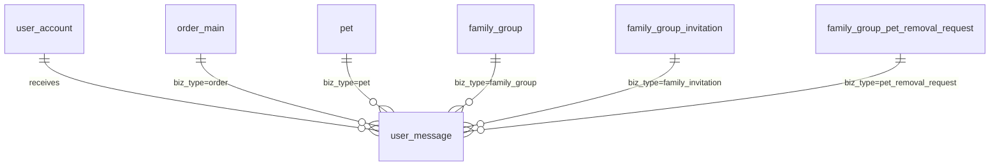

# 用户消息中心 — 数据库与接口设计

> **文档类型**：数据库 + API 设计规划（Schema v4）  
> **文档版本**：v0.2.0  
> **更新日期**：2026-05-29  
> **状态**：**已确认并实现**（Schema v4：`npm run migrate:v4`；API §5.17）  
> **关联现有表**：`user_account`（`user_id`）、`order_main`、`pet`、`family_group` 等  
> **前端场景**：消息页 Tab / 分类列表（系统消息、订单消息、宠物消息）

---

## 1. 设计目标与原则

### 1.1 业务目标

| 目标 | 说明 |
|------|------|
| 统一收件箱 | 用户在一个消息页查看所有通知，按**大类**筛选 |
| 三类消息 | **系统消息**、**订单消息**、**宠物消息**；后续可扩展新大类 |
| 可跳转 | 消息可携带业务关联与小程序页面路径，点击后进入订单详情、宠物档案、家庭组等待办页 |
| 已读管理 | 支持单条 / 批量 / 按分类标记已读；展示各分类未读数 |
| 事件驱动写入 | 由订单、宠物、家庭组等业务模块在**应用层**调用消息服务写入，前端**只读** |

### 1.2 消息大类与归属规则（产品约定）

| 大类 | `category` 值 | 归属规则 |
|------|---------------|----------|
| 系统消息 | `1` | 除订单、宠物外的全部消息：公告、活动、账号安全、版本更新等 |
| 订单消息 | `2` | 交易订单全链路：下单、支付提醒、发货/物流、签收、售后、退款等 |
| 宠物消息 | `3` | 宠物档案与家庭组相关：每日记录提醒、邀请/表决/移出通知、档案变更等 |

> **扩展方式**：新增大类时递增 `category` 整型值（如 `4` = 营销消息），并在应用层枚举与前端 Tab 配置中同步注册；**不修改表结构**。

### 1.3 数据库设计原则

| 原则 | 本方案做法 |
|------|------------|
| 第三范式 | 消息正文与收件人合一存于 `user_message`（一行 = 一个用户的一条消息），不拆「内容表 + 收件人表」，避免 MVP 阶段多表 JOIN |
| 消除冗余 | 标题、摘要仅存一份；业务实体通过 `biz_type` + `biz_id` 关联，不重复存储订单金额等可变字段（详情跳转后由业务 API 拉取） |
| 可扩展字段 | 展示用结构化数据放 `extra_json`（图标、按钮、快照等），避免频繁 `ALTER TABLE` |
| 幂等 | 定时提醒类消息使用 `idempotency_key`，防止重复推送 |
| 与工程对齐 | MySQL 8.0+、`utf8mb4_unicode_ci`、InnoDB、`snake_case`、`{entity}_id` 主键、`create_time` / `update_time` |

### 1.4 与宠物/家庭组模块的关系

[宠物档案与家庭组-数据库设计.md](./宠物档案与家庭组-数据库设计.md) 中约定：表决、邀请等待办状态由 `family_group_*` 业务表承载；**消息表负责通知触达与已读状态**，二者通过 `biz_type` + `biz_id` 关联，不重复存储表决明细。

---

## 2. 实体关系



说明：`biz_type` / `biz_id` 为**逻辑关联**（应用层校验），不设多态外键，避免 MySQL 无法表达多表 FK 的问题。

---

## 3. 数据表设计

### 3.1 `user_message` — 用户消息（收件箱）

每个用户、每条通知对应**一行**。群发场景（如家庭组通知多名成员）由应用层**批量 INSERT** 多行，内容相同、`user_id` 不同。

| 字段 | 类型 | 约束 | 说明 |
|------|------|------|------|
| `message_id` | BIGINT | PK, AI | 消息 ID |
| `user_id` | BIGINT | NOT NULL, FK→`user_account` | **收件人** |
| `category` | TINYINT | NOT NULL | 大类：`1`-系统 `2`-订单 `3`-宠物 |
| `message_type` | VARCHAR(32) | NOT NULL | 细分类编码，见 §3.2 |
| `title` | VARCHAR(128) | NOT NULL | 列表/详情标题 |
| `content` | VARCHAR(500) | NOT NULL | 摘要正文（列表展示） |
| `extra_json` | TEXT | NULL | 扩展载荷 JSON，见 §3.3 |
| `biz_type` | VARCHAR(32) | NULL | 关联业务类型，见 §3.4 |
| `biz_id` | BIGINT | NULL | 关联业务主键 |
| `action_path` | VARCHAR(255) | NULL | 小程序页面路径，如 `pages/order/detail?id=xxx` |
| `sender_type` | TINYINT | NOT NULL, DEFAULT 0 | `0`-系统 `1`-用户 |
| `sender_user_id` | BIGINT | NULL, FK→`user_account` | 用户触发类消息的发起人 |
| `is_read` | TINYINT | NOT NULL, DEFAULT 0 | `0`-未读 `1`-已读 |
| `read_time` | DATETIME | NULL | 标记已读时间 |
| `status` | TINYINT | NOT NULL, DEFAULT 1 | `1`-正常 `0`-用户删除（软删） |
| `priority` | TINYINT | NOT NULL, DEFAULT 0 | `0`-普通 `1`-重要（置顶排序用，可选） |
| `idempotency_key` | VARCHAR(64) | NULL | 幂等键，见 §3.5 |
| `expire_time` | DATETIME | NULL | 过期时间；过期后列表默认不展示（可选） |
| `create_time` | DATETIME | NOT NULL | 创建时间 |
| `update_time` | DATETIME | NULL | 更新时间 |

**索引**

| 索引名 | 列 | 用途 |
|--------|-----|------|
| `idx_user_category_time` | (`user_id`, `category`, `create_time`) | 按分类分页列表 |
| `idx_user_read_time` | (`user_id`, `is_read`, `create_time`) | 未读列表 / 未读数统计 |
| `idx_user_status_time` | (`user_id`, `status`, `create_time`) | 有效消息列表 |
| `uk_user_idempotency` | (`user_id`, `idempotency_key`) | 幂等去重（`idempotency_key` 非 NULL 时唯一） |

**查询约定**

- 列表默认：`status = 1` 且 (`expire_time IS NULL` OR `expire_time > NOW()`)
- 排序：`priority DESC`, `create_time DESC`
- 用户软删：仅更新 `status = 0`，不做物理删除（便于审计与问题排查）

---

### 3.2 `message_type` 细分类编码（初版）

应用层以常量维护；数据库存字符串便于可读与扩展。

#### 系统消息（`category = 1`）

| `message_type` | 说明 |
|----------------|------|
| `system_announcement` | 系统公告 |
| `system_activity` | 活动 / 营销（暂归系统类） |
| `system_account` | 账号与安全 |
| `system_maintenance` | 维护通知 |
| `system_other` | 其他系统消息 |

#### 订单消息（`category = 2`）

| `message_type` | 说明 | 典型触发时机 |
|----------------|------|--------------|
| `order_created` | 订单提交成功 | `POST /orders` 成功后 |
| `order_pay_remind` | 待支付提醒 | 超时前定时任务 |
| `order_paid` | 支付成功 | 支付回调成功 |
| `order_shipped` | 已发货 / 物流更新 | 发货、物流状态变更 |
| `order_delivered` | 已签收 | 物流签收 |
| `order_completed` | 订单完成 | 确认收货 / 超时自动完成 |
| `order_cancelled` | 订单取消 / 关闭 | 用户取消、超时未支付关闭 |
| `order_after_sale` | 售后进度 | 售后申请、审核、处理 |
| `order_refund` | 退款进度 | 退款发起 / 到账 |

#### 宠物消息（`category = 3`）

| `message_type` | 说明 | 典型触发时机 |
|----------------|------|--------------|
| `pet_daily_remind` | 每日记录提醒 | 定时任务 |
| `pet_health_remind` | 健康提醒（疫苗、驱虫等） | 定时 / 规则引擎 |
| `pet_info_updated` | 宠物档案被他人修改 | 家庭组成员更新档案 |
| `family_invitation` | 家庭组邀请 | 发出邀请 |
| `family_invitation_result` | 邀请被接受 / 拒绝 | 受邀人操作后通知邀请人 |
| `family_member_removal` | 成员移出确认 | `family_group_member_removal` 流程 |
| `family_pet_removal_vote` | 宠物出组表决待办 | 发起 `pet_removal_request` |
| `family_pet_removal_result` | 出组表决结果 | 通过 / 驳回 |
| `family_pet_removed` | 宠物已出组通知 | 执行出组后 |
| `family_group_dissolved` | 家庭组已解散 | 解散家庭组 |

> 新增 `message_type` 时：选定所属 `category`，在服务端枚举与本文档同步追加一行即可。

---

### 3.3 `extra_json` 建议结构

```json
{
  "icon": "order",
  "tags": ["待支付"],
  "snapshot": {
    "order_no": "202605290001",
    "pet_name": "豆豆",
    "amount": 128.5
  },
  "actions": [
    { "label": "去支付", "action": "navigate", "path": "pages/order/detail?id=202605290001" },
    { "label": "忽略", "action": "dismiss" }
  ]
}
```

| 键 | 说明 |
|----|------|
| `icon` | 前端图标 key |
| `tags` | 角标文案，如「待支付」「待表决」 |
| `snapshot` | 列表展示用静态快照，**不作为权威数据** |
| `actions` | 可选操作按钮；`navigate` 与 `action_path` 二选一或并存 |

---

### 3.4 `biz_type` 与 `biz_id` 对照

| `biz_type` | `biz_id` 含义 | 示例 |
|------------|---------------|------|
| `order` | `order_main.order_id` | 订单详情 |
| `pet` | `pet.pet_id` | 宠物档案 |
| `family_group` | `family_group.group_id` | 家庭组首页 |
| `family_invitation` | `family_group_invitation.invitation_id` | 邀请处理页 |
| `pet_removal_request` | `family_group_pet_removal_request.request_id` | 表决页 |
| `member_removal` | `family_group_member_removal.removal_id` | 成员移出确认 |
| `daily_record` | `pet_daily_record.record_id` | 日记录页 |
| `null` | — | 纯文案类系统公告 |

---

### 3.5 幂等键 `idempotency_key` 约定

格式建议：`{message_type}:{biz_type}:{biz_id}:{yyyyMMdd}` 或带用户维度。

| 场景 | 示例 |
|------|------|
| 每日支付提醒 | `order_pay_remind:order:10086:20260529` |
| 每日记录提醒 | `pet_daily_remind:pet:42:20260529` |

写入时：`INSERT` 若触发 `uk_user_idempotency` 冲突则**静默跳过**（或 `INSERT IGNORE`），避免定时任务重复发信。

---

### 3.6 本阶段不单独建表的能力

| 能力 | 说明 |
|------|------|
| 全员系统广播 | 若未来需「一条公告给所有用户」，再引入 `system_broadcast` + `user_broadcast_read`；当前 MVP 可按运营需要批量生成 `user_message` 或仅对活跃用户写入 |
| 推送通道 | 微信订阅消息 / App Push 为**通道层**，与本表解耦；本表仅存站内信 |
| 消息模板表 | 文案由各业务 Service 拼装后写入，初版不建 `message_template` |

---

## 4. 应用层：消息写入服务（内部）

不落 REST 对外接口，供 `orderService`、`petService`、`familyGroupService`、定时任务调用。

### 4.1 `messageService.create(params)` 草案

```javascript
// 伪代码
await messageService.create({
  userId: 10001,
  category: 2,
  messageType: 'order_created',
  title: '订单提交成功',
  content: '您的订单 202605290001 已提交，请在 30 分钟内完成支付。',
  bizType: 'order',
  bizId: 10086,
  actionPath: 'pages/order/detail?id=202605290001',
  extraJson: { icon: 'order', snapshot: { order_no: '202605290001', amount: 128.5 } },
  idempotencyKey: null, // 一次性事件可为 null
  senderType: 0,
});
```

### 4.2 `messageService.createBatch(list)` 

家庭组通知多名成员时使用，内部事务批量插入。

### 4.3 与各模块集成点（实现阶段）

| 模块 | 事件 | `category` | `message_type` |
|------|------|------------|----------------|
| 订单 | 创建订单 | 2 | `order_created` |
| 订单 | 支付成功 | 2 | `order_paid` |
| 订单 | 发货 | 2 | `order_shipped` |
| 宠物/家庭组 | 发出邀请 | 3 | `family_invitation` |
| 宠物/家庭组 | 出组表决 | 3 | `family_pet_removal_vote` |
| 定时任务 | 待支付即将超时 | 2 | `order_pay_remind` |
| 定时任务 | 未填日记录 | 3 | `pet_daily_remind` |

---

## 5. REST API 设计（前端对接）

**统一前缀**：`/api/v1`  
**鉴权**：`Authorization: Bearer <accessToken>`（全部接口需登录）  
**响应格式**：`{ "code": 0, "message": "success", "data": {} }`  
**命名**：请求 / 响应字段使用 **snake_case**（与订单、宠物 API 一致）

### 5.1 接口一览

| 方法 | 路径 | 说明 |
|------|------|------|
| GET | `/messages` | 分页列表，支持按大类、已读筛选 |
| GET | `/messages/unread-count` | 各分类未读数 + 总未读 |
| GET | `/messages/{message_id}` | 消息详情（自动标记已读，见 §5.4） |
| PUT | `/messages/{message_id}/read` | 标记单条已读 |
| PUT | `/messages/read` | 批量 / 按分类标记已读 |
| DELETE | `/messages/{message_id}` | 软删除单条 |
| DELETE | `/messages` | 批量软删除 |

**新增业务码**（`utils/businessCodes.js`）：

| 常量 | code | 说明 |
|------|------|------|
| `MESSAGE_NOT_FOUND` | 40414 | 消息不存在或不属于当前用户 |

---

### 5.2 GET `/messages` — 消息列表

**Query 参数**

| 参数 | 类型 | 必填 | 说明 |
|------|------|------|------|
| `category` | INT | 否 | `1` 系统 / `2` 订单 / `3` 宠物；不传返回全部 |
| `is_read` | INT | 否 | `0` 仅未读 / `1` 仅已读；不传不过滤 |
| `page` | INT | 否 | 默认 `1` |
| `page_size` | INT | 否 | 默认 `20`，最大 `50` |

**响应 `data`**

```json
{
  "list": [
    {
      "message_id": 90001,
      "category": 2,
      "category_label": "订单消息",
      "message_type": "order_created",
      "title": "订单提交成功",
      "content": "您的订单 202605290001 已提交，请在 30 分钟内完成支付。",
      "is_read": 0,
      "priority": 0,
      "biz_type": "order",
      "biz_id": 10086,
      "action_path": "pages/order/detail?id=202605290001",
      "extra": {
        "icon": "order",
        "tags": ["待支付"],
        "snapshot": { "order_no": "202605290001", "amount": 128.5 }
      },
      "create_time": "2026-05-29T10:30:00.000Z",
      "read_time": null
    }
  ],
  "pagination": {
    "page": 1,
    "page_size": 20,
    "total": 35,
    "has_more": true
  }
}
```

---

### 5.3 GET `/messages/unread-count` — 未读统计

**响应 `data`**

```json
{
  "total": 5,
  "by_category": {
    "1": 1,
    "2": 3,
    "3": 1
  }
}
```

> 前端 Tab 角标：总未读用 `total`；分类 Tab 用 `by_category[category]`。

---

### 5.4 GET `/messages/{message_id}` — 消息详情

**行为**

1. 校验 `message_id` 属于当前用户且 `status = 1`
2. 若 `is_read = 0`，**顺带标记已读**（更新 `is_read`、`read_time`），减少前端两次请求
3. 返回完整字段（含 `content`、`extra`、`action_path`）

**响应 `data`**：与列表单项结构相同，可增加详情专属字段（若后续扩展 `detail_content` 再加列；初版与 `content` 相同）。

---

### 5.5 PUT `/messages/{message_id}/read` — 标记单条已读

幂等：已读则直接返回成功。

**响应 `data`**

```json
{
  "message_id": 90001,
  "is_read": 1,
  "read_time": "2026-05-29T11:00:00.000Z"
}
```

---

### 5.6 PUT `/messages/read` — 批量 / 分类已读

**请求体**

```json
{
  "message_ids": [90001, 90002],
  "category": 2,
  "all": false
}
```

| 字段 | 说明 |
|------|------|
| `message_ids` | 指定 ID 列表；与 `category` / `all` 互斥优先级：`all` > `category` > `message_ids` |
| `category` | 将该分类下全部未读标为已读 |
| `all` | `true` 时标记当前用户全部未读为已读 |

**响应 `data`**

```json
{
  "updated_count": 3
}
```

---

### 5.7 DELETE `/messages/{message_id}` — 删除单条

软删：`status = 0`。响应 `data`：`{ "message_id": 90001, "deleted": true }`。

---

### 5.8 DELETE `/messages` — 批量删除

**请求体**

```json
{
  "message_ids": [90001, 90002]
}
```

或按分类清空（需二次确认由前端保证）：

```json
{
  "category": 2,
  "all_read_only": true
}
```

| 字段 | 说明 |
|------|------|
| `all_read_only` | `true` 时仅删除该分类下**已读**消息 |

**响应 `data`**：`{ "deleted_count": 2 }`。

---

## 6. 前端页面对接建议

### 6.1 页面结构（参考）

```
消息页
├── Tab: 全部 | 系统 | 订单 | 宠物
├── 顶栏: 「全部已读」
└── 列表项: 图标 + 标题 + 摘要 + 时间 + 未读点
    └── 点击 → action_path 跳转（或先 GET 详情再跳转）
```

### 6.2 推荐调用顺序

| 场景 | 接口 |
|------|------|
| 进入消息页 | `GET /messages/unread-count` + `GET /messages?category=&page=1` |
| 切换分类 Tab | `GET /messages?category={n}&page=1` |
| 点击列表项 | `GET /messages/{id}` → `uni.navigateTo(action_path)` |
| 全部已读 | `PUT /messages/read` body `{ "all": true }` |
| 分类全部已读 | `PUT /messages/read` body `{ "category": 2 }` |
| 我的页角标 | `GET /messages/unread-count` 取 `total` |

### 6.3 `category` 与前端 Tab 映射

| 前端 Tab | `category` |
|----------|------------|
| 系统消息 | `1` |
| 订单消息 | `2` |
| 宠物消息 | `3` |
| 全部 | 不传 `category` |

---

## 7. Schema v4 迁移计划（确认后执行）

| 步骤 | 内容 |
|------|------|
| 1 | `scripts/schema.sql` 追加 `user_message` 表 | ✅ |
| 2 | 新增 `scripts/migrate-schema-v4-user-message.js` | ✅ |
| 3 | Sequelize Model：`models/UserMessage.js` | ✅ |
| 4 | `services/messageService.js`（内部写入） | ✅ |
| 5 | `controllers/messageController.js` + `routes/message.js` | ✅ |
| 6 | `utils/businessCodes.js` 增加 `MESSAGE_NOT_FOUND` | ✅ |
| 7 | `npm run verify:schema-v4` / `verify:message` | ✅ |
| 8 | 文档：`项目开发说明-后端.md` 更新 | ✅ |

**表数量**：31 → **32**

---

## 8. 已确认事项（2026-05-29）

| # | 决策 |
|---|------|
| D1 | 表名 **`user_message`** |
| D2 | 打开消息详情时**自动标记已读** |
| D3 | 当前电商 + 宠物功能下，`message_type` 覆盖范围**够用** |
| D4 | **家庭组消息写入**不在本期微信小程序接入；`message_type` / `biz_type` 设计方案**保留**，供未来移动端 APP 使用 |
| D5 | 保留删除类接口（含 `all_read_only`）；**前端本期仅提供「全部标记已读」**，不提供清除消息入口 |
| D6 | 时间字段与订单 API 一致：`YYYY-MM-DD HH:mm:ss` |

---

## 9. 修订记录

| 版本 | 日期 | 说明 |
|------|------|------|
| v0.2.0 | 2026-05-29 | 产品确认 D1–D6；Schema v4 + 7 个 REST API 已实现；下单自动写入 `order_created` |
| v0.1.0 | 2026-05-29 | 初稿：单表 `user_message` + 7 个用户侧 REST 接口 + 内部 messageService |