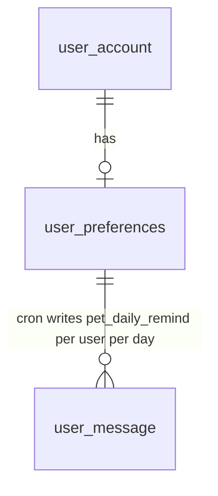

# 用户设置 — 数据库与接口设计

> **文档类型**：数据库 + API 设计规划（Schema v5）  
> **文档版本**：v0.2.0  
> **更新日期**：2026-05-29  
> **状态**：**已确认并实现**（Schema v5：`npm run migrate:v5`；API §5.18）  
> **依据**：[项目开发说明-小程序前端.md](../pet-app/docs/项目开发说明-小程序前端.md) §4.13a 设置页说明  
> **关联现有表**：`user_account`（`user_id`）、`user_message`（`pet_daily_remind` 定时提醒）

---

## 1. 设计目标与原则

### 1.1 业务目标

| 目标 | 说明 |
|------|------|
| 跨设备同步 | 将设置页中当前仅存于本地的偏好（`zzp_user_preferences`）持久化到服务端 |
| 支撑定时提醒 | 服务端按用户配置的提醒时间，写入 `pet_daily_remind` 类站内信 |
| 与资料解耦 | 设置项与用户资料分表存储，职责清晰 |
| 前端最小改动 | API 字段与 `services/settings.js` 本地结构映射，服务层做 camelCase ↔ snake_case 转换 |

### 1.2 设置页功能与后端边界

| 设置页功能 | 后端方案 |
|------------|----------|
| 每日记录提醒开关 | `user_preferences.pet_daily_reminder_enabled` |
| 提醒时间（默认 20:00） | `user_preferences.pet_reminder_time`（`VARCHAR(5)`，`HH:mm`） |
| 收货地址管理 | 沿用 `GET /addresses` |
| 消息通知 | 微信 `openSetting`，不落库 |
| 清除缓存 | 客户端行为；偏好可经 `GET /user/preferences` 恢复 |
| 用户协议 / 隐私 / 关于我们 | 沿用 `GET /cms/pages/{type}` |
| 账户登出 | 沿用 `POST /auth/logout` |

---

## 2. 实体关系



---

## 3. 数据表设计

### 3.1 `user_preferences` — 用户偏好 / 设置

| 字段 | 类型 | 约束 | 说明 |
|------|------|------|------|
| `preference_id` | BIGINT | PK, AI | 主键 |
| `user_id` | BIGINT | NOT NULL, UK, FK→`user_account` | 用户 ID |
| `pet_daily_reminder_enabled` | TINYINT | NOT NULL, DEFAULT 0 | `0`-关闭 `1`-开启 |
| `pet_reminder_time` | VARCHAR(5) | NOT NULL, DEFAULT `'20:00'` | 每日提醒时刻 `HH:mm`（分钟粒度；不用 MySQL `TIME`） |
| `extra_json` | TEXT | NULL | 扩展偏好 JSON |
| `create_time` | DATETIME | NOT NULL | 创建时间 |
| `update_time` | DATETIME | NULL | 更新时间（登录合并时与本地 `updated_at` 比较） |

**索引**：`uk_user_id`；`idx_reminder_schedule` (`pet_daily_reminder_enabled`, `pet_reminder_time`)

**业务规则**

1. **懒创建**：`GET` / `PUT /user/preferences` 时无记录则插入默认行（提醒关闭、`20:00`）。  
2. **部分更新**：`PUT` 仅更新请求体中出现的字段。  
3. **关闭提醒**：仅置 `pet_daily_reminder_enabled = 0`，保留 `pet_reminder_time`。  
4. **提醒不校验是否已记录**：即使用户当日已填写宠物记录，定时任务仍发送提醒。

---

## 4. 定时提醒（内部）

脚本：`npm run cron:pet-daily-remind`（`scripts/cron-pet-daily-remind.js`）

| 规则 | 说明 |
|------|------|
| 粒度 | **每用户每日合并一条** `pet_daily_remind` 站内信 |
| 幂等键 | `pet_daily_remind:user:{user_id}:{yyyyMMdd}` |
| 跳转 | `action_path = pages/pet/pet` |
| 时区 | 默认 `Asia/Shanghai`；联调可用 `REMIND_AT=HH:mm` 覆盖 |
| 部署 | 由运维配置 cron（如每分钟 `* * * * *`）；**未内嵌于 `server.js`** |

---

## 5. REST API 设计

**前缀**：`/api/v1` · **鉴权**：Bearer · **字段**：snake_case

| 方法 | 路径 | 说明 |
|------|------|------|
| GET | `/user/preferences` | 获取设置（懒创建默认行） |
| PUT | `/user/preferences` | 部分更新 |

**业务错误码**：`40020` 非法提醒时间 · `40021` 非法开关取值

### 5.1 GET `/user/preferences` 响应示例

```json
{
  "code": 0,
  "message": "success",
  "data": {
    "preference_id": 501,
    "user_id": 10001,
    "pet_daily_reminder_enabled": 0,
    "pet_reminder_time": "20:00",
    "extra": null,
    "create_time": "2026-05-29 10:00:00",
    "update_time": null
  }
}
```

### 5.2 PUT `/user/preferences` 请求体

```json
{
  "pet_daily_reminder_enabled": 1,
  "pet_reminder_time": "20:30"
}
```

---

## 6. 前端对接

### 6.1 字段映射

| 前端（camelCase） | API（snake_case） |
|-------------------|-------------------|
| `petDailyReminder` | `pet_daily_reminder_enabled`（`0`/`1` ↔ boolean） |
| `petReminderTime` | `pet_reminder_time` |

### 6.2 登录后合并策略（D7）

比较服务端 `update_time` 与本地 `preferencesUpdatedAt`（毫秒时间戳，由前端维护）：

- 服务端更新 → 覆盖本地 `zzp_user_preferences`
- 本地更新 → `PUT /user/preferences` 上传
- 相等或仅一方存在 → 以有数据的一方为准

---

## 7. 已确认事项（2026-05-29）

| # | 决策 |
|---|------|
| D1 | 表名 **`user_preferences`** |
| D2 | API 路径 **`GET/PUT /user/preferences`** |
| D3 | 提醒时刻 **`VARCHAR(5)` 存 `HH:mm`** |
| D4 | **懒创建**默认行 |
| D5 | 定时提醒 **每用户每日合并一条**；**不检查**是否已填写当日记录 |
| D6 | 定时任务脚本已实现；**生产 cron 另行配置** |
| D7 | 登录合并：**按 `update_time` 取较新** |

---

## 8. 修订记录

| 版本 | 日期 | 说明 |
|------|------|------|
| v0.2.0 | 2026-05-29 | 产品确认 D1–D7；Schema v5 + 2 REST API + cron 脚本已实现 |
| v0.1.0 | 2026-05-29 | 初稿 |