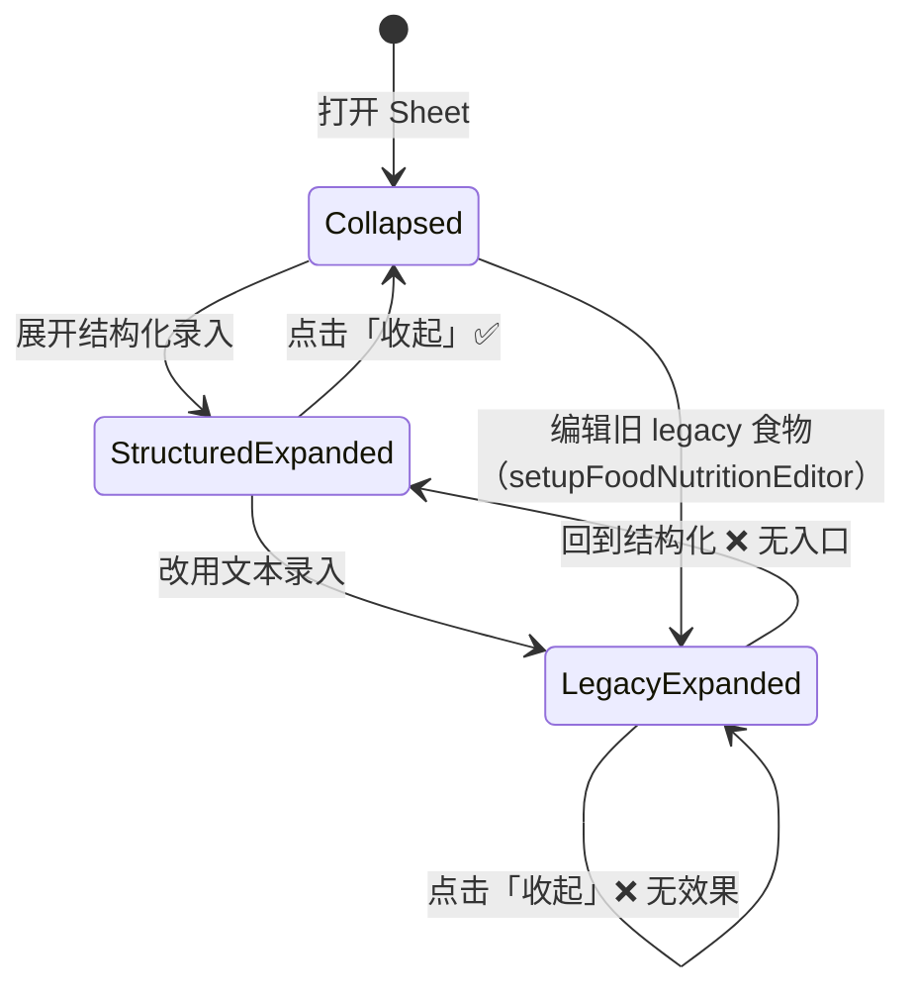

# 问题分析（临时文档）

> **文档性质**：UI/交互缺陷根因分析与修复建议  
> **创建日期**：2026-06-20  
> **涉及模块**：记一餐 · 添加/编辑食物 Sheet（`src/pages/pet/meal-record.vue`）  
> **关联组件**：`src/components/food-nutrition-form/FoodNutritionForm.vue`  
> **关联常量/工具**：`src/constants/nutrition.js` · `src/utils/nutrition.js`  
> **状态**：已修复（v0.9.102 · MP-N13）

---

## 1. 问题概述

在「添加食物」底部 Sheet 中，营养参考区存在两类可复现的交互/视觉问题：

| # | 现象摘要 | 复现路径（简要） | 优先级建议 |
|---|----------|------------------|------------|
| **P1** | 切换「鲜基 / 干物质基」时，上方「录入方式」标签，以及更上方的「食物名称」「克重」输入框 placeholder，出现可见的竖直方向微位移 | 展开结构化录入 → 在「基准」chips 间切换 | P2 · 视觉稳定性 |
| **P2** | 结构化录入 ↔ 文本录入切换后无法回到结构化；「收起」在文本模式下不可点击/无效 | 展开结构化录入 → 改用文本录入 → 尝试收起或回到结构化 | **P0 · 功能阻断** |

---

## 2. 现状与代码结构

### 2.1 Sheet 布局（`meal-record.vue`）

```
overlay（fixed · align-items: flex-end）     ← Sheet 自底部向上生长
└─ sheet（max-height: 85vh · flex column）
   ├─ sheet-head
   ├─ sheet-body（overflow-y: auto）         ← 表单主体可滚动
   │  ├─ 食物名称 input
   │  ├─ 克重 input
   │  └─ 营养参考 form-group
   │     ├─ nutrition-head（「营养参考」+ 「收起/编辑营养」）
   │     ├─ textarea（legacy 文本模式）
   │     ├─ FoodNutritionForm（结构化模式）
   │     ├─ 「展开结构化录入」链接
   │     └─ 「改用文本录入」链接
   └─ sheet-foot
```

### 2.2 营养编辑器状态变量

| 变量 | 含义 |
|------|------|
| `foodNutritionExpanded` | 营养区是否展开（显示 textarea 或结构化表单） |
| `foodNutritionLegacyMode` | 是否使用 legacy 文本录入（textarea） |
| `foodNutritionDraft` | 结构化 draft 对象（`v-model` 绑定 `FoodNutritionForm`） |

计算属性 `useLegacyNutritionEditor` 等价于 `foodNutritionLegacyMode`。

### 2.3 结构化表单基准切换（`FoodNutritionForm.vue`）

- 「基准」chip 切换调用 `setBasis()` → `emitDraft()` → 父组件 `onNutritionDraftChange()`。
- 当 `draft.basis === 'dry_matter'` 时，**条件渲染**一条提示文案：

  > 干物质基录入须填写水分；系统将换算为鲜基存储。

- 激活 chip 使用 `font-weight: 600`，未激活为默认字重。

---

## 3. 问题 P1：切换基准时上方文案/placeholder 微位移

### 3.1 现象描述

用户在结构化营养表单内切换「鲜基 ↔ 干物质基」时，不仅营养区内部有变化，**位于更上方的**「录入方式」标签，以及 Sheet 顶部的「食物名称」「克重」placeholder 也会伴随产生 1～数 rpx 量级的竖直跳动。该现象在开发者工具与真机上均可感知，属于 layout shift 而非数据错误。

### 3.2 根因分析

经代码走查，该问题由 **多个因素叠加** 导致，按影响程度排序如下。

#### 根因 A（主因）：Bottom Sheet 随内容增高而整体上移

```scss
// meal-record.vue
.overlay {
  align-items: flex-end;   // Sheet 锚定在视口底部
}
.sheet {
  max-height: 85vh;        // 上限固定，但实际高度随内容变化
}
```

Sheet 采用 **自底向上对齐**（`flex-end`），且 **实际高度由内容撑开**（未设置固定 `height` / `min-height`）。当切换到「干物质基」时，`FoodNutritionForm` 通过 `v-if` **插入** 一行提示块（`.fnf-hint`），Sheet 内容总高度增加 → 整个 Sheet 向上「长高」→ Sheet 内所有元素的 **视口坐标整体上移**。

因此，即使用户尚未滚动 `sheet-body`，位于顶部的「食物名称」「克重」输入框也会随 Sheet 顶边上移而产生 **可见位移**。这是典型的 **bottom-aligned dynamic height panel** 布局问题，而非输入框本身逻辑错误。

#### 根因 B（次因）：条件 DOM 插入引起 scroll 容器重排

`sheet-body` 使用 `overflow-y: auto`。干物质提示的出现/消失改变了可滚动区域高度，触发 scroll 容器重新计算布局。在部分小程序运行时中，scroll 容器重排会连带引起 **原生 `input` 组件 placeholder 重绘偏移**（已知平台层 compositing 问题，表现即为 placeholder 相对边框有 1～2px 竖直抖动）。

#### 根因 C（次因）：chip 激活态字重变化

```scss
.fnf-chip.active {
  font-weight: 600;  // 未激活为默认 400
}
```

「干物质基」比「鲜基」更长，激活态加粗后 chip 行 **占位宽度/换行** 可能微变，导致「录入方式」行下方内容起始位置变化。该因素主要影响营养区内部，但在 Sheet 整体上移时会被用户一并感知。

#### 根因 D（轻微）：基准切换触发父组件全量更新

`setBasis()` → `emitDraft()` → 父组件 `onNutritionDraftChange()` 会更新 `foodForm.nutrition_json` / `foodForm.nutrition`。即使 draft 尚无有效数值，仍会触发父级 re-render，原生 `input`（`v-model="foodForm.name"` 等）可能被销毁重建或重绘，加剧 placeholder 抖动。

**关联代码：**

```559:604:src/pages/pet/meal-record.vue
toggleNutritionEditor() { ... }
openStructuredNutritionEditor() { ... }
switchToLegacyNutritionEditor() { ... }
onNutritionDraftChange(draft) { ... }
```

```181:183:src/components/food-nutrition-form/FoodNutritionForm.vue
setBasis(basis) {
  this.draft.basis = basis
  this.emitDraft()
}
```

### 3.3 修复建议（P1）

| 方案 | 做法 | 优点 | 注意 |
|------|------|------|------|
| **R1-A（推荐）** | Sheet 使用 **固定高度**（如 `height: 85vh` 或 `min-height` + `flex: 1` 的 `sheet-body`），内容增高只在 `sheet-body` 内滚动，**不改变 Sheet 外框高度** | 从布局层面消除顶部位移 | 需验证小屏设备 footer 不被遮挡 |
| **R1-B（推荐，低成本）** | 干物质提示块 **始终占位**：`v-show` 替代 `v-if`，或预留 `min-height` 容器 | 切换基准时 DOM 高度不变 | 鲜基模式下会有空白提示区，可用透明占位 + 绝对定位文案 |
| **R1-C** | chip 激活态避免字重变化：改用边框/背景/描边区分选中态，**保持 font-weight 一致** | 减少 chip 行 reflow | 需微调视觉设计 |
| **R1-D** | `setBasis` 时若 draft 无有效营养值，**不向上 emit** 或 debounce `onNutritionDraftChange` | 减少父级 re-render | 须保证最终保存时 basis 仍写入 `nutrition_json` |
| **R1-E** | 输入框 placeholder 对齐：`line-height` 与 `height` 相等在部分端上不稳定，可改为 **flex 垂直居中** 或仅依赖 `padding` | 缓解原生 input 抖动 | 属平台兼容层优化 |

**建议实施顺序**：R1-A + R1-B（布局稳定）→ R1-C（chip 稳定）→ 视情况加 R1-D / R1-E。

---

## 4. 问题 P2：结构化 ↔ 文本录入切换后无法回退、「收起」失效

### 4.1 现象描述

1. 点击「展开结构化录入」→ 正常进入 `FoodNutritionForm`。
2. 点击「改用文本录入」→ 切换为 textarea 文本模式。
3. 此后：
   - 页面上 **不再出现**「展开结构化录入」或等价的「改回结构化录入」入口；
   - 右上角「收起」文案仍显示，但 **点击无反应**；
   - 无法像结构化模式下那样收起营养编辑区。

该问题属于 **状态机设计缺陷**，会导致用户误以为自己进入了不可退出的录入模式。

### 4.2 根因分析（已定位）

#### 根因 A（主因）：`toggleNutritionEditor` 在 legacy 模式下直接 return

```559:561:src/pages/pet/meal-record.vue
toggleNutritionEditor() {
  if (this.useLegacyNutritionEditor) return   // ← 文本模式下收起被硬禁用
  this.foodNutritionExpanded = !this.foodNutritionExpanded
```

进入文本模式后 `foodNutritionLegacyMode = true`，「收起」按钮绑定的 `toggleNutritionEditor` **永远 early return**，用户看到「收起」却无法执行。

#### 根因 B（主因）：模板条件未覆盖 legacy 展开态的反向入口

当前链接显示条件：

```237:250:src/pages/pet/meal-record.vue
<!-- 仅非 legacy 且未展开 -->
v-if="!useLegacyNutritionEditor && !foodNutritionExpanded"  → 「展开结构化录入」

<!-- 仅非 legacy 且已展开 -->
v-if="!useLegacyNutritionEditor && foodNutritionExpanded"   → 「改用文本录入」
```

当 `useLegacyNutritionEditor === true && foodNutritionExpanded === true`（`switchToLegacyNutritionEditor` 刻意设成此组合）时，**两个链接均不满足 `v-if`**，UI 上没有任何回到结构化的操作。

#### 根因 C：`switchToLegacyNutritionEditor` 销毁 draft 且无备份

```579:585:src/pages/pet/meal-record.vue
switchToLegacyNutritionEditor() {
  this.foodNutritionLegacyMode = true
  this.foodNutritionExpanded = true
  this.foodForm.nutrition_json = null
  this.foodForm.nutrition_source = 'legacy_text'
  this.foodNutritionDraft = null              // ← 结构化 draft 被清空
}
```

即使后续补上入口，若无 draft 备份，用户已填的结构化数据也会丢失（若曾在 `onNutritionDraftChange` 中写入 `foodForm.nutrition` 展示串，文本框可能仍有派生文本，但 `nutrition_json` 已被置 null）。

#### 根因 D：toggle 文案与行为不一致

```211:213:src/pages/pet/meal-record.vue
{{ foodNutritionExpanded ? '收起' : (useLegacyNutritionEditor ? '文本录入' : '编辑营养') }}
```

legacy 展开态下仍显示「收起」，但逻辑上收起被禁用 → **文案承诺与行为不一致**，构成 UX 缺陷。

### 4.3 状态机现状（问题态）



### 4.4 修复建议（P2）

#### 方案 R2-A（推荐）：补齐 legacy 展开态的 UI 与行为

1. **允许 legacy 模式下收起**  
   修改 `toggleNutritionEditor`：legacy 模式下也应切换 `foodNutritionExpanded`，而非 `return`。

   ```javascript
   toggleNutritionEditor() {
     this.foodNutritionExpanded = !this.foodNutritionExpanded
     if (this.foodNutritionExpanded && !this.useLegacyNutritionEditor && !this.foodNutritionDraft) {
       this.foodNutritionDraft = nutritionJsonToDraft(...)
     }
   }
   ```

2. **新增对称入口「改回结构化录入」**  
   在 `useLegacyNutritionEditor && foodNutritionExpanded` 时显示，调用例如 `switchToStructuredNutritionEditor()`：
   - `foodNutritionLegacyMode = false`
   - 从 `foodNutritionDraft` 备份或 `foodForm.nutrition_json` 恢复 draft
   - 若仅有 legacy 文本、无 JSON，可尝试 parse 或给出空 draft

3. **修正 toggle 文案**  
   legacy 收起态可显示「文本录入」；legacy 展开态显示「收起」且必须可点。

#### 方案 R2-B（推荐）：切换至 legacy 前保留 draft 快照

在 `switchToLegacyNutritionEditor` 中：

```javascript
this.foodNutritionDraftSnapshot = cloneDraft(this.foodNutritionDraft)
// 或不清空 nutrition_json，仅切换 UI 模式
```

回切结构化时优先恢复快照，避免用户误触导致数据丢失。

#### 方案 R2-C（中长期）：用单一枚举状态替代双布尔

| 状态 | 含义 | 渲染 |
|------|------|------|
| `collapsed` | 收起 | 摘要 / 空提示 + 「展开结构化录入」 |
| `structured` | 结构化展开 | `FoodNutritionForm` + 「改用文本录入」 |
| `legacy` | 文本展开 | textarea + 「改回结构化录入」 |

双布尔（`expanded` × `legacyMode`）共 4 种组合，但 UI 只设计了 3 种合法路径，第 4 种（legacy + expanded 且无回退）即为当前 bug。枚举状态机可 **从类型层面禁止非法组合**。

#### 方案 R2-D：单测/regression 用例

建议在 `tests/` 中补充状态转换断言（可抽离纯函数）：

- 结构化展开 → legacy → 改回结构化 → draft 不丢
- legacy 展开 → 收起 → 再展开仍为 legacy textarea
- 任意态「收起」均可收敛到 `collapsed`

### 4.5 建议实施顺序（P2）

1. **P0 热修**：R2-A（1）（2）— 恢复「收起」与「改回结构化」  
2. **P1**：R2-B — 切换不丢 draft  
3. **P2**：R2-C + R2-D — 状态机重构与回归测试  

---

## 5. 验收标准（修复后）

### P1 · 布局稳定

- [ ] 在结构化表单内连续切换「鲜基 ↔ 干物质基」≥ 10 次，「食物名称」「克重」placeholder 与「录入方式」标签 **无明显竖直跳动**（或以录屏对比，位移 < 1px）。
- [ ] Sheet 顶边（标题栏下沿）在切换基准时 **保持视口位置不变**。
- [ ] 小屏（如 iPhone SE 类高度）下 Sheet 仍完整可用，footer 按钮不被遮挡。

### P2 · 录入模式互切

- [ ] 「展开结构化录入」→「改用文本录入」→「改回结构化录入」全路径可走通。
- [ ] 文本模式下点击「收起」可收起营养区；再次展开仍进入文本模式（若上次为 legacy）。
- [ ] 结构化模式下「收起」行为与修复前一致。
- [ ] 在结构化表单中已填部分字段后切到文本再切回，**已填结构化数据不丢失**（或明确提示将丢失 — 不推荐）。
- [ ] 保存后 `nutrition_source` / `nutrition_json` 与所选模式一致（`manual` vs `legacy_text`）。

---

## 6. 涉及文件清单

| 文件 | 变更类型（预期） |
|------|------------------|
| `src/pages/pet/meal-record.vue` | Sheet 布局 CSS；营养编辑器状态机；模板链接与 `toggleNutritionEditor` |
| `src/components/food-nutrition-form/FoodNutritionForm.vue` | 干物质提示占位；chip 样式；可选减少无效 emit |
| `tests/mealTemplateNutrition.test.js` 或新建 UI 状态单测 | 状态转换 regression（可选） |

---

## 7. 参考

- 产品说明：`docs/项目开发说明-小程序前端.md` §2.31（结构化营养 · legacy 互切）
- 需求契约：`./需求分析-商品规格营养信息录入-临时.md`
- 实现入口：`meal-record.vue` L208–250 · L537–604；`FoodNutritionForm.vue` L18–46 · L181–183

---

## 8. 修订记录

| 版本 | 日期 | 说明 |
|------|------|------|
| v0.1 | 2026-06-20 | 初稿：P1 布局 shift 根因 + P2 状态机缺陷分析与修复建议 |
| v0.2 | 2026-06-20 | MP-N13 落地：`meal-record.vue` · `FoodNutritionForm.vue` · §2.31 v0.9.102 |