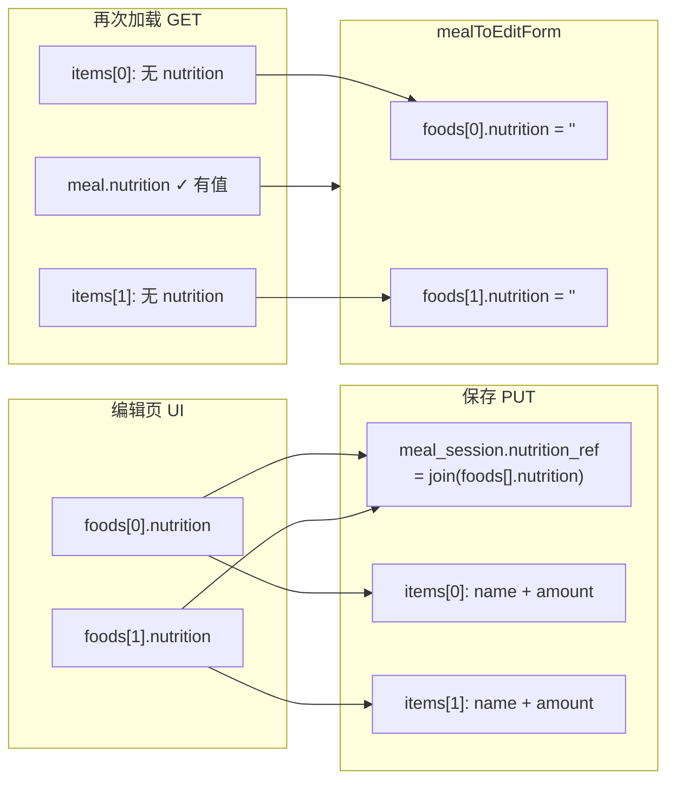
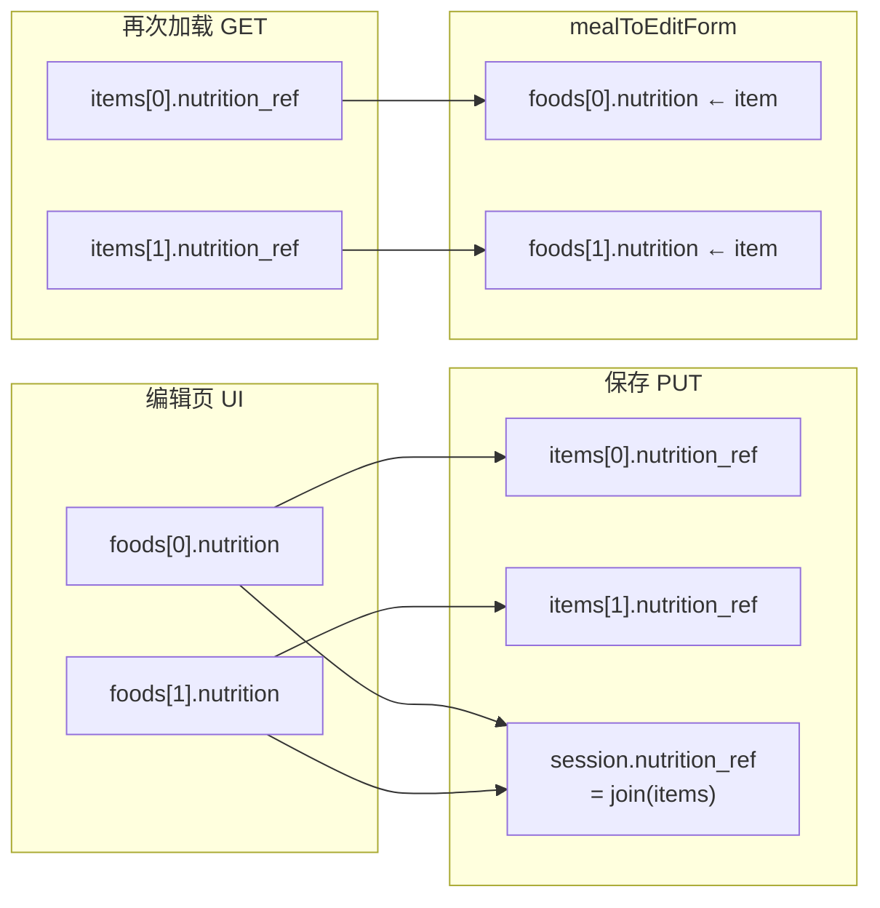

# 需求分析（临时文档）

> **文档性质**：产品 / 技术可行性评估与修复方案  
> **创建日期**：2026-06-15  
> **涉及模块**：商品详情页（`src/pages/product/detail.vue`）、记一餐 / 编辑餐食页（`src/pages/pet/meal-record.vue`）、宠物服务层（`src/services/pet.js`）、餐食模板服务（`src/services/meal-template.js`）  
> **状态**：R3 方案 B **前后端已落地**（v0.9.87 / BE v0.9.42）· R1/R2 已落地

---

## 1. 需求概述

| # | 需求摘要 | 类型 | 优先级建议 |
|---|----------|------|------------|
| R1 | 商品详情页右上角分享按钮被微信原生胶囊 / 悬浮控件遮挡，需移至左下角底栏，与客服、购物车并列 | UI / 交互 | P1 |
| R2 | 记一餐 / 编辑餐食页「添加 / 编辑食物」弹层中，营养参考 placeholder 需改为宠物粮五项指标示例 | 文案 | P2 |
| R3 | 营养参考可在弹层内填写并保存，但再次进入编辑餐食页时，各食物项营养参考为空 | **数据持久化缺陷** | **P0** |

---

## 2. 逐项分析

### 2.1 R1：商品详情页分享按钮位置

#### 2.1.1 现象

用户在微信开发者工具或真机打开商品详情页时，右上角自定义「分享」圆形按钮与微信客户端原生 **胶囊按钮（菜单 + 转发入口）** 区域重叠，导致分享按钮难以点击或被完全遮挡。

#### 2.1.2 根因

当前实现将分享按钮放在 **沉浸式顶栏** `float-nav` 内，与返回按钮左右分布：

```7:22:src/pages/product/detail.vue
      <view class="float-nav" :style="{ paddingTop: statusBarHeight + 'px' }">
        <view class="float-nav-inner">
          <view class="float-btn" @tap="goBack">
            <text>‹</text>
          </view>
          <!-- #ifdef MP-WEIXIN -->
          <button class="float-btn float-btn--plain" open-type="share" hover-class="none">
            <text class="share-icon">⎙</text>
          </button>
          <!-- #endif -->
```

顶栏采用 `position: fixed; top: 0; justify-content: space-between`，右侧按钮天然落在 **系统保留的胶囊安全区**。微信小程序 **不允许** 开发者自定义控件覆盖或挤占胶囊区域；该区域由客户端渲染，z-index 与 hit area 均高于普通页面元素。

这是 **平台约束 + 布局选择** 共同导致的问题，而非单纯 z-index 或样式 bug。

#### 2.1.3 用户期望的可行性

**完全可行，且改动成本低。**

同项目内 **资讯详情页**（`src/pages/news/detail.vue`）已采用「底栏 icon + `open-type="share"`」模式，与产品期望一致，可直接作为参考实现：

```122:127:src/pages/news/detail.vue
      <view class="action-bar">
        <!-- #ifdef MP-WEIXIN -->
        <button class="action-icon-btn action-icon-btn--plain" open-type="share" hover-class="none">
          <text class="action-emoji">↗</text>
          <text class="action-label">分享</text>
        </button>
```

#### 2.1.4 建议方案

| 步骤 | 内容 |
|------|------|
| 1 | 从 `float-nav` 移除分享按钮，顶栏仅保留「返回」 |
| 2 | 在底部 `action-bar` 中，于「客服」「购物车」之前或之后新增「分享」icon 按钮 |
| 3 | 微信小程序端使用 `button` + `open-type="share"`；非微信端保留 `@tap="onShare"` |
| 4 | 复用资讯详情页 `.action-icon-btn--plain` 样式，去除微信 `button` 默认边框 |
| 5 | 评估底栏宽度：当前已有客服、购物车、数量步进器、「加入购物车」主按钮；新增分享后需确认小屏（如 iPhone SE）不换行，必要时微调 gap 或 icon 区 padding |

**注意事项：**

- 微信 `open-type="share"` 必须绑定在 `button` 组件上，不能放在普通 `view`。
- 底栏分享与右上角胶囊内「转发给朋友」功能重复，但 **不冲突**；用户习惯在电商详情页底部找分享入口，符合行业惯例。
- 无需后端或接口变更。

**预估工作量**：前端 0.5 人日（含微信开发者工具走查）。

---

### 2.2 R2：营养参考 placeholder 文案

#### 2.2.1 现象

当前 placeholder 为通用人类膳食表述：

```206:212:src/pages/pet/meal-record.vue
            <text class="form-label">营养参考<text class="form-opt">（选填）</text></text>
            <textarea
              v-model="foodForm.nutrition"
              class="form-input form-textarea"
              maxlength="120"
              placeholder="如：蛋白质 30g · 脂肪 8g · 纤维 2g"
```

与宠物粮 / 宠物鲜食实际标注习惯（**粗蛋白、粗脂肪、粗纤维、粗灰质、水分**）不一致，易误导用户填写格式。

#### 2.2.2 根因

页面与原型（`prototype/pet-meal-record-prototype.html`）沿用早期通用营养示例，未按 **宠物饲料标签规范**（GB/T、AAFCO 等常见五项）对齐。

#### 2.2.3 用户期望的可行性

**完全可行，纯文案变更。**

建议 placeholder：

```text
如：粗蛋白 65.6g · 粗脂肪 0.8g · 粗纤维 1.6g · 粗灰质 6.4g · 水分 5.2g
```

#### 2.2.4 建议方案

| 范围 | 动作 |
|------|------|
| `meal-record.vue` | 更新 textarea `placeholder` |
| `prototype/pet-meal-record-prototype.html` | 同步，避免设计与实现漂移 |
| Mock 数据（可选） | `constants/pet.js`、`meal-template.js` 中示例 `nutrition` / `nutrition_ref` 可逐步改为五项格式，非阻塞 |

**说明：** 当前字段为 **自由文本**（`maxlength="120"`），placeholder 仅作引导，不强制校验格式。若未来需结构化录入或自动汇总，需另开需求（见 R3 长期方案）。

**预估工作量**：0.1 人日。

---

### 2.3 R3：营养参考保存后再次编辑为空（核心缺陷）

#### 2.3.1 现象

1. 在「添加食物 / 编辑食物」弹层中填写营养参考 → 确认 → 列表中 **可正常显示**；
2. 点击「保存餐食记录 / 保存修改」→ 退出页面；
3. 再次进入「编辑餐食」→ 食物清单列表显示「暂无营养参考」；打开编辑弹层，营养参考输入框 **为空**。

#### 2.3.2 根因（已定位）

问题本质是 **UI 数据模型与持久化模型不一致**，并在「读回编辑表单」环节存在 **硬编码丢字段**。

**（1）编辑页 UI 模型：按「食物项」存储营养**

```245:245:src/pages/pet/meal-record.vue
const EMPTY_FOOD = { name: '', weight: '', nutrition: '' }
```

每个 `form.foods[]` 元素独立持有 `nutrition`，列表与弹层均绑定该字段。

**（2）持久化模型：营养仅存在于「餐食 session」层级**

保存时，`buildMealSessionFromForm` 将所有食物的营养字符串 **拼接** 后写入 session 的 `nutrition_ref`，**不会** 写入各 `items[]`：

```803:817:src/services/pet.js
function buildMealSessionFromForm(form, sessionId = null) {
  const nutrition = (form.foods || [])
    .map((f) => f.nutrition?.trim())
    .filter(Boolean)
    .join(' · ')
  const payload = {
    session_slot: form.slot,
    session_time: form.time,
    post_meal_status: form.status?.trim() || '',
    nutrition_ref: nutrition,
    remark: '',
    items: (form.foods || []).map((f) => ({
      food_name: f.name,
      amount: `${f.weight}g`,
    })),
  }
```

后端 API 与文档中的 `items` / `meal_items` 结构同样仅含 `food_name`、`amount`（见 `docs/项目开发说明-后端.md` §5.15、`./餐食模板存模板-50001后端排查说明.md` 示例）。`pet_meal_item` 表 **当前无** 单项 `nutrition_ref` 字段的读写契约。

**（3）读回编辑表单：强制清空每项 nutrition**

```125:129:src/services/pet.js
    foods: (meal.items || []).map((item) => ({
      name: item.name || '',
      weight: parseMealAmountGrams(item.amount),
      nutrition: '',
    })),
```

`mealToEditForm` 在映射时 **写死 `nutrition: ''`**，未从 API 响应或 session 级 `meal.nutrition` 回填。

**（4）标准化层同样丢弃 item 级营养**

```65:70:src/services/pet.js
function normalizeMealItem(raw) {
  if (!raw) return null
  return {
    name: raw.food_name ?? raw.foodName ?? raw.name ?? '食物',
    amount: raw.amount ?? raw.weight ?? '',
  }
}
```

**（5）同构问题存在于餐食模板**

`src/services/meal-template.js` 中 `templateToForm` 同样在映射模板项时将 `nutrition` 置空；模板快照 `buildTemplateSnapshotFromForm` 与餐食保存逻辑相同——营养汇总到 session 级 `nutrition_ref`，items 不含单项营养。

#### 2.3.3 数据流示意



因此：

- **同一会话内**（未离开编辑页）：数据仍在内存 `form.foods` 中，显示正常；
- **持久化后再进入**：item 级营养丢失；session 级 `nutrition_ref` 可能 **已在服务端保存**，但编辑页 **未使用** 该字段回填到各食物项。

宠物 Tab 餐食详情弹窗展示的是 **session 级** `activeMeal.nutrition`（`src/pages/pet/pet.vue`），与编辑页 **per-item** 展示不一致，进一步造成「详情里有、编辑里无」的体验分裂（多食物时详情为拼接串，无法对应到具体食物）。

#### 2.3.4 用户期望的可行性

| 期望 | 可行性 | 说明 |
|------|--------|------|
| 每个食物独立保存、编辑、展示营养参考 | **可行，需前后端协同** | 需在 `pet_meal_item`（及模板项表）增加字段，并扩展 API |
| 仅修复「再次编辑为空」且多为单食物 | **可行，前端可部分缓解** | 见下方短期方案 |
| 多食物各自不同营养参考且可精确回显 | **短期方案不可靠** | session 级拼接字符串无法无损拆分 |

#### 2.3.5 方案对比

##### 方案 A：前端短期补丁（仅缓解，不推荐作为终态）

**思路：** 在 `mealToEditForm` 中，当 `meal.items.length === 1` 且 `meal.nutrition` 非空时，将该字符串赋给唯一食物项的 `nutrition`。

| 优点 | 缺点 |
|------|------|
| 不改后端，上线快 | 多食物场景仍无法回显；历史数据若 session 营养为拼接串，无法分配 |
| 覆盖最常见「一餐一项食物」 | 与「每项独立编辑」产品语义仍不一致 |
| | 模板应用、Mock 路径需同样补丁 |

**适用：** 紧急 hotfix 或后端排期受阻时的 **临时** 措施。

##### 方案 B：扩展 item 级持久化（推荐 · 正解）

**思路：** 在数据模型与 API 中为每个 meal item 增加 `nutrition_ref`（或 `nutrition`）字段。

| 层级 | 变更 |
|------|------|
| 数据库 | `pet_meal_item.nutrition_ref` VARCHAR；`pet_meal_template_item` 同步 |
| 后端 GET | `items[]` 返回 `nutrition_ref` |
| 后端 PUT | `items[]` 接受并持久化 `nutrition_ref` |
| 前端 `normalizeMealItem` | 读取 `nutrition_ref` → `nutrition` |
| 前端 `buildMealSessionFromForm` | 每项写入 `nutrition_ref`；session 级 `nutrition_ref` 可保留为 **汇总展示用**（join）或改为冗余字段由后端计算 |
| 前端 `mealToEditForm` | 从 item 映射 `nutrition`，删除硬编码 `''` |
| 餐食模板 | `buildTemplateSnapshotFromForm` / `templateToForm` 同步 |
| Mock | `constants/pet.js` mock items 可带 `nutrition_ref` |

**session 级 `nutrition_ref` 策略建议：**

- **保留并自动汇总**：保存时 `session.nutrition_ref = foods.map(f => f.nutrition).filter(Boolean).join(' · ')`，与现网宠物 Tab 详情弹窗兼容；
- item 级为 **权威数据源**，编辑页只读写 item；
- 详情弹窗可继续展示 session 汇总，或改为按 item 分行展示（产品可选）。

| 优点 | 缺点 |
|------|------|
| 语义清晰，支持多食物各自营养 | 需后端 migration + 联调 |
| 编辑 / 详情 / 模板行为一致 | 旧数据 item 营养为空，需接受或做一次性迁移（若历史仅有 session 级且仅一项，可迁移脚本填充） |

**预估工作量：** 后端 1~2 人日 + 前端 1 人日 + 联调 0.5 人日。

##### 方案 C：前端本地扩展存储（不推荐）

将 item 营养 JSON 塞进 `remark` 或自定义分隔符写入 `nutrition_ref`，纯前端解析。

| 优点 | 缺点 |
|------|------|
| 不依赖后端表结构 | 污染字段语义；模板 / 家庭组 / 多端同步风险高；难维护 |

**结论：** 仅作原型验证，不宜生产。

#### 2.3.6 实施决策

**R3 采用方案 B（item 级 `nutrition_ref` 全链路持久化）。** 方案 A 不再作为备选。

```
阶段 1（P0 · R3 方案 B）
  → 后端 Schema + API 扩展（§8）
  → 小程序前端读写对齐（§9）
  → 联调验收（§10）

阶段 2（P2 · 体验）
  → R2 placeholder 文案
  → 可选：宠物 Tab 餐食详情按 item 展示营养（§7.4）

并行（P1）
  → R1 商品详情分享按钮下移
```

具体接口契约、数据迁移、前后端任务拆分见 **§7–§10**。

---

## 3. 测试要点（实施后）

### R1

- [ ] 微信开发者工具 + 真机：商品详情顶栏仅显示返回，无右侧分享
- [ ] 底栏分享按钮可点击，触发转发卡片（标题、路径、图片符合 `onShareAppMessage` 配置）
- [ ] 底栏布局在小屏设备无溢出、无遮挡安全区
- [ ] H5 / 非微信端分享 fallback 仍可用

### R2

- [ ] 添加 / 编辑食物弹层 placeholder 为五项指标示例
- [ ] 用户仍可自由输入任意文本，不受 placeholder 限制

### R3

- [ ] 单食物：填写营养 → 保存 → 退出 → 再编辑，弹层与列表均回显
- [ ] 多食物：各项不同营养 → 保存 → 再编辑，**逐项** 回显正确（方案 B）
- [ ] 宠物 Tab 餐食详情：营养信息与保存内容一致
- [ ] 存为餐食模板 → 从模板应用 → 编辑页营养回显
- [ ] Mock 模式与真实 API 模式行为一致

---

## 4. 风险与依赖

| 项 | 说明 |
|----|------|
| 后端排期 | R3 方案 B 依赖 §8 BE-R3-01~11；前端 FE-R3-03 起需 Staging 接口 |
| 历史数据 | BE-R3-02 仅回填「单 item + session 有营养」；多 item 历史餐食 item 营养仍为空（产品可接受） |
| 字段长度 | DB/API 256；前端 textarea 保持 `maxlength="120"`；超长以后端 40025 为准 |
| 整包 PUT 回归 | 未改动的 session 经 `mealToApiPayload` 写回时必须携带 item `nutrition_ref`（§9 FE-R3-04） |
| session 汇总来源 | 推荐后端 BE-R3-05 统一 join；若前端先行计算，联调时需对比 GET 一致性 |

---

## 5. 结论摘要

| 需求 | 根因 | 可行性 | 建议 |
|------|------|--------|------|
| R1 分享按钮遮挡 | 顶栏右侧与微信胶囊区冲突 | 高 | 移至底栏，对齐资讯详情页实现 |
| R2 placeholder | 文案未按宠物粮五项指标设计 | 高 | 直接改 placeholder，低成本 |
| R3 营养丢失 | item 级 UI 与 session 级 API 不匹配 + `mealToEditForm` 硬编码清空 | 高（需联调） | **已选方案 B**：item 级 `nutrition_ref` 全链路（§7–§10） |

---

## 7. R3 方案 B：具体实施方案

### 7.1 设计原则

| 原则 | 说明 |
|------|------|
| **item 为权威数据源** | 每个食物项独立保存 `nutrition_ref`；编辑页只读写 item，不再依赖 session 级字符串反解析 |
| **session 级保留冗余汇总** | `pet_meal_session.nutrition_ref` 继续存在，由 **写入方**（前端 PUT 或后端落库时）按 item 非空营养 `join(' · ')` 生成，供宠物 Tab 餐食详情弹窗等只读场景使用 |
| **向后兼容** | 请求体 item 省略 `nutrition_ref` 或传空串视为无营养；GET 对旧数据返回 `""` 或省略字段；不破坏现有 `food_name` / `amount` 契约 |
| **模板与餐食同构** | `pet_meal_template_item` 与 `pet_meal_item` 字段命名、长度、序列化规则一致 |
| **字段命名** | API JSON 使用 snake_case **`nutrition_ref`**（与现有 session 级字段一致）；小程序内部 UI 模型继续用 **`nutrition`**，在 service 层映射 |

### 7.2 数据模型变更

#### 7.2.1 表结构（建议 migration v19）

| 表 | 新增列 | 类型 | 默认 | 说明 |
|----|--------|------|------|------|
| `pet_meal_item` | `nutrition_ref` | `VARCHAR(256) NOT NULL` | `''` | 单项食物营养参考自由文本 |
| `pet_meal_template_item` | `nutrition_ref` | `VARCHAR(256) NOT NULL` | `''` | 与餐食 item 对齐 |

> 长度 256：覆盖前端 `maxlength="120"` 并留余量；与 session 表 `nutrition_ref` 列宽保持一致（若 session 已为 256 则对齐；若更长则统一升格）。

#### 7.2.2 历史数据迁移（一次性脚本，随 migration 或独立 `migrate:v19`）

| 场景 | 处理 |
|------|------|
| session 有 `nutrition_ref` 且 **仅 1 个 item**、item.`nutrition_ref` 为空 | 将 session 营养 **复制** 到该 item |
| session 有营养且 **多个 item** | item 保持空（无法无损拆分）；session 汇总保留 |
| 新写入 | 以 item 为准；session 由写入逻辑汇总 |

### 7.3 API 契约扩展

涉及接口（均见 `docs/项目开发说明-后端.md` §5.15）：

| 方法 | 路径 | 变更 |
|------|------|------|
| GET | `/pets/{pet_id}/daily-records/{record_date}` | `meal_sessions[].items[]` 增加 `nutrition_ref` |
| PUT | `/pets/{pet_id}/daily-records/{record_date}` | `meal_sessions[].items[]` 接受并持久化 `nutrition_ref` |
| GET | `/meal-templates` | 列表/预览若含 items，返回 item 级 `nutrition_ref`（或详情接口保证完整） |
| GET | `/meal-templates/{template_id}` | `items[]` 增加 `nutrition_ref` |
| PUT | `/pets/.../daily-records/...`（`save_as_template=true`） | 存模板时 template_item 写入 item 级 `nutrition_ref` |
| POST | `/pets/.../apply-meal-template` | 应用模板写入的 session items 携带 item 级 `nutrition_ref` |

**`items[]` / `meal_items[]` 元素结构（扩展后）：**

```json
{
  "food_name": "鸡肉鲜食",
  "amount": "140g",
  "nutrition_ref": "粗蛋白 65.6g · 粗脂肪 0.8g · 粗纤维 1.6g · 粗灰质 6.4g · 水分 5.2g"
}
```

**写入规则：**

1. `nutrition_ref` 可选；trim 后超过 256 字符 → `400` 业务码（建议 **40025**「营养参考超过长度限制」，需在错误码表登记）。
2. 落库后 session.`nutrition_ref` = 该 session 下所有 item 非空 `nutrition_ref` 按数组顺序 `join(' · ')`（**建议后端统一计算**，避免多端不一致；若短期由前端计算 PUT，后端须 **原样存 session 字段并校验 item**）。
3. 替换 `meal_sessions` 全量写回时，item 子表随 session 重建/upsert，**不得丢失** `nutrition_ref`。

**GET 响应示例（节选）：**

```json
{
  "meal_sessions": [
    {
      "session_id": 24,
      "session_slot": "早餐",
      "session_time": "07:30",
      "nutrition_ref": "粗蛋白 65.6g · 粗脂肪 0.8g",
      "items": [
        {
          "food_name": "鸡肉鲜食",
          "amount": "140g",
          "nutrition_ref": "粗蛋白 65.6g · 粗脂肪 0.8g"
        }
      ]
    }
  ]
}
```

### 7.4 前端展示策略（方案 B 范围内）

| 页面 | 行为 | 本期是否必改 |
|------|------|--------------|
| 记一餐 / 编辑餐食 · 食物清单 | 展示 `food.nutrition`（来自 item） | **必改**（读回修复） |
| 记一餐 · 添加/编辑食物弹层 | 读写 `foodForm.nutrition` | **必改**（PUT 带上 item） |
| 宠物 Tab · 餐食详情弹窗 | 当前展示 session 级 `activeMeal.nutrition` | **可不改**（session 汇总仍有效） |
| 宠物 Tab · 餐食详情（可选增强） | 各食物行下展示该项 `nutrition` | P2 可选 |

### 7.5 目标数据流（修复后）



---

## 8. 后端实现任务清单

> **负责方**：后端服务（宠物档案 §5.15）  
> **状态**：✅ **已落地**（Schema v19 · `docs/项目开发说明-后端.md` v0.9.42）

| ID | 任务 | 说明 | 依赖 |
|----|------|------|------|
| **BE-R3-01** | 编写 migration v19 | `pet_meal_item`、`pet_meal_template_item` 增加 `nutrition_ref VARCHAR(256) NOT NULL DEFAULT ''` | — |
| **BE-R3-02** | 历史数据回填脚本 | 单 item session：session.`nutrition_ref` → item.`nutrition_ref`（见 §7.2.2） | BE-R3-01 |
| **BE-R3-03** | 扩展日记录读路径 | `GET …/daily-records/{date}` 组装 `meal_sessions[].items[]` 时 SELECT 并输出 `nutrition_ref` | BE-R3-01 |
| **BE-R3-04** | 扩展日记录写路径 | `PUT …/daily-records/{date}` 解析 `items[].nutrition_ref`；trim；长度 ≤256；写入 `pet_meal_item` | BE-R3-01 |
| **BE-R3-05** | session 级汇总逻辑 | 保存 item 后更新 `pet_meal_session.nutrition_ref`（推荐服务端 join，与 GET 一致） | BE-R3-04 |
| **BE-R3-06** | 扩展餐食模板读路径 | `GET /meal-templates`、`GET /meal-templates/{id}` 的 template items 返回 `nutrition_ref` | BE-R3-01 |
| **BE-R3-07** | 扩展餐食模板写路径 | `save_as_template` 快照写入 `pet_meal_template_item.nutrition_ref`；覆盖模板时同步更新 | BE-R3-04 |
| **BE-R3-08** | 扩展 apply-meal-template | `POST …/apply-meal-template` 生成的 session items 复制 template item 的 `nutrition_ref` | BE-R3-06 |
| **BE-R3-09** | 校验与错误码 | 超长 `nutrition_ref` 返回 **40025**（或项目统一校验码）；非法字符不做额外限制（自由文本） | BE-R3-04 |
| **BE-R3-10** | 自动化验证 | 新增 `verify:meal-item-nutrition`（或扩展现有 `verify:meal-session`）：覆盖「PUT 多 item 不同营养 → GET 回显 → 再 PUT 修改营养 → GET 校验 session 汇总」 | BE-R3-03–08 |
| **BE-R3-11** | 更新后端开发文档 | §5.15 补充 `items[].nutrition_ref` 请求/响应表；migration 命令 `npm run migrate:v19`；错误码 40025 | BE-R3-10 |

**后端交付物：**

- migration v19 可执行且 idempotent
- Staging 上 `verify:*` 全绿
- §5.15 文档与示例 JSON 已更新
- 通知前端：接口已就绪，可联调

---

## 9. 小程序前端实现任务清单

> **负责方**：本仓库 `pet-app` 小程序端  
> **状态**：✅ **v0.9.87 已落地**（2026-06-15）

| ID | 任务 | 文件 / 位置 | 说明 | 依赖 |
|----|------|-------------|------|------|
| **FE-R3-01** | 标准化：meal item 读 | `src/services/pet.js` · `normalizeMealItem` | 增加 `nutrition: raw.nutrition_ref ?? raw.nutritionRef ?? ''`；页面模型 item 可选增加 `nutritionRef` 别名（非必须） | BE-R3-03 |
| **FE-R3-02** | 标准化：编辑表单读回 | `src/services/pet.js` · `mealToEditForm` | `nutrition: (item.nutrition \|\| item.nutritionRef \|\| '').trim()` 或直接用 normalize 后 item 的 `nutrition`；**删除**硬编码 `''` | FE-R3-01 |
| **FE-R3-03** | 写入：新建/更新餐食 PUT | `buildMealSessionFromForm` | `items[]` 每项增加 `nutrition_ref: (f.nutrition \|\| '').trim()`；session 级 `nutrition_ref` 保持 join 逻辑 | BE-R3-04 |
| **FE-R3-04** | 写入：整包写回已有餐食 | `mealToApiPayload` | 从 `meal.items` 带出 `nutrition_ref`（需在 normalize 后 item 上保留该字段，或 PUT 前从 `nutrition` 映射） | FE-R3-01 |
| **FE-R3-05** | Mock：本地餐食持久化 | `buildMealFromForm` · `normalizeMockMeal` | mock item 增加 `nutrition` 字段；`normalizeMockMeal` 映射 `nutrition_ref` | FE-R3-01 |
| **FE-R3-06** | Mock：constants 样例数据 | `src/constants/pet.js` | mock 日记录 `items` 可选补充示例 `nutrition_ref`，便于游客模式验收到项回显 | FE-R3-05 |
| **FE-R3-07** | 餐食模板：item 读 | `meal-template.js` · `normalizeTemplateItem` | 增加 `nutritionRef: raw.nutrition_ref ?? … ?? ''` | BE-R3-06 |
| **FE-R3-08** | 餐食模板：表单读回 | `templateToForm` | `nutrition: item.nutritionRef \|\| ''`，不再写死空串 | FE-R3-07 |
| **FE-R3-09** | 餐食模板：快照写入 | `buildTemplateSnapshotFromForm` | `items[]` 增加 `nutrition_ref`；session 级 `nutrition_ref` 仍 join | BE-R3-07 |
| **FE-R3-10** | 餐食模板：Mock 数据 | `meal-template.js` · `MOCK_MEAL_TEMPLATES` | 各 template item 补充示例 `nutrition_ref` | FE-R3-07 |
| **FE-R3-11** | 页面层（通常无需改） | `meal-record.vue` | 已绑定 `food.nutrition` / `foodForm.nutrition`；确认保存链路走 service 即可；**无 UI 结构变更** | FE-R3-02、FE-R3-03 |
| **FE-R3-12** | 联调与回归 | — | 真实 API：新建 → 再编辑 → 多 item；存模板 → 应用 → 编辑；编辑餐食时不丢其他 session 的 item 营养 | BE-R3-10 |
| **FE-R3-13** | 更新测试清单（可选） | `pet-app-common/docs/requirements/小程序前端-微信开发工具测试任务清单.md` | 记一餐 / 编辑餐食增加「营养参考持久化」用例 | FE-R3-12 |

**前端实现要点（`mealToApiPayload` 特别注意）：**

当前 `normalizeMealItem` 只暴露 `name` / `amount`，编辑后整包 PUT 时会把其他未改 session 的 item 营养 **再次丢失**。FE-R3-01 必须在 item 模型上 **保留 `nutrition`（或 `nutritionRef`）**，且 FE-R3-04 在 `mealToApiPayload` 中写回：

```javascript
items: (meal.items || []).map((item) => ({
  food_name: item.name,
  amount: item.amount,
  nutrition_ref: (item.nutrition ?? item.nutritionRef ?? '').trim(),
})),
```

**前端交付物：**

- `pet.js` / `meal-template.js` 读写闭环
- Mock 与 API 模式行为一致
- 微信开发者工具走查通过 §3 R3 用例

---

## 10. 联调顺序与验收标准

### 10.1 推荐联调顺序

```
1. BE-R3-01 ~ BE-R3-05 上线 Staging
      ↓
2. FE-R3-01 ~ FE-R3-06 对接日记录 PUT/GET（可先 Mock 自测结构）
      ↓
3. 联调：记一餐新建 + 编辑餐食（单 item / 多 item）
      ↓
4. BE-R3-06 ~ BE-R3-08 + FE-R3-07 ~ FE-R3-10
      ↓
5. 联调：存模板 + 应用模板 + 再编辑
      ↓
6. BE-R3-10 verify 全绿 + FE-R3-12 人工回归
      ↓
7. BE-R3-11 / FE-R3-13 文档收尾
```

### 10.2 验收标准（R3 · 方案 B）

| # | 场景 | 预期 |
|---|------|------|
| AC-1 | 记一餐 · 1 个食物带营养 → 保存 → 退出 → 编辑餐食 | 列表与弹层均回显原营养文本 |
| AC-2 | 记一餐 · 2+ 食物各自不同营养 → 保存 → 再编辑 | 每项营养 **独立** 回显，互不混淆 |
| AC-3 | 编辑餐食 · 仅修改其中一项营养 → 保存 | 其他 item 营养不变；session 汇总更新 |
| AC-4 | 同日多餐 · 编辑其中一餐 | 其他 session 的 item 营养不被清空 |
| AC-5 | 存为模板 → 应用模板 → 进入编辑 | 模板 item 营养完整带入 |
| AC-6 | 宠物 Tab 餐食详情弹窗 | session 级营养展示为各 item 营养拼接（与保存内容一致） |
| AC-7 | 历史单 item 餐食（迁移后） | 若 session 曾有营养，编辑页该项应回显（依赖 BE-R3-02） |
| AC-8 | 游客 Mock 模式 | 与 AC-1~AC-5 同逻辑，不依赖后端 |

### 10.3 工作量汇总

| 端 | 人日 |
|----|------|
| 后端（§8） | 1.5–2 |
| 小程序前端（§9） | 1 |
| 联调 + 回归（§10） | 0.5 |
| **合计** | **3–3.5** |

---

## 11. 关联文件索引

| 文件 | 关联需求 |
|------|----------|
| `src/pages/product/detail.vue` | R1 |
| `src/pages/news/detail.vue` | R1 参考实现 |
| `src/pages/pet/meal-record.vue` | R2、R3 UI |
| `src/services/pet.js` | R3 `mealToEditForm` · `buildMealSessionFromForm` · `normalizeMealItem` |
| `src/services/meal-template.js` | R3 模板同源问题 |
| `src/pages/pet/pet.vue` | R3 详情弹窗 session 级营养展示 |
| `docs/项目开发说明-后端.md` §5.15 | R3 API / 表结构依据 · 实施后需 BE-R3-11 更新 |
| `pet-app-common/docs/requirements/小程序前端-微信开发工具测试任务清单.md` | R3 实施后 FE-R3-13 补充用例 |
| `prototype/pet-meal-record-prototype.html` | R2 原型同步 |

---

*本文档为临时需求分析；R3 方案 B 任务清单见 §8（后端）、§9（小程序前端）。评审通过后可拆入迭代看板或关闭归档。*