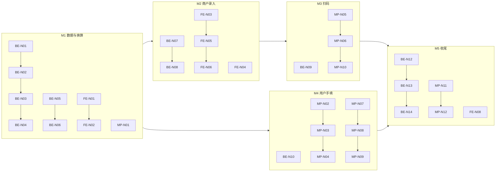

# 需求分析（临时文档）

> **文档性质**：产品 / 数据模型 / 技术可行性评估与实施方案  
> **创建日期**：2026-06-20  
> **涉及模块**：商户 Web 管理端（商品 / SKU）、小程序记一餐（食物添加 Sheet · 扫码预填）、后端商品与餐食 API  
> **关联文档**：[需求分析-小程序扫码功能-临时.md](需求分析-小程序扫码功能-临时.md) · [需求分析-商品分享与餐食营养参考-临时.md](需求分析-商品分享与餐食营养参考-临时.md) · [项目开发说明-后端.md](../pet-app-backend/docs/项目开发说明-后端.md) §5.4 · §5.15 · [项目开发说明-Web前端.md](../pet-app-admin-web/docs/项目开发说明-Web前端.md) §4.3  
> **状态**：**已定稿**（§1.4 产品确认 · 2026-06-20）· **后端 ✅ · 小程序 MP-N01~12 ✅ · 商户 Web FE-N01~08 ✅**

---

## 1. 需求概述

商户希望为配合「食物扫码输入营养信息」能力，建立一套 **可按规格维护营养数据** 的录入体系，并允许终端用户在记餐时 **手动补录非本店食物** 的营养信息。

### 1.1 营养信息内容

| 类别 | 字段（暂定） | 是否必填 | 说明 |
|------|--------------|----------|------|
| **基础营养** | 粗蛋白、粗脂肪、粗纤维、粗灰质、水分 | 每项可选 | 对齐宠物饲料标签常见五项；不同食物可能缺项（如鲜肉缺粗纤维、干货不标水分等） |
| **额外营养** | 钙、磷、维生素 A/C/E、赖氨酸、DHA 等（字典可拓展） | 整体可选 | 字典由商户维护（C6）；用户端仅选用已启用项 |

### 1.2 原始标注形式（录入侧）

来源包装上可能出现三种表达方式：

| 模式 | 示例 | 典型场景 |
|------|------|----------|
| **净克重** | 本袋 500g 含粗蛋白 65.6g | 按整包 / 本规格标注 |
| **每百克含量** | 每 100g 含粗蛋白 13.12g | 商品详情、检验报告 |
| **百分占比** | 粗蛋白 ≥ 26% | 国标宠物粮标签「保证值」 |

约束：**至少有一份克重信息**（与记一餐「食物克重」或 SKU 规格净含量对应），否则无法在「按份喂养」场景下换算绝对摄入量。

### 1.3 使用场景

| 角色 | 场景 | 期望 |
|------|------|------|
| **商户** | Web 管理端维护各 SKU 营养 | 按包装原文习惯录入（三种模式均可），系统统一存储 |
| **用户** | 扫本店商品 QR | 预填名称、克重、营养（已按当次克重或规格换算展示） |
| **用户** | 录入非本店食物 | 同样可选手动填写营养，录入方式与商户一致 |

### 1.4 产品确认（定稿 · 2026-06-20）

| # | 确认项 | 结论 |
|---|--------|------|
| **C1** | 权威存储基准 | **鲜基（as_fed）** 为默认权威形态；**同时支持干物质基（dry_matter）** 录入，保存时 normalize 为 `per_100g_as_fed`（干物质基录入须配合水分，见 §5.3） |
| **C2** | SKU 营养字段位置 | 采用 **§6.1 方案 A**：`product_sku.nutrition_json`（JSON 权威源）；不将营养长期耦合在 `extra_json.meal_scan` 内 |
| **C3** | 用户侧录入 | **一期同时开放**用户侧结构化营养填写（与商户录入模式一致）；保留 legacy 纯文本兼容 |
| **C4** | 修改克重后营养展示 | 当 item 持有结构化 `nutrition_json` 时，用户修改克重须 **同比缩放** 各营养素展示值并重算 `nutrition_ref`；legacy 纯文本不改写 |
| **C5** | `nutrition_ref` 展示字段 | **保留**作派生展示串；超长采用 **截断**（维持现网 VARCHAR **256** 上限与错误码 **40042**）；完整数据以 `nutrition_json` 为准。**备案**：未来是否提高 `nutrition_ref` 字段长度上限，待独立决策（见 §6.4） |
| **C6** | 额外营养素字典 | 字典由 **商户提供与拓展**（管理端维护）；系统预置首批：**钙、磷、维生素 A、维生素 C、维生素 E、赖氨酸、DHA**；用户端从该字典选用，不自行扩展字典项 |
| **C7** | 个人食物库 | **本期不实现**。**备案**：未来是否建设 `user_food_library`（常用手动食物模板），待独立决策（见 §6.5） |

---

## 2. 现状与差距

### 2.1 已落地能力（2026-06）

| 能力 | 现状 | 局限 |
|------|------|------|
| 记一餐食物 Sheet | `name` / `weight` / `nutrition` 三字段；营养为 **自由文本** textarea（前端截断 120 字，后端 `nutrition_ref` ≤256 字） | 非结构化；无法校验、换算、聚合统计 |
| 餐食持久化 | Schema v19：`pet_meal_item.nutrition_ref` 单项持久化 ✅ | 仅存展示字符串 |
| 食物扫码 | `GET /products/{id}/meal-scan-payload` → `food_name` / `weight_g` / `nutrition_ref` | 营养来自 `product.extra_json.meal_scan.skus[*].nutrition_ref` 文本 |
| 商户 Web SKU | 规格、价格、库存 ✅ | **无营养录入 UI**；`meal_scan` 需手工维护 JSON |
| 商品详情 | `detailBlocks` 可能有「每 100g」文案 | 非结构化，仅作扫码降级摘要 |

### 2.2 核心差距

```
商户需求：结构化 + 多录入模式 + 统一存储 + Web 表单
当前实现：SKU 级自由文本 nutrition_ref + 用户端 textarea
```

若不升级数据模型，会出现：

1. **商户录入成本高**：需直接编辑 `extra_json.meal_scan`，易错且无法做单位换算校验。  
2. **扫码预填不一致**：同一 SKU 不同包装标注方式（%/g/百克）需人工换算后再写入文本。  
3. **用户手填体验差**：自由文本难以引导五项指标格式，后续若做营养汇总、图表无法复用。  
4. **256 字上限**：结构化额外营养素 + 多字段后，纯文本方案很快触顶（错误码 **40042**）。

**结论**：需求方向 **合理且必要**；在现有扫码与 `nutrition_ref` 链路上做 **结构化升级** 是自然演进，而非推翻重做。

---

## 3. 需求合理性分析

### 3.1 业务合理性 ✅

| 维度 | 评估 |
|------|------|
| 与扫码功能衔接 | 扫码已预填三项；营养若仍靠 `detailBlocks` 摘要则质量不可控。按 SKU 维护结构化营养是扫码价值的 **必要前置** |
| 与宠物场景匹配 | 粗蛋白/粗脂肪/粗纤维/粗灰质/水分是 GB 宠物饲料标签与 AAFCO 常见「保证分析值」维度，比人类膳食「蛋白质/碳水」更贴切 |
| 非店购食物 | 记餐场景必然包含自制鲜食、他牌粮等；仅依赖商品库不完整，开放用户录入 **符合真实使用** |
| 多录入模式 | 包装标注不统一是行业常态；录入层灵活、存储层统一 **降低商户运营成本** |

### 3.2 需在产品层明确的边界

| 议题 | 建议立场 |
|------|----------|
| 营养数据是否作为 **法律保证值** 展示 | 录入页注明「来源于包装标注，仅供参考」；与商品详情「保证分析」文案口径一致 |
| 缺失项如何处理 | **允许留空**；展示与扫码时仅输出有值项，不强行补 0 |
| 用户手填是否强制 | **保持选填**（与现网一致）；结构化表单降低填写门槛即可 |
| 是否一期做「营养摄入日报 / 达标率」 | **本期不做**；聚焦录入、存储、扫码预填与展示一致性 |
| 个人食物库（常吃的食物模板） | **本期不做**（C7 备案）；营养挂在 `meal_item` 与 `product_sku` |
| 干物质基录入 | **本期支持**（C1）；录入 UI 须区分鲜基 / 干物质基 |
| 用户结构化手填 | **本期支持**（C3）；与商户录入模式对齐 |

### 3.3 专业合规提示（非法律意见）

- 对外展示时区分 **「保证值」**（≥ / ≤）与 **「实测值」**；系统存储建议存 **数值 + 比较符（可选）**，避免丢失「≥26%」语义。  
- 额外营养素单位多样（mg、μg、IU、%）；需 **营养素字典 + 单位枚举**，不宜全部压成「g」。

---

## 4. 可行性分析

### 4.1 技术可行性 ✅

| 项 | 结论 |
|----|------|
| 三种录入模式互相换算 | 在 **明确基准克重** 前提下可纯函数实现（见 §5.2） |
| 统一存储 | JSON 字段存「每百克（鲜基）」为标准形，行业通用 |
| 商户 Web 表单 | 管理端已有商品 / SKU CRUD，扩展面板工作量可控 |
| 小程序 structured 表单 | 与现有 Sheet 兼容；可保留 `nutrition_ref` 作展示冗余 |
| 向后兼容 | 旧 `nutrition_ref` 纯文本可只读展示；新数据双写 `nutrition_json` + 生成 `nutrition_ref` |

### 4.2 主要风险

| 风险 | 等级 | 缓解 |
|------|------|------|
| 用户误把 **干物质基** 当 **鲜基** 录入 | 中 | 录入时选择「基准：鲜基 / 干物质基」；干物质基需同时有水分 |
| 百分比与每百克混淆（水分等特殊项） | 低 | 水分 % 在鲜基下等价于 g/100g；UI 给示例 |
| 额外营养素种类开放导致脏数据 | 中 | 字典 **仅商户可增删**（C6）；用户端只能从字典选用 |
| 餐食 item 与 SKU 营养重复维护 | 低 | 扫码写入时 **快照** 到 item，SKU 后续变更不影响历史记录 |
| 字段膨胀超出 256 字展示串 | 中 | 展示串由系统生成并截断；权威数据放 JSON |

### 4.3 工作量粗估（方案 B · 推荐）

| 端 | 内容 | 人日 |
|----|------|------|
| 后端 | Schema、`nutrition_json` 校验、换算服务、meal-scan-payload 扩展、迁移 | 2~3 |
| 商户 Web | SKU 营养编辑面板、三种录入模式切换、预览 | 2~3 |
| 小程序 | 食物 Sheet 结构化录入（可折叠高级模式）、扫码映射、展示 | 2~3 |
| 联调与验收 | 含旧数据兼容、种子数据 | 1 |
| **合计** | | **7~10 人日** |

---

## 5. 推荐方案：统一存储与换算规则

### 5.1 核心原则

1. **权威存储形态**：所有基础营养素统一为 **`per_100g_as_fed`（每 100g 鲜基含量，单位 g）**；水分同时存 **`moisture_pct`**（0–100，与 g/100g 数值相同）。  
2. **录入层多模式**：商户 / 用户录入时选择「按每百克」「按占比 %」「按本规格净含量」，**保存前** 服务端或共享 SDK 一律 normalize 为标准形。  
3. **展示层按份换算**：记一餐当次克重 `W`（g）时，展示克数：`value_g = per_100g * W / 100`。  
4. **冗余展示字段**：继续生成 `nutrition_ref` 字符串（与现网、扫码、列表展示兼容），由结构化数据 **派生**，不作为权威源。  
5. **可选字段用 `null`**：缺失 ≠ 0。

> **为何选「每百克鲜基」而非「本规格绝对克数」**  
> SKU 规格可能有多档（500g / 1kg），用户当次喂养克重也可能不等于整包。每百克是标签与检测报表最常见基准，与 **用户填写的当次克重** 组合最稳定。

### 5.2 换算公式

设某营养素录入值为 `V`，参考整规格净重 `R`（g），当次喂养克重 `W`（g）。

| 录入模式 | 输入 | 转为 `per_100g`（g） |
|----------|------|---------------------|
| 每百克含量 | `V` g / 100g | `per_100g = V` |
| 百分占比（鲜基） | `P` % | `per_100g = P`（因 100g × P% = P g） |
| 本规格净含量 | `V` g / 整包 `R` g | `per_100g = V × 100 / R` |

**当次展示（写入 foodForm / nutrition_ref）**：

```text
display_g = per_100g × W / 100
```

**示例（与现网 Mock 一致）**  
500g 规格包装标注：粗蛋白 65.6g（净含量）→ `per_100g = 65.6 × 100 / 500 = 13.12` g。  
用户记餐填写 140g → 展示粗蛋白 `13.12 × 140 / 100 ≈ 18.37` g。

### 5.3 干物质基（本期支持 · C1）

录入 UI 须提供 **基准选择**：`as_fed`（鲜基，默认）/ `dry_matter`（干物质基）。

若包装给 **干物质基（DM）** 百分比，normalize 为鲜基 `per_100g_as_fed` 时 **必须已知水分 %**：

```text
per_100g_as_fed = DM% × (100 - moisture%) / 100
```

| 规则 | 说明 |
|------|------|
| 干物质基录入 | 商户 / 用户选择「干物质基」时，**水分项必填**（或已从 SKU / 表单带入） |
| 权威存储 | 不论录入基准，落库一律为 `per_100g_as_fed`；`nutrition_json.basis` 记录录入时使用的基准供审计 |
| 展示换算 | 按份缩放仍基于鲜基 `per_100g_as_fed`（§5.2） |

### 5.4 额外营养素

建议结构：

```json
{
  "code": "ca",
  "name": "钙",
  "value": 1.2,
  "unit": "g",
  "basis": "per_100g_as_fed",
  "display_op": ">=" 
}
```

- `code`：字典键，与商户维护的字典一致  
- `unit`：g / mg / μg / IU / %（按字典项配置）  
- 录入模式换算规则与基础五项相同，换算后统一为 `per_100g_as_fed` + 标准单位  

**首批字典（C6 · 商户可拓展）**

| code | 名称 | 建议默认单位 |
|------|------|--------------|
| `ca` | 钙 | g 或 mg |
| `p` | 磷 | g 或 mg |
| `vit_a` | 维生素 A | IU 或 μg |
| `vit_c` | 维生素 C | mg |
| `vit_e` | 维生素 E | mg 或 IU |
| `lys` | 赖氨酸 | g 或 % |
| `dha` | DHA | mg 或 % |

> 完整字典由商户在 Web 管理端维护；用户端仅展示已启用项。

---

## 6. 数据模型建议

### 6.1 商品 SKU（商户维护 · 扫码数据源）✅ 已定稿

**采用方案 A（C2）**：`product_sku.nutrition_json` JSON 为权威源，与价格库存同级。

**`nutrition_json` 建议 Schema（v1）**：

```json
{
  "schema_version": 1,
  "basis": "as_fed",
  "reference_weight_g": 500,
  "basic": {
    "crude_protein": { "per_100g": 13.12, "op": ">=" },
    "crude_fat": { "per_100g": 0.16 },
    "crude_fiber": { "per_100g": 0.32 },
    "crude_ash": { "per_100g": 1.28 },
    "moisture": { "pct": 1.04 }
  },
  "extra": [
    { "code": "ca", "name": "钙", "value": 0.5, "unit": "g", "per_100g": 0.5 }
  ],
  "source": "label",
  "updated_at": "2026-06-20T10:00:00Z"
}
```

- `reference_weight_g`：商户用「本规格净含量」录入时的参考包重，与 SKU `spec_json.weight` 对齐；仅作录入辅助，**不参与存储权威换算**（已归一到 per_100g）。  
- `meal_scan` 保留 `food_name` / `weight_g`；`nutrition_ref` 改为 **由 `nutrition_json` + `weight_g` 动态生成**（或保存时物化）。

### 6.2 餐食 item（用户当次记录 · 含非店购）

| 字段 | 类型 | 说明 |
|------|------|------|
| `nutrition_json` | JSON nullable | 与 SKU 同 Schema 的子集；用户手填或扫码快照 |
| `nutrition_ref` | VARCHAR(256) | 派生展示串；保持现网 API 兼容 |
| `nutrition_source` | enum | `scan_sku` / `manual` / `legacy_text` |

**快照策略**：扫码预填时，将 SKU 的 `nutrition_json` **复制** 到 item（并记录 `product_id` / `sku_id` 可选），避免日后改价改配方影响历史餐食。

### 6.4 备案：`nutrition_ref` 字段长度上限（C5）

| 项 | 本期 | 备案（未来决策） |
|----|------|------------------|
| 字段 | `pet_meal_item.nutrition_ref` · `pet_meal_template_item.nutrition_ref` · 扫码响应 `nutrition_ref` | 同上 |
| 上限 | **维持 VARCHAR(256)**；派生串超长时截断，完整数据在 `nutrition_json` | 是否扩至 512 / 1024 或改为 TEXT |
| 错误码 | **40042** 营养参考超过长度限制 | 若扩字段需同步文档与校验 |
| 触发条件 | 额外营养素较多时展示串易触顶 | 评估扩字段 vs 仅展示摘要项 |

### 6.5 备案：个人食物库（C7）

| 项 | 说明 |
|----|------|
| 概念 | `user_food_library`：用户保存常用手动食物（名称 + 默认克重 + `nutrition_json`），记餐时一键选用 |
| 本期 | **不实现** |
| 预留 | 餐食 item 已含 `nutrition_json` + `nutrition_source=manual`，未来可从此沉淀模板 |
| 未来决策点 | 是否独立表、是否与餐食模板合并、是否跨家庭组共享 |

---

## 7. 商户 Web 端录入方案

### 7.1 入口与信息架构

在 **商品编辑 → SKU 列表** 每行增加「营养」操作，或 SKU 抽屉内 Tab：**「价格库存」|「营养信息」**。

### 7.2 表单交互（推荐）

```
┌─────────────────────────────────────────────┐
│ 营养信息（本规格：500g/袋）                    │
├─────────────────────────────────────────────┤
│ 录入方式： ○ 每百克  ○ 占比%  ○ 本规格净含量   │
│ 参考净重：[ 500 ] g  （仅「本规格」模式显示）    │
├─────────────────────────────────────────────┤
│ 基础营养（有则填，无则留空）                    │
│  粗蛋白   [    ] g/100g 或 % 或 g/包           │
│  粗脂肪   [    ]                              │
│  粗纤维   [    ]                              │
│  粗灰质   [    ]                              │
│  水分     [    ]                              │
├─────────────────────────────────────────────┤
│ 额外营养  [+ 添加]  从字典选用（钙/磷/维A…）    │
├─────────────────────────────────────────────┤
│ 预览（本规格 500g）：粗蛋白 65.6g · …          │
│ 预览（每100g）：粗蛋白 13.12g · …             │
└─────────────────────────────────────────────┘
```

| 要点 | 说明 |
|------|------|
| 基准选择 | 鲜基 / 干物质基（C1）；干物质基时水分必填 |
| 录入方式切换 | 切换时 **按字段尝试换算** 回填，避免商户重输 |
| 实时预览 | 同时显示「本规格」与「每 100g」，便于对照包装 |
| 校验 | 非负、水分 0–100、至少一项基础营养或明确「未标注」 |
| 与 `meal_scan` 联动 | 保存 SKU 营养后由 `nutrition_json` **派生** `meal_scan.skus[*].nutrition_ref`（展示用） |
| 字典管理 | 商户可增删改额外营养素字典（C6）；首批种子见 §5.4 |

### 7.3 批量与导入（三期）

- CSV / Excel 按 SKU 编码导入 `per_100g` 列  
- 从商品详情 `detailBlocks` **不自动解析**（误差大），仅作录入参考文案

---

## 8. 用户端（小程序）录入方案

### 8.1 交互分层（推荐）

| 层级 | 用户看到 | 说明 |
|------|----------|------|
| **默认** | 与现网一致：名称 + 克重 + 营养摘要一行 | 扫码后自动填好 |
| **展开「编辑营养」** | 结构化五项 + 从字典添加额外项；录入方式三选一 + 鲜基/干物质基 | 与商户 Web 同逻辑（C3），移动端竖排 |
| **极简模式** | 保留「从照片识别包装」为 **远期** OCR，一期不做 |

非店购食物：无扫码时用户走 **手动 → 展开编辑营养**；不强制完整五项。

### 8.2 扫码预填逻辑（升级后）

```
petapp://v1/product?id=&sku=
  → GET meal-scan-payload
  → food_name, weight_g
  → nutrition_json (新) 或 nutrition_ref (旧)
  → 前端按 foodForm.weight 换算 display 并生成 nutrition_ref 展示
```

用户修改克重后，营养展示须 **同比缩放并重算 `nutrition_ref`（C4）**（当持有结构化 `nutrition_json`）；若仅为 legacy 文本则不改写。

### 8.3 与现网兼容

| 数据类型 | 编辑页行为 |
|----------|------------|
| 仅有 `nutrition_ref` 文本 | 只读展示在 textarea；保存原样，`nutrition_source=legacy_text` |
| 有 `nutrition_json` | 结构化编辑；保存双写 |

---

## 9. API 变更摘要（建议）

### 9.1 管理端

| 方法 | 路径 | 变更 |
|------|------|------|
| GET/POST/PUT/DELETE | `/admin/nutrition-extra-dict` | 额外营养素字典 CRUD（C6） |
| GET/PUT | `/admin/products/{id}/skus/{skuId}` | 响应 / 请求增加 `nutrition_json` |
| POST | `/admin/products/{id}/skus` | 创建时可选带 `nutrition_json` |

校验：JSON Schema `nutrition.v1.json`；保存时服务端 normalize `per_100g`。

### 9.2 C 端

| 方法 | 路径 | 变更 |
|------|------|------|
| GET | `/nutrition-extra-dict` | 已启用的额外营养素字典（只读） |
| GET | `/products/{id}/meal-scan-payload` | 增加 `nutrition_json`；`nutrition_ref` 仍返回（派生） |
| PUT | `/pets/.../daily-records/...` | `items[]` 增加可选 `nutrition_json`、`nutrition_source` |

错误码建议：**40050** 营养 JSON 非法；**40051** 换算缺少参考克重。

---

## 10. 实施范围与里程碑

本期（**NUT-v1**）按 §1.4 定稿交付，三端任务见 **§15**。

| 里程碑 | 范围 | 验收要点 |
|--------|------|----------|
| **M1 · 数据与换算** | 后端 Schema + 换算服务 + 字典种子 | 三种录入模式 + 鲜基/干物质基 normalize 单测通过 |
| **M2 · 商户录入** | Web SKU 营养面板 + 字典管理 | 商户可维护 SKU 营养并预览派生 `nutrition_ref` |
| **M3 · 扫码链路** | meal-scan-payload + 小程序扫码预填 | 扫商品 QR 预填名称/克重/营养；改克重同比缩放 |
| **M4 · 用户手填** | 小程序结构化表单 + 餐食持久化 | 非店购食物可结构化录入；编辑回显；legacy 兼容 |
| **M5 · 联调收尾** | 种子数据、迁移、文档同步 | `verify:nutrition-*` 通过；开发说明更新 |

**本期不包含**：个人食物库（C7 备案）、批量 CSV 导入、日摄入汇总图表、`nutrition_ref` 扩字段（C5 备案）。

**后续可选（未排期）**

- [ ] 旧 `meal_scan.nutrition_ref` / 纯文本 item 批量迁移为 `nutrition_json`  
- [ ] 宠物 Tab 餐食详情结构化营养分行展示  
- [ ] 批量导入、`nutrition_ref` 扩字段、个人食物库（见 §6.4 · §6.5）  
- [ ] 日摄入汇总 / 营养建议  

---

## 11. 方案对比

| 方案 | 描述 | 优点 | 缺点 | 建议 |
|------|------|------|------|------|
| **A** | 维持纯文本，仅规范 placeholder | 零开发 | 无法满足多模式录入与一致性；不可扩展 | ❌ 不采纳 |
| **B** | 结构化 JSON + 派生 `nutrition_ref`（本文） | 语义清晰、可换算、兼容现网 | 需 Schema 与双写 | ✅ **推荐** |
| **C** | 仅商品详情富文本，扫码继续摘 `detailBlocks` | 改动小 | 数据质量差、无法按份计算 | ❌ 仅作降级 |
| **D** | 外部营养数据库（第三方 API） | 覆盖非店购 | 宠物鲜食 / 小众品牌覆盖差；成本高 | 作二期补充 |

---

## 12. 决策清单（已定稿）

| # | 决策项 | 结论 | 对应 |
|---|--------|------|------|
| D1 | 权威存储基准 | 鲜基权威存储 + **支持干物质基录入** | C1 · §5.3 |
| D2 | SKU 营养字段位置 | **`product_sku.nutrition_json`** | C2 · §6.1 |
| D3 | 用户手填 | **本期开放结构化填写** + legacy 兼容 | C3 · §8 |
| D4 | 修改克重 | **同比缩放** + 重算 `nutrition_ref` | C4 · §8.2 |
| D5 | `nutrition_ref` 上限 | **维持 256 + 截断**；扩字段 **备案** | C5 · §6.4 |
| D6 | 额外营养素字典 | **商户维护**；首批 7 项见 §5.4 | C6 |
| D7 | 个人食物库 | **本期不做**；**备案** | C7 · §6.5 |

---

## 13. 结论

| 维度 | 结论 |
|------|------|
| **需求合理性** | ✅ 高。与扫码、记餐、宠物标签习惯一致；非店购手填是真实场景必需 |
| **技术可行性** | ✅ 高。三种录入模式可收敛到「每百克鲜基」；现网 `nutrition_ref` 可平滑兼容 |
| **推荐路径** | **方案 B（已定稿）**：`nutrition_json` 权威存储 + 多模式录入 UI + 派生 `nutrition_ref` + 餐食 item 快照 |
| **本期范围** | 商户 Web SKU 营养 + 扫码预填 + **用户结构化手填** + 克重同比缩放 + 干物质基 + 商户字典 |
| **不建议** | 继续扩大自由文本职责；从 `detailBlocks` 正则解析营养 |

---

## 14. 附录：与现网 Mock 数据对照

现网 `constants/meal-scan.js` 中 500g 鸡肉鲜食：

```text
粗蛋白 65.6g · 粗脂肪 0.8g · 粗纤维 1.6g · 粗灰质 6.4g · 水分 5.2g
```

归一后 `per_100g`（g）：

| 营养素 | 本规格 500g | per_100g |
|--------|-------------|----------|
| 粗蛋白 | 65.6 | 13.12 |
| 粗脂肪 | 0.8 | 0.16 |
| 粗纤维 | 1.6 | 0.32 |
| 粗灰质 | 6.4 | 1.28 |
| 水分 | 5.2（≈1.04% 或 1.04g/100g） | 1.04 |

用户记餐 140g 时展示：

```text
粗蛋白 18.4g · 粗脂肪 0.2g · 粗纤维 0.4g · 粗灰质 1.8g · 水分 1.5g
```

（四舍五入策略应在实现规范中统一。）

---

## 15. 三端工作事项与任务清单（NUT-v1）

> 任务 ID 前缀：**BE-N** 后端 · **FE-N** 商户 Web · **MP-N** 小程序。完成后在 `[ ]` 打勾并同步各端开发说明。

### 15.1 后端（pet-backend）

| ID | 任务 | 说明 | 依赖 | 里程碑 |
|----|------|------|------|--------|
| BE-N01 | Schema 迁移 | `product_sku` 增 `nutrition_json` JSON NULL；`pet_meal_item` / `pet_meal_template_item` 增 `nutrition_json` JSON NULL、`nutrition_source` VARCHAR(16) DEFAULT `''` | — | M1 | ✅ |
| BE-N02 | JSON Schema | `config/schemas/nutrition.v1.json`：basic / extra / basis / schema_version | BE-N01 | M1 | ✅ |
| BE-N03 | 换算与 normalize 服务 | `utils/nutritionNormalize.js`：三种录入模式 → `per_100g_as_fed`；鲜基/干物质基互转（干物质基须校验水分） | BE-N02 | M1 | ✅ |
| BE-N04 | `nutrition_ref` 派生 | `utils/nutritionDisplay.js`：按克重 `W` 生成展示串；**超长截断至 256**；四舍五入策略统一 | BE-N03 | M1 | ✅ |
| BE-N05 | 额外营养素字典表 | 新表 `nutrition_extra_dict`（或 CMS 配置）：code、name、default_unit、sort、status；种子 7 项（C6） | — | M1 | ✅ |
| BE-N06 | 字典管理 API | `GET/POST/PUT/DELETE /admin/nutrition-extra-dict`；仅管理员；用户端 `GET /nutrition-extra-dict` 只读已启用项 | BE-N05 | M2 | ✅ |
| BE-N07 | 管理端 SKU API 扩展 | `GET/POST/PUT /admin/products/{id}/skus[/{skuId}]` 读写 `nutrition_json`；保存时 normalize + 校验 | BE-N03 | M2 | ✅ |
| BE-N08 | `meal_scan` 联动 | 保存 SKU 营养时更新 `product.extra_json.meal_scan.skus[*]` 的 `nutrition_ref`（派生）；可选写入 `nutrition_json` 引用 | BE-N04, BE-N07 | M2 | ✅ |
| BE-N09 | meal-scan-payload 扩展 | `GET /products/{id}/meal-scan-payload` 响应增 `nutrition_json`；`nutrition_ref` 按 `weight_g` 或 query 克重派生 | BE-N04 | M3 | ✅ |
| BE-N10 | 餐食 API 扩展 | 日记录 PUT/GET `items[]` 增 `nutrition_json`、`nutrition_source`；写入时 normalize；派生 item `nutrition_ref` | BE-N03, BE-N04 | M4 | ✅ |
| BE-N11 | 错误码 | **40050** 营养 JSON 非法；**40051** 换算缺少参考克重/水分；保留 **40042** 截断后仍超长（理论上不应触发） | BE-N02 | M1 | ✅（40051→**40056** 备案） |
| BE-N12 | 种子与迁移 | `seed:demo` 犬类商品 SKU 写入示例 `nutrition_json`；`migrate:v20`（或下一版号） | BE-N01 | M5 | ✅ |
| BE-N13 | 自测脚本 | `npm run verify:nutrition-normalize` · `verify:meal-scan-nutrition` · 扩展 `verify:meal-item-nutrition` | BE-N03~N10 | M5 | ✅ |
| BE-N14 | 文档 | 更新 [项目开发说明-后端.md](../pet-app-backend/docs/项目开发说明-后端.md) §5.4 · §5.15 · 错误码表 | M5 完成后 | M5 | ✅ |

### 15.2 商户 Web 管理端（pet-admin-web）

| ID | 任务 | 说明 | 依赖 | 里程碑 |
|----|------|------|------|--------|
| FE-N01 | 类型与常量 | `types/nutrition.ts` · `constants/nutrition.ts`：basic 五项 key、basis、录入模式枚举 | BE-N02 | M1 | ✅ |
| FE-N02 | 换算工具 | `utils/nutrition.ts`：与后端 BE-N03 规则一致（录入切换回填、预览）；或调用后端 preview 接口 | BE-N03 | M1 | ✅ |
| FE-N03 | API 封装 | `api/nutrition.ts`（字典）· 扩展 `api/product.ts` SKU `nutrition_json` | BE-N06, BE-N07 | M2 | ✅ |
| FE-N04 | 额外营养素字典页 | 侧栏或商品子菜单「营养字典」：列表 CRUD、启用/停用；首批 7 项只读种子展示 | BE-N06 | M2 | ✅ |
| FE-N05 | SKU 营养面板 | 商品编辑 → SKU 行「营养」或 Tab「营养信息」：基础五项 + 额外项 + 基准/录入方式切换 | FE-N02, FE-N03 | M2 | ✅ |
| FE-N06 | 实时预览 | 本规格 / 每 100g 双预览 + 派生 `nutrition_ref` 预览（含截断提示） | FE-N02 | M2 | ✅ |
| FE-N07 | 校验与提交 | 干物质基无水分时阻断；空营养允许保存；保存成功刷新 SKU 列表 | FE-N05 | M2 | ✅ |
| FE-N08 | 文档 | 更新 [项目开发说明-Web前端.md](../pet-app-admin-web/docs/项目开发说明-Web前端.md) §4.3 商品 SKU 营养 | M5 完成后 | M5 | ✅ |

### 15.3 小程序前端（pet-app）

| ID | 任务 | 说明 | 依赖 | 里程碑 |
|----|------|------|------|--------|
| MP-N01 | 营养模块 | `utils/nutrition.js`（或 `services/nutrition.js`）：normalize、按克重缩放、生成 `nutrition_ref`、截断 256 | BE-N03 契约 | M1 | ✅ |
| MP-N02 | 字典常量 | `constants/nutrition.js`：基础五项 label；额外项从 `GET /nutrition-extra-dict` 拉取，失败用首批 7 项 fallback | BE-N06 | M4 | ✅ |
| MP-N03 | 结构化食物表单组件 | `components/food-nutrition-form`（或 Sheet 内嵌）：五项 + 额外项 + 基准/录入方式；可折叠「编辑营养」 | MP-N01, MP-N02 | M4 | ✅ |
| MP-N04 | meal-record 集成 | `meal-record.vue`：替换/增强营养 textarea；展开结构化表单；提交写 `nutrition_json` + 派生 `nutrition` | MP-N03 | M4 | ✅ |
| MP-N05 | 克重同比缩放 | `foodForm.weight` 变更时，若存在 `nutrition_json`，重算展示营养与 `nutrition_ref`（C4） | MP-N01 | M3 | ✅ |
| MP-N06 | 扫码预填升级 | `mealScan.js`：`mapPayloadToFoodForm` 读 `nutrition_json`；快照到 foodForm；按 `weight` 缩放 | BE-N09, MP-N05 | M3 | ✅ |
| MP-N07 | pet 服务层 | `pet.js`：`normalizeMealItem` / `buildMealSessionFromForm` / `mealToEditForm` 读写 `nutrition_json`、`nutrition_source` | BE-N10 | M4 | ✅ |
| MP-N08 | 餐食模板 | `meal-template.js` 同步 `nutrition_json` 字段 | MP-N07 | M4 | ✅ |
| MP-N09 | Legacy 兼容 | 仅有 `nutrition_ref` 无 JSON：textarea 只读/可编辑文本；`nutrition_source=legacy_text`；保存不丢 | MP-N04 | M4 | ✅ |
| MP-N10 | Mock 数据 | `constants/meal-scan.js` 增 `nutrition_json`；与派生 `nutrition_ref` 一致 | BE-N12 | M3 | ✅ |
| MP-N11 | 单测 | `tests/nutrition.test.js` · 扩展 `tests/mealScan.test.js`（缩放、截断） | MP-N01, MP-N05 | M5 | ✅ |
| MP-N12 | 文档 | 更新 [项目开发说明-小程序前端.md](../pet-app/docs/项目开发说明-小程序前端.md) §2.24 · §2.31 | M5 完成后 | M5 | ✅ |

### 15.4 联调与验收清单

| # | 场景 | 端 | 预期 |
|---|------|-----|------|
| QA-N01 | 商户录入 500g 规格净含量模式 | Web → API | `nutrition_json` per_100g 正确；`meal_scan.nutrition_ref` 派生正确 |
| QA-N02 | 干物质基 + 水分录入 | Web | normalize 为鲜基；无水分时保存失败 **40051** |
| QA-N03 | 扫码预填 | MP | 三项预填；`nutrition_json` 快照；Sheet 仍打开 |
| QA-N04 | 改克重 500→140 | MP | 营养数值同比缩放；`nutrition_ref` 更新 |
| QA-N05 | 用户手填非店购 | MP → API | `nutrition_source=manual`；编辑回显结构化表单 |
| QA-N06 | Legacy 旧记录 | MP | 仅 `nutrition_ref` 文本可编辑；保存不破坏 |
| QA-N07 | 额外营养素字典 | Web | 商户新增项后 MP 下拉可见（已启用） |
| QA-N08 | 超长营养展示 | MP | `nutrition_ref` ≤256；`nutrition_json` 完整 |
| QA-N09 | 存模板 / 应用模板 | MP | 模板 item `nutrition_json` 往返 |
| QA-N10 | 截断与 40042 | API | 极端多 extra 项时截断生效；不误报 40042 |

### 15.5 建议实施顺序



| 周次建议 | 并行 |
|----------|------|
| 第 1 周 | BE-N01~N05 + FE-N01~N02 + MP-N01（契约对齐） |
| 第 2 周 | BE-N06~N08 + FE-N03~N07（商户可录入） |
| 第 3 周 | BE-N09~N10 + MP-N02~N09（扫码 + 用户手填 + 持久化） |
| 第 4 周 | BE-N12~N14 + QA-N01~N10 + 三端文档 |

---

**文档结束 · 开发启动后请将 §15 任务状态同步至各端 [项目开发说明-后端.md](../pet-app-backend/docs/项目开发说明-后端.md)、[项目开发说明-Web前端.md](../pet-app-admin-web/docs/项目开发说明-Web前端.md)、[项目开发说明-小程序前端.md](../pet-app/docs/项目开发说明-小程序前端.md)。****