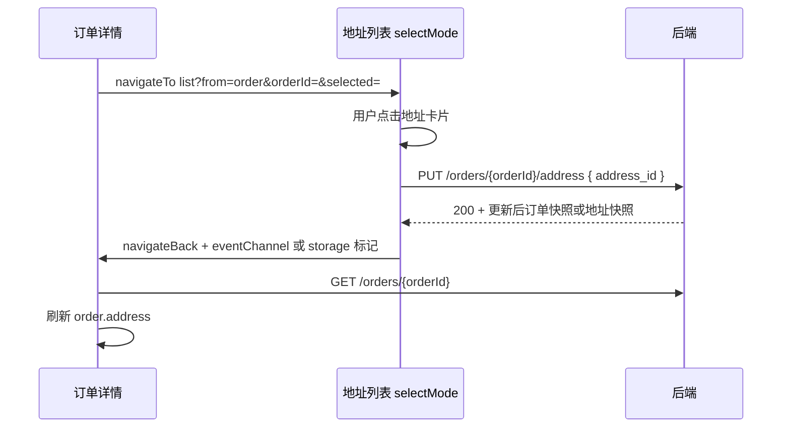

# 需求分析（临时文档）

> **文档性质**：产品 / 技术可行性评估与修复方案  
> **创建日期**：2026-06-15  
> **触发来源**：微信开发者工具测试 · 章节 6.6 地址列表（AD-03 / AD-05）及关联订单详情改址流程  
> **涉及模块**：`src/pages/address/list.vue` · `src/pages/address/edit.vue` · `src/pages/order/detail.vue` · `src/services/address.js` · `src/api/address.js`  
> **状态**：✅ 小程序前端 v0.9.88 已落地（P0 / P1 方案 A / P2）

---

## 1. 测试现象摘要

| # | 场景 | 操作 | 实际表现 | 用户感知 |
|---|------|------|----------|----------|
| P1 | 地址管理（「我的」→ 收货地址） | 新增地址后，在列表页点击该地址「设为默认」 | Toast 提示「设置失败，请稍后重试」 | 失败 |
| P1′ | 同上 | 退出后重新进入地址列表 | 新地址已显示为默认地址 | 与 P1 矛盾，体验混乱 |
| P2 | 待付款订单详情 | 点击收货地址区域进入地址页 | 页面标题为「收货地址」，有编辑/删除按钮，与「我的」入口一致 | 不像「选择地址」 |
| P2′ | 同上 | 点击另一条未选中地址 | Toast「设置失败，请稍后重试」 | 失败 |
| P2″ | 同上 | 返回订单详情 | 订单收货地址未变化 | 改址未生效 |
| P2‴ | 同上 | 再次进入地址页 | 刚才点击的地址已呈「默认/选中」态 | 部分成功但上下文错误 |

---

## 2. 根因分析

### 2.1 P1 / P1′：`setDefaultAddressRecord` 远程成功 + 本地同步失败

**代码路径**：地址列表管理模式下，点击非默认卡片 → `onCardTap` → `setDefault` → `setDefaultAddressRecord`。

```150:157:src/pages/address/list.vue
    async setDefault(addr) {
      try {
        await setDefaultAddressRecord(addr.id)
        await this.loadAddresses()
        uni.showToast({ title: '已设为默认地址', icon: 'none' })
      } catch {
        uni.showToast({ title: '设置失败，请稍后重试', icon: 'none' })
      }
    },
```

**服务层缺陷**（核心）：

```213:226:src/services/address.js
export async function setDefaultAddressRecord(addressId) {
  const id = Number(addressId)

  try {
    await addressApi.setDefaultAddress(id)
  } catch {
    /* fallback local */
  }

  const list = getOrInitLocalAddresses().map((item) => normalizeAddress(item))
  if (!list.some((item) => item.id === id)) throw new Error('地址不存在')
  replaceLocalAddressList(applyDefaultFlag(list, id))
  return list.find((item) => item.id === id)
}
```

| 对比项 | `createAddressRecord` / `updateAddressRecord` | `setDefaultAddressRecord` |
|--------|-----------------------------------------------|---------------------------|
| 远程 API 成功时 | **立即 `return`**，不再写本地 | **仍强制写本地** |
| 云端后端 + 本地 MOCK 地址 ID 不一致 | 无影响 | 本地找不到 ID → **抛错** |
| 用户可见结果 | 成功 Toast | 失败 Toast |
| 再次进入列表 | 远程数据正确 | 远程数据正确（`fetchAddresses` 读 API） |

**结论**：P1 是 **前端实现 Bug**，不是后端接口失败。云端 `PUT /addresses/{id}/default` 已成功，但前端在成功后仍尝试同步 `zzp_local_addresses`，远程地址 ID 不在本地 MOCK 列表中，触发 `catch` 显示失败提示。

**与 AE-03（编辑页勾选默认）的关系**：新建/编辑页通过 `createAddressRecord` / `updateAddressRecord` 保存时，远程成功路径会提前返回，**通常不会出现 P1 同类问题**。若用户在 **列表页点击卡片设默认**，则必现 P1。

---

### 2.2 P2 系列：订单详情改址入口未接入「选择模式」

**当前实现**：

```381:383:src/pages/order/detail.vue
    onAddressTap() {
      uni.navigateTo({ url: '/pages/address/list' })
    },
```

对比结算页已实现的 **选择模式**：

```112:114:src/pages/address/list.vue
    this.from = options?.from || ''
    this.selectMode = this.from === 'checkout'
    this.selectedId = Number(options?.selected || getItem(STORAGE_KEYS.LAST_CHECKOUT_ADDRESS_ID)) || null
```

| 入口 | URL 参数 | `selectMode` | 点击卡片行为 |
|------|----------|--------------|--------------|
| 我的 / 设置 | `/pages/address/list` | `false` | 设为用户 **默认地址**（`setDefault`） |
| 确认订单 checkout | `/pages/address/list?from=checkout&selected=…` | `true` | **选中并返回**（写 `LAST_CHECKOUT_ADDRESS_ID`） |
| **待付款订单详情** | `/pages/address/list`（无参数） | `false` | 误走 **设默认** 逻辑 → 触发 P1 同类 Toast |

**结论**：P2 页面「不像选择模式」是 **预期设计缺失**，不是测试误操作。订单详情跳转未传 `from`，复用了地址 **管理页** 的交互。

---

### 2.3 P2″：即使 UI 正确，当前也无法更新订单收货地址

进一步分析发现，即便将订单详情改为 `from=checkout` 的选择模式，仍存在 **业务链路缺口**：

1. **无订单改址 API**：`src/api/order.js` 仅有 `createOrder`、`cancelOrder`、`confirmReceipt` 等；后端文档（§5 订单）亦无 `PUT /orders/{id}/address` 或等价接口。
2. **选择模式只写本地偏好**：checkout 选择模式仅更新 `STORAGE_KEYS.LAST_CHECKOUT_ADDRESS_ID`，用于 **下次下单**，不会回写已创建订单的 `order.address`。
3. **订单详情 onShow 会刷新**：首次 `loadOrder` 完成后 `skipShowReload = false`，返回时会重新拉取详情；但因服务端订单地址未变，UI 仍显示旧地址——这与 P2″ 现象一致。

**结论**：待付款订单「点击地址 → 选择 → 订单详情更新」在 **产品需求上合理**，在 **当前实现上不可行**（缺 API + 缺前端编排）。

---

## 3. 需求合理性与可行性评估

### 3.1 地址列表 · 管理模式下点击设默认（P1）

| 维度 | 评估 |
|------|------|
| **产品合理性** | ✅ 高。主流电商「收货地址管理」均支持列表内一键设默认，与 AE-03 编辑页勾选默认互为补充。 |
| **技术可行性** | ✅ 高。后端 `PUT /addresses/{id}/default` 已实现且测试环境可用。 |
| **当前状态** | ❌ 前端 `setDefaultAddressRecord` 逻辑错误，**修复成本低（约 0.5h）**。 |

### 3.2 待付款订单 · 修改收货地址（P2）

| 维度 | 评估 |
|------|------|
| **产品合理性** | ✅ 高。待支付订单允许改址是电商常见能力（支付前校正地址、避免冷链配错区域）。部分平台限制「仅可改一次」或「不可跨省」，属业务规则细化，不影响主能力合理性。 |
| **技术可行性（完整方案）** | 🟡 中。需 **后端新增接口** + 前端选择模式 + 订单详情联动，约 1～2 人日（视后端排期）。 |
| **技术可行性（仅修 UI 误用）** | ✅ 高。可先禁止订单详情误触「设默认」，或短期隐藏改址入口，约 0.5h。 |
| **当前状态** | ❌ 入口存在但语义错误；完整改址 **未实现**。 |

### 3.3 测试清单 AD-03 / AD-05 与现象的对应关系

| 测试 ID | 清单定义 | 本次现象归属 |
|---------|----------|--------------|
| AD-03 | 编辑地址 → 跳转 edit 并预填 | 若从列表点「编辑」按钮，与 P1 无直接关系 |
| AD-05 | 从 **checkout** 进入 select 模式 | 结算页路径已实现；**订单详情改址不在 AD-05 覆盖范围**，属 **新缺口** |
| AE-03 | 编辑页勾选默认 | 列表点击设默认走 P1 路径，与 AE-03 不同入口 |

建议在测试清单中 **增补 OD-xx（订单详情 · 待付款改址）** 或明确「待付款改址 MVP 不做 / 二期做」，避免测试与产品预期漂移。

---

## 4. 建议方案

### 4.1 【P0 · 必修】修复 `setDefaultAddressRecord` 远程/本地双写逻辑

与 `createAddressRecord`、`updateAddressRecord` 对齐：**API 成功则直接返回**，失败再 fallback 本地。

```javascript
// 建议修改 src/services/address.js
export async function setDefaultAddressRecord(addressId) {
  const id = Number(addressId)

  try {
    await addressApi.setDefaultAddress(id)
    // 远程成功：重新拉列表取最新默认态（或 trust API 返回体若后端有）
    const { list } = await fetchAddresses()
    const found = list.find((item) => item.id === id)
    if (found) return found
    return { id, isDefault: true } // 兜底
  } catch {
    /* fallback local */
  }

  const list = getOrInitLocalAddresses().map((item) => normalizeAddress(item))
  if (!list.some((item) => item.id === id)) throw new Error('地址不存在')
  replaceLocalAddressList(applyDefaultFlag(list, id))
  return list.find((item) => item.id === id)
}
```

**验收**：云端后端模式下，列表点击设默认 → Toast「已设为默认地址」；Network 见 `PUT …/default` 200；刷新后默认标签正确。

---

### 4.2 【P1 · 已确认】待付款订单改址 · 方案 A（完整实现）

> ✅ **产品决策**：采用方案 A。方案 B（禁用入口）、方案 C（复用 checkout 选择模式）不纳入本期。



| 步骤 | 负责 | 内容 |
|------|------|------|
| 1 | 后端 | 新增 `PUT /api/v1/orders/{order_id}/address`，body `{ address_id }`；仅 `status=pending` 可改；校验地址属当前用户；可选限制跨省/改址次数 |
| 2 | 前端 API | `src/api/order.js` 增加 `updateOrderAddress(orderId, addressId)` |
| 3 | 地址列表 | 扩展 `selectMode`：`from === 'order'` 时标题「选择收货地址」，选中后调改址 API 再返回 |
| 4 | 订单详情 | `onAddressTap` 传 `from=order&orderId=${id}&selected=${order.address.id}`；`onShow` 刷新详情（已有） |

**预估**：后端 0.5～1 人日 + 前端 1 人日（含 P2 重构）+ 联调 0.5 人日。

---

### 4.3 【P2 · 已确认】地址列表选择模式语义扩展

建议将 `selectMode` 从单一 `from === 'checkout'` 扩展为枚举：

```javascript
// 建议 constants/address.js
export const ADDRESS_LIST_FROM = {
  MANAGE: 'manage',   // 默认
  CHECKOUT: 'checkout',
  ORDER: 'order',     // 待付款改址
}

// list.vue
this.selectMode = ['checkout', 'order'].includes(this.from)
```

| `from` | 标题 | 选中后行为 |
|--------|------|------------|
| — / `manage` | 收货地址 | 点击非默认 → 设默认 |
| `checkout` | 选择收货地址 | 写 LAST_CHECKOUT + 返回结算页 |
| `order` | 选择收货地址 | 调订单改址 API + 返回订单详情 |

---

## 5. 测试回归建议

修复 P1 后，在 **云端后端 + 老用户登录** 下复测：

| ID | 场景 | 预期 |
|----|------|------|
| AD-03 延伸 | 列表点击非默认地址设默认 | Toast 成功；默认标签即时更新 |
| AE-03 | 新建/编辑勾选默认 | 保持通过 |
| AD-05 | checkout → 管理 → 选择 | 选中返回结算页，地址栏更新 |
| **新增 OD-ADDR-01** | 待付款订单详情 → 改址 | 依方案 A/B：完整改址成功 **或** 入口禁用/明确提示 |
| AD-07 | 断网 fallback | 设默认走本地存储，Toast 成功 |

---

## 6. 结论

1. **「设置失败但重进已成功」** 是已定位的 **前端 Bug**（`setDefaultAddressRecord` 远程成功后仍强制写本地），**P0** 独立修复。
2. **订单详情进入地址页像管理页** 是 **入口未传 `from` 参数** 导致；**P2** 统一 `from` 语义，**P1 方案 A** 补齐订单改址 API 与联动。
3. **待付款订单改址** 已确认采用 **方案 A**（完整实现）；实施任务见 §8（后端）、§9（小程序前端）。
4. 测试清单建议增补 **OD-ADDR-01** 等用例，P0 修复纳入 AD-03 回归范围。

---

## 7. 实施范围总览

| 优先级 | 范围 | 后端 | 小程序前端 | 可独立交付 |
|--------|------|------|------------|------------|
| **P0** | 列表设默认 Toast 误报 | 无变更（接口已有） | `services/address.js` | ✅ 是 |
| **P1 · 方案 A** | 待付款订单改址 | 新增 `PUT /orders/{id}/address` | API 封装 + 列表/详情联动 | ❌ 需前后端联调 |
| **P2** | `from` 语义枚举化 | 无变更 | `constants/address.js` + 各页 refactor | 🟡 可与 P1 前端合并发版 |

**推荐实施顺序**：P0 →（P2 与 BE-P1 并行）→ FE-P1 联调 → 文档与测试清单收尾。

---

## 8. 后端实现任务清单

> **负责方**：后端服务（订单 §5.7、`order_main.address_snapshot`）  
> **状态**：待实施

| ID | 任务 | 说明 | 依赖 |
|----|------|------|------|
| **BE-P0-01** | — | P0 无后端任务；`PUT /addresses/{id}/default` 已可用 | — |
| **BE-P1-01** | 新增改址路由 | `PUT /api/v1/orders/{order_id}/address`；鉴权 Bearer；`order_id` 支持内部 ID 或 `out_trade_no`（与现有订单路由一致） | — |
| **BE-P1-02** | 请求体与校验 | Body `{ "address_id": number }`；`address_id` 必填且须为当前用户 `user_address` 有效记录 | BE-P1-01 |
| **BE-P1-03** | 订单状态门禁 | 仅 `order_status = 10`（待支付）允许改址；已支付/已关闭返回 **42215**「仅待支付订单可修改收货地址」 | BE-P1-01 |
| **BE-P1-04** | 归属与权限 | 订单须属当前用户；地址须属同一 `user_id`；跨用户访问返回 **404** / **403**（与现有订单接口风格一致） | BE-P1-02 |
| **BE-P1-05** | 更新地址快照 | 从 `user_address` 读取最新字段，序列化写入 `order_main.address_snapshot`（JSON，字段与下单时快照一致：`address_id`、`receiver_name`、`receiver_phone`、省市区、`detail_address`、`is_default` 等） | BE-P1-02 |
| **BE-P1-06** | 响应体 | 200 返回更新后地址快照或完整订单摘要（建议至少含 `address` 对象，供前端即时刷新；与 `GET /orders/{id}` 的 `address` 结构一致） | BE-P1-05 |
| **BE-P1-07** | 错误码登记 | 新增 **42215**（非待支付不可改址）、**42216**（地址不存在或不属于当前用户）、**42217**（与当前订单地址相同，可选，避免无意义写库） | BE-P1-03 |
| **BE-P1-08** | 订单详情补充 `address_id` | `GET /orders/{order_id}` 响应中 `address` 对象增加 `address_id`（或 `id`），便于前端 `selected` 高亮与改址前后对比 | BE-P1-05 |
| **BE-P1-09** | 自动化验证 | 扩展 `verify:trade` 或新增用例：创建待支付订单 → PUT 改址 → GET 详情校验快照；非 pending 改址应 42215 | BE-P1-06 |
| **BE-P1-10** | 更新后端开发文档 | `docs/项目开发说明-后端.md` §5.7 增补改址接口表、请求/响应示例、错误码 42215–42217；§6.3 前端对接状态 | BE-P1-09 |

**后端交付物：**

- Staging 可调用 `PUT /orders/{order_id}/address`
- `verify:trade`（或等价脚本）覆盖改址 happy path 与状态门禁
- §5.7 文档与错误码表已更新
- 通知前端：接口就绪，可联调

**接口契约（草案）**

```http
PUT /api/v1/orders/{order_id}/address
Authorization: Bearer {token}
Content-Type: application/json

{ "address_id": 3002 }
```

```json
// 200 data（节选）
{
  "order_id": "202606150012",
  "address": {
    "address_id": 3002,
    "name": "张三",
    "phone": "13800138000",
    "province": "广东省",
    "city": "深圳市",
    "district": "南山区",
    "detail": "广东省 深圳市 南山区 XX 路 1 号",
    "is_default": true
  },
  "updated_at": "2026-06-15T10:30:00+08:00"
}
```

---

## 9. 小程序前端实现任务清单

> **负责方**：本仓库 `pet-app`  
> **状态**：✅ **v0.9.88 已落地**（2026-06-15）

### 9.1 P0 · 设默认误报修复

| ID | 任务 | 文件 / 位置 | 说明 | 依赖 |
|----|------|-------------|------|------|
| **FE-P0-01** | 修复远程/本地双写 | `src/services/address.js` · `setDefaultAddressRecord` | API 成功时 `return`（可 `fetchAddresses` 取最新项），失败再 fallback 本地；与 `createAddressRecord` / `updateAddressRecord` 对齐（见 §4.1 示例） | — |
| **FE-P0-02** | 回归验证 | — | 云端模式：列表点击设默认 → Toast 成功；断网 → 本地 fallback 成功（AD-07） | FE-P0-01 |

**P0 交付物**：设默认交互与 Toast 一致；无后端变更。

---

### 9.2 P2 · 选择模式语义扩展

| ID | 任务 | 文件 / 位置 | 说明 | 依赖 |
|----|------|-------------|------|------|
| **FE-P2-01** | 新增来源常量 | `src/constants/address.js`（新建） | 导出 `ADDRESS_LIST_FROM`（`manage` / `checkout` / `order`）及 `isAddressSelectMode(from)` 辅助函数 | — |
| **FE-P2-02** | 列表页接入枚举 | `src/pages/address/list.vue` | `selectMode = isAddressSelectMode(this.from)`；`onLoad` 解析 `orderId`（`from=order` 时）；标题、提示条、`onCardTap` 三分支（manage / checkout / order）骨架 | FE-P2-01 |
| **FE-P2-03** | 编辑页传播 `from` | `src/pages/address/edit.vue` | `onAdd` / `onEdit` / 微信导入 / `goBackAfterSave` 已带 `from` 参数；补充 `from=order` 时保存后 `navigateBack` 回列表（与 checkout 一致） | FE-P2-01 |
| **FE-P2-04** | 结算页常量替换 | `src/pages/order/checkout.vue` | `onManageAddress` / `onAddAddress` URL 使用 `ADDRESS_LIST_FROM.CHECKOUT`；行为不变 | FE-P2-01 |
| **FE-P2-05** | 管理入口对齐 | `src/pages/mine/mine.vue` · `src/pages/settings/index.vue` | 可选：显式 `from=manage` 或保持无参（默认管理态）；文档注释说明 | FE-P2-01 |

**P2 交付物**：`from` 语义集中管理；列表页具备 checkout / order 双选择模式 UI 骨架（order 分支行为在 P1 填充）。

---

### 9.3 P1 · 方案 A · 待付款订单改址

| ID | 任务 | 文件 / 位置 | 说明 | 依赖 |
|----|------|-------------|------|------|
| **FE-P1-01** | API 封装 | `src/api/order.js` | 新增 `updateOrderAddress(orderId, addressId)` → `PUT /orders/{orderId}/address` | BE-P1-01 |
| **FE-P1-02** | 服务层 | `src/services/order.js` | 新增 `updateOrderAddressRecord(orderId, addressId)`：远程成功返回 normalize 后地址；失败时更新 `readLocalOrders` 中对应 pending 订单的 `address`（Mock 模式） | FE-P1-01 |
| **FE-P1-03** | 订单地址模型补 `id` | `src/services/order.js` · `normalizeAddress` | 增加 `id: Number(raw.address_id ?? raw.id ?? 0)`，供详情页传 `selected` | BE-P1-08 |
| **FE-P1-04** | 订单详情入口 | `src/pages/order/detail.vue` | `onAddressTap`：仅 `status === 'pending'` 可点击；跳转 `list?from=order&orderId=&selected=`；非 pending 不跳转或 Toast 提示 | FE-P2-01、FE-P1-03 |
| **FE-P1-05** | 列表 order 分支 | `src/pages/address/list.vue` | `from=order` 时点击卡片：若与当前 `selectedId` 相同则直接返回；否则调 `updateOrderAddressRecord` → 成功 Toast「收货地址已更新」→ `navigateBack`；失败友好提示（含 42215 等） | FE-P1-02、FE-P2-02 |
| **FE-P1-06** | 列表 loading 态 | `src/pages/address/list.vue` | 改址请求期间防重复点击（`selecting` 或 disable 卡片） | FE-P1-05 |
| **FE-P1-07** | 详情页刷新 | `src/pages/order/detail.vue` | 从改址返回后 `onShow` 已有 `loadOrder`；确认 `skipShowReload` 逻辑在改址返回时会触发刷新（必要时改址成功写 eventChannel / 强制 `loadOrder`） | FE-P1-04 |
| **FE-P1-08** | 新增地址后回选 | `src/pages/address/edit.vue` | `from=order` 新建保存后返回列表，列表 `onShow` 重载；用户再点新地址走 FE-P1-05（不在 edit 页直接改订单，保持单一改址入口） | FE-P2-03、FE-P1-05 |
| **FE-P1-09** | 测试清单 | `pet-app-common/docs/requirements/小程序前端-微信开发工具测试任务清单.md` | 新增 **OD-ADDR-01～03**（待付款改址 / 非 pending 不可改 / 改址失败提示）；AD-03 延伸设默认用例 | FE-P1-07 |
| **FE-P1-10** | 更新前端开发说明 | `docs/项目开发说明-小程序前端.md` | 地址 `from` 枚举、订单改址流程、API 封装索引 | FE-P1-09 |

**P1 前端交付物：**

- 待付款订单详情 → 选择模式 → 改址成功 → 详情地址即时更新
- Mock 模式改址可本地验证
- 测试清单 OD-ADDR 用例可执行

---

## 10. 联调顺序与验收标准

### 10.1 推荐实施与联调顺序

```
1. FE-P0-01 ~ FE-P0-02（可立即上线，不阻塞 P1）
      ↓
2. 并行：
   · BE-P1-01 ~ BE-P1-10
   · FE-P2-01 ~ FE-P2-05
      ↓
3. BE-P1-06 就绪后：FE-P1-01 ~ FE-P1-08
      ↓
4. 联调：待付款订单完整改址链路 + 错误码场景
      ↓
5. FE-P1-09 ~ FE-P1-10、BE-P1-10 文档收尾
```

### 10.2 验收标准

| # | 优先级 | 场景 | 预期 |
|---|--------|------|------|
| AC-P0-1 | P0 | 地址管理 · 列表点击非默认设默认（云端） | Toast「已设为默认地址」；默认标签即时更新 |
| AC-P0-2 | P0 | 同上 · 断网 | 本地 fallback 成功（AD-07） |
| AC-P2-1 | P2 | checkout → 管理地址 | 标题「选择收货地址」；无编辑/删除；选中返回结算页 |
| AC-P2-2 | P2 | 我的 → 收货地址 | 标题「收货地址」；有编辑/删除；点击设默认 |
| AC-P1-1 | P1 | 待付款订单详情 → 点地址 | 进入选择模式（同 AC-P2-1 UI）；当前订单地址高亮 |
| AC-P1-2 | P1 | 选择其他地址 | 改址 API 200；返回详情；收货人/电话/详细地址已更新 |
| AC-P1-3 | P1 | 待发货/已完成订单 | 地址区域不可改址或点击无跳转/明确提示 |
| AC-P1-4 | P1 | 改址 API 42215（模拟已支付） | 前端友好 Toast，详情地址不变 |
| AC-P1-5 | P1 | 选择模式 · 新增地址后回列表再选 | 新地址可选中并成功改址 |
| AC-P1-6 | P1 | checkout 选择模式 | 行为与改址前一致（AD-05 不退化） |

### 10.3 工作量汇总

| 端 | 任务包 | 人日 |
|----|--------|------|
| 小程序前端 | P0 | 0.25 |
| 小程序前端 | P2 | 0.5 |
| 小程序前端 | P1 | 0.75 |
| 后端 | P1（BE-P1-01～10） | 0.5～1 |
| 联调 + 回归 | §10 | 0.5 |
| **合计** | | **2.5～3** |

---

## 11. 关联文件索引

| 文件 | 关联任务 |
|------|----------|
| `src/services/address.js` | FE-P0-01 |
| `src/constants/address.js` | FE-P2-01（新建） |
| `src/pages/address/list.vue` | FE-P2-02、FE-P1-05、FE-P1-06 |
| `src/pages/address/edit.vue` | FE-P2-03、FE-P1-08 |
| `src/pages/order/detail.vue` | FE-P1-04、FE-P1-07 |
| `src/pages/order/checkout.vue` | FE-P2-04 |
| `src/api/order.js` | FE-P1-01 |
| `src/services/order.js` | FE-P1-02、FE-P1-03 |
| `src/services/local-order.js` | FE-P1-02（Mock 改址写回） |
| `docs/项目开发说明-后端.md` §5.7 | BE-P1-10 |
| `docs/项目开发说明-小程序前端.md` | FE-P1-10 |
| `pet-app-common/docs/requirements/小程序前端-微信开发工具测试任务清单.md` | FE-P1-09 |

---

## 12. 修订记录

| 版本 | 日期 | 说明 |
|------|------|------|
| v0.1 | 2026-06-15 | 初稿：基于 AD-03/AD-05 测试现象与代码走读 |
| v0.2 | 2026-06-15 | 确认 P0、P1 方案 A、P2；新增 §7–§10 任务与联调 |
| v0.3 | 2026-06-15 | 小程序前端 v0.9.88 落地 |

---

*本文档为临时需求分析；任务清单见 §8（后端）、§9（小程序前端）。评审通过后可拆入迭代看板。*