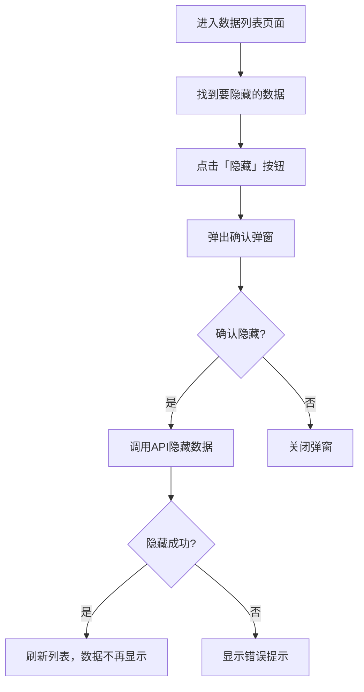
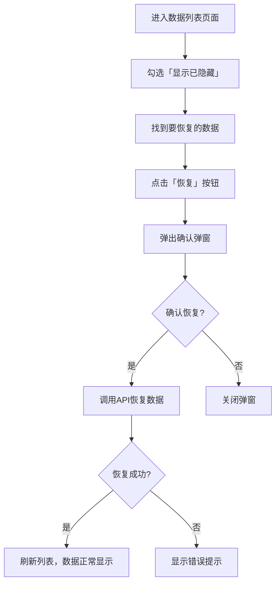

# 需求分析：多模块管理端隐藏功能

**文档版本**：v1.0  
**编制日期**：2026-07-07  
**适用范围**：`pet-app-backend` 后端服务、`pet-app-admin-web` 管理端  
**状态**：草稿

**核心目标**：为管理端多个数据实体（订单、宠物、会员等）添加隐藏功能，支持管理员对敏感数据或无效数据进行隐藏，而不是直接删除，保证数据完整性。

---

## 1. 需求背景与目标

### 1.1 需求背景

在日常运营中，管理端需要处理大量数据，其中部分数据可能由于各种原因（如测试数据、无效数据、用户请求删除等）需要进行隐藏处理。直接删除数据可能会影响关联数据和业务逻辑，因此需要提供隐藏功能。

### 1.2 需求目标

- 为多个数据实体添加 `is_hidden` 字段，支持数据隐藏
- 隐藏的数据在管理端默认不可见
- 支持管理员查看已隐藏的数据
- 支持管理员恢复已隐藏的数据

---

## 2. 功能需求分析

### 2.1 隐藏功能

| 需求编号 | 需求描述 | 优先级 | 来源 |
|----------|----------|--------|------|
| H-01 | 管理员可以隐藏订单数据 | P0 | pet-app-admin-web |
| H-02 | 管理员可以隐藏宠物数据 | P0 | pet-app-admin-web |
| H-03 | 管理员可以隐藏会员数据 | P0 | pet-app-admin-web |
| H-04 | 管理员可以隐藏商品数据 | P0 | pet-app-admin-web |
| H-05 | 管理员可以隐藏分类数据 | P1 | pet-app-admin-web |
| H-06 | 管理员可以隐藏资讯数据 | P1 | pet-app-admin-web |
| H-07 | 管理员可以隐藏活动数据 | P1 | pet-app-admin-web |
| H-08 | 管理员可以隐藏优惠券数据 | P1 | pet-app-admin-web |
| H-09 | 管理员可以隐藏评价数据 | P1 | pet-app-admin-web |

### 2.2 隐藏数据管理

| 需求编号 | 需求描述 | 优先级 | 来源 |
|----------|----------|--------|------|
| HM-01 | 管理端列表默认只显示未隐藏的数据 | P0 | pet-app-admin-web |
| HM-02 | 管理员可以通过筛选查看已隐藏的数据 | P0 | pet-app-admin-web |
| HM-03 | 管理员可以恢复已隐藏的数据 | P0 | pet-app-admin-web |
| HM-04 | 记录隐藏操作的时间和操作人 | P1 | pet-app-backend |

---

## 3. 技术方案设计

### 3.1 数据库设计

为以下9个表添加隐藏相关字段：

| 表名 | 需要添加的字段 |
|------|----------------|
| orders | is_hidden, hidden_at, hidden_by |
| pets | is_hidden, hidden_at, hidden_by |
| users | is_hidden, hidden_at, hidden_by |
| products | is_hidden, hidden_at, hidden_by |
| categories | is_hidden, hidden_at, hidden_by |
| articles | is_hidden, hidden_at, hidden_by |
| activities | is_hidden, hidden_at, hidden_by |
| coupons | is_hidden, hidden_at, hidden_by |
| reviews | is_hidden, hidden_at, hidden_by |

#### 3.1.1 字段定义

| 字段名 | 类型 | 约束 | 说明 |
|--------|------|------|------|
| is_hidden | BOOLEAN | NOT NULL, DEFAULT FALSE | 是否隐藏 |
| hidden_at | TIMESTAMP | NULL | 隐藏时间 |
| hidden_by | INT | NULL | 操作人ID |

#### 3.1.2 数据库迁移脚本

```sql
-- 订单表
ALTER TABLE orders ADD COLUMN is_hidden BOOLEAN DEFAULT FALSE;
ALTER TABLE orders ADD COLUMN hidden_at TIMESTAMP NULL;
ALTER TABLE orders ADD COLUMN hidden_by INT NULL;

-- 宠物表
ALTER TABLE pets ADD COLUMN is_hidden BOOLEAN DEFAULT FALSE;
ALTER TABLE pets ADD COLUMN hidden_at TIMESTAMP NULL;
ALTER TABLE pets ADD COLUMN hidden_by INT NULL;

-- 用户表
ALTER TABLE users ADD COLUMN is_hidden BOOLEAN DEFAULT FALSE;
ALTER TABLE users ADD COLUMN hidden_at TIMESTAMP NULL;
ALTER TABLE users ADD COLUMN hidden_by INT NULL;

-- 商品表
ALTER TABLE products ADD COLUMN is_hidden BOOLEAN DEFAULT FALSE;
ALTER TABLE products ADD COLUMN hidden_at TIMESTAMP NULL;
ALTER TABLE products ADD COLUMN hidden_by INT NULL;

-- 分类表
ALTER TABLE categories ADD COLUMN is_hidden BOOLEAN DEFAULT FALSE;
ALTER TABLE categories ADD COLUMN hidden_at TIMESTAMP NULL;
ALTER TABLE categories ADD COLUMN hidden_by INT NULL;

-- 资讯表
ALTER TABLE articles ADD COLUMN is_hidden BOOLEAN DEFAULT FALSE;
ALTER TABLE articles ADD COLUMN hidden_at TIMESTAMP NULL;
ALTER TABLE articles ADD COLUMN hidden_by INT NULL;

-- 活动表
ALTER TABLE activities ADD COLUMN is_hidden BOOLEAN DEFAULT FALSE;
ALTER TABLE activities ADD COLUMN hidden_at TIMESTAMP NULL;
ALTER TABLE activities ADD COLUMN hidden_by INT NULL;

-- 优惠券表
ALTER TABLE coupons ADD COLUMN is_hidden BOOLEAN DEFAULT FALSE;
ALTER TABLE coupons ADD COLUMN hidden_at TIMESTAMP NULL;
ALTER TABLE coupons ADD COLUMN hidden_by INT NULL;

-- 评价表
ALTER TABLE reviews ADD COLUMN is_hidden BOOLEAN DEFAULT FALSE;
ALTER TABLE reviews ADD COLUMN hidden_at TIMESTAMP NULL;
ALTER TABLE reviews ADD COLUMN hidden_by INT NULL;
```

### 3.2 API 接口设计

#### 3.2.1 隐藏操作接口

| API路径 | HTTP方法 | 所属文件 | 功能描述 |
|---------|----------|----------|----------|
| /api/v1/admin/{entity}/hidden/{id} | POST | pet-app-backend/routes/admin/*.js | 隐藏指定数据 |
| /api/v1/admin/{entity}/hidden/{id}/restore | POST | pet-app-backend/routes/admin/*.js | 恢复指定数据 |

#### 3.2.2 列表查询接口增强

| API路径 | HTTP方法 | 所属文件 | 功能描述 |
|---------|----------|----------|----------|
| /api/v1/admin/{entity} | GET | pet-app-backend/routes/admin/*.js | 列表查询，支持 is_hidden 筛选 |

---

## 4. 前端实现方案

### 4.1 管理端

#### 4.1.1 列表页面增强

| 区域 | 功能描述 |
|------|----------|
| 筛选栏 | 添加「显示已隐藏」筛选选项 |
| 操作列 | 添加「隐藏」和「恢复」操作按钮 |
| 数据行 | 已隐藏的数据显示特殊标识或样式 |

#### 4.1.2 交互设计

| 交互场景 | 设计说明 |
|----------|----------|
| 隐藏数据 | 点击「隐藏」按钮，弹出确认弹窗，确认后调用API隐藏数据 |
| 恢复数据 | 点击「恢复」按钮，弹出确认弹窗，确认后调用API恢复数据 |
| 查看隐藏数据 | 在筛选栏勾选「显示已隐藏」，列表显示所有数据（包括已隐藏） |
| 隐藏数据标识 | 已隐藏的数据行显示灰色背景或「已隐藏」标签 |

---

## 5. 业务流程

### 5.1 隐藏数据流程



### 5.2 恢复数据流程



---

## 6. 安全与权限

### 6.1 权限要求

| 接口 | 权限要求 |
|------|----------|
| 隐藏数据 | 管理员权限 |
| 恢复数据 | 管理员权限 |
| 查看隐藏数据 | 管理员权限 |

### 6.2 数据隔离

| 场景 | 处理方式 |
|------|----------|
| C端查询 | 默认不返回已隐藏的数据 |
| 管理端查询 | 默认不返回已隐藏的数据，需主动筛选 |
| 关联查询 | 关联查询时过滤已隐藏的数据 |

---

## 7. 异常处理

| 异常场景 | 处理方式 |
|----------|----------|
| 数据不存在 | 返回404错误，提示"数据不存在" |
| 数据已隐藏 | 返回400错误，提示"数据已隐藏" |
| 数据未隐藏 | 返回400错误，提示"数据未隐藏" |
| 无权限操作 | 返回403错误，提示"无权限操作" |
| 服务器错误 | 返回500错误，提示"服务器内部错误" |

---

## 8. 版本迭代计划

| 版本 | 迭代内容 | 预计时间 |
|------|----------|----------|
| v1.0 | 为订单、宠物、会员、商品4个核心模块添加隐藏功能 | 2026-07 |
| v1.1 | 为分类、资讯、活动、优惠券、评价5个模块添加隐藏功能 | 2026-08 |
| v1.2 | 添加隐藏操作日志记录 | 2026-09 |