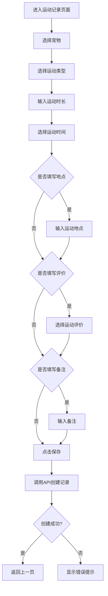
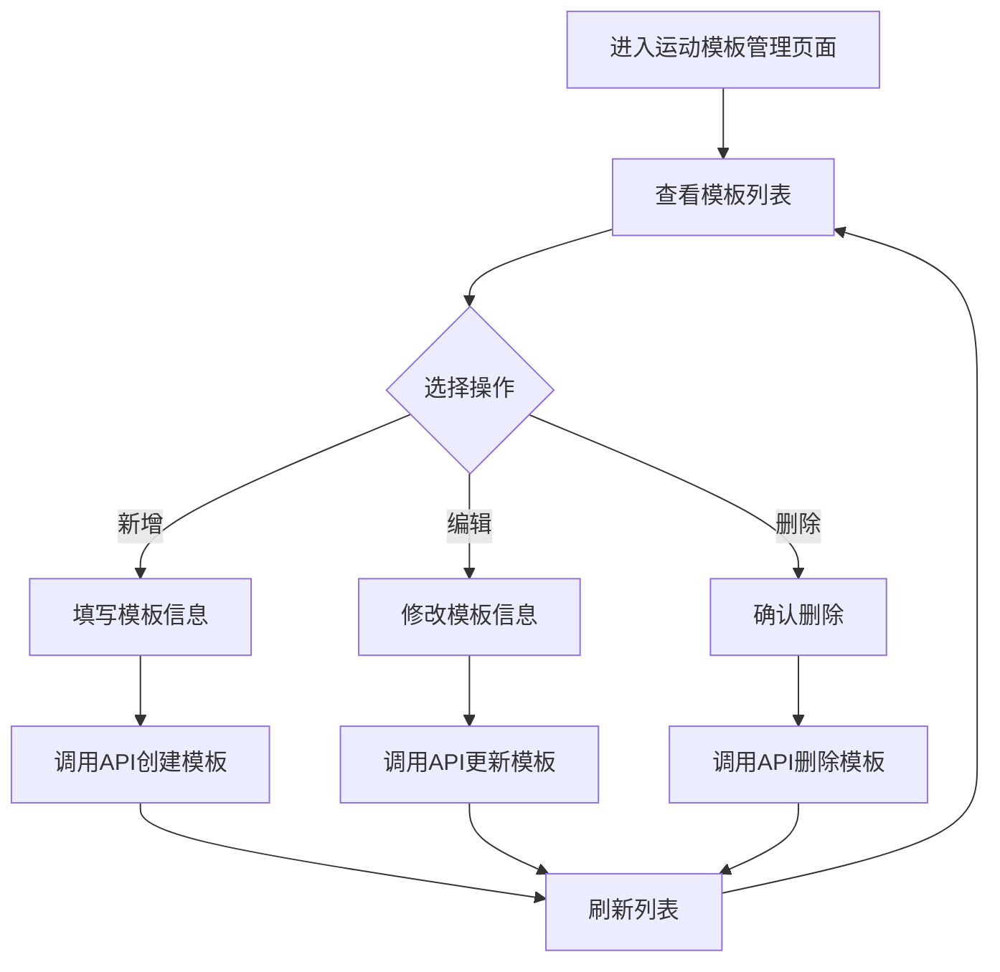

# 需求分析：宠物运动记录功能

**文档版本**：v1.0  
**编制日期**：2026-07-07  
**适用范围**：`pet-app` 微信端、`pet-app-backend` 后端服务、`pet-app-admin-web` 管理端  
**状态**：草稿

**核心目标**：实现宠物运动记录功能，支持记录宠物的运动时间、运动类型、运动时长等信息，并提供运动模板快速记录

---

## 1. 需求背景与目标

### 1.1 需求背景

随着宠物健康意识的提升，宠物主人希望能够记录宠物的日常运动情况，了解宠物的运动习惯，为宠物健康管理提供数据支持。

### 1.2 需求目标

- 支持宠物运动记录的创建、编辑、删除
- 提供运动模板快速记录常见运动类型
- 支持按日期查看运动记录
- 展示运动统计数据

---

## 2. 功能需求分析

### 2.1 运动记录

| 需求编号 | 需求描述 | 优先级 | 来源 |
|----------|----------|--------|------|
| MR-01 | 用户可以为宠物记录运动信息，包括运动类型、运动时长、运动时间、运动地点等 | P0 | pet-app |
| MR-02 | 用户可以编辑已有的运动记录 | P0 | pet-app |
| MR-03 | 用户可以删除已有的运动记录 | P0 | pet-app |
| MR-04 | 用户可以按日期查看宠物的运动记录 | P0 | pet-app |
| MR-05 | 用户可以查看宠物的运动统计数据（如总运动时长、运动次数等） | P1 | pet-app |

### 2.2 运动模板

| 需求编号 | 需求描述 | 优先级 | 来源 |
|----------|----------|--------|------|
| MT-01 | 系统提供预设的运动模板（如散步、奔跑、玩耍、游泳等） | P0 | pet-app |
| MT-02 | 用户可以选择运动模板快速记录运动 | P0 | pet-app |
| MT-03 | 管理端可以新增、编辑、删除运动模板 | P0 | pet-app-admin-web |
| MT-04 | 管理端可以对运动模板进行排序 | P1 | pet-app-admin-web |

---

## 3. 技术方案设计

### 3.1 数据库设计

#### 3.1.1 运动记录表 (`pet_exercise_record`)

| 字段名 | 类型 | 约束 | 说明 |
|--------|------|------|------|
| id | BIGINT | PRIMARY KEY, AUTO_INCREMENT | 主键 |
| pet_id | BIGINT | NOT NULL | 宠物ID |
| record_date | DATE | NOT NULL | 记录日期 |
| exercise_type | VARCHAR(32) | NOT NULL | 运动类型 |
| duration_minutes | SMALLINT | NOT NULL | 运动时长（分钟） |
| start_time | TIME | NOT NULL | 运动开始时间 |
| location | VARCHAR(255) | NULL | 运动地点 |
| assessment | VARCHAR(32) | NULL | 运动评价 |
| remark | TEXT | NULL | 备注 |
| ext_json | JSON | NULL | 扩展字段 |
| create_time | DATETIME | NOT NULL, DEFAULT CURRENT_TIMESTAMP | 创建时间 |
| update_time | DATETIME | NOT NULL, DEFAULT CURRENT_TIMESTAMP ON UPDATE CURRENT_TIMESTAMP | 更新时间 |

**索引设计**：
- `idx_pet_date` (pet_id, record_date)
- `idx_record` (id)

#### 3.1.2 运动模板表 (`exercise_template`)

| 字段名 | 类型 | 约束 | 说明 |
|--------|------|------|------|
| id | BIGINT | PRIMARY KEY, AUTO_INCREMENT | 主键 |
| name | VARCHAR(64) | NOT NULL | 模板名称 |
| icon | VARCHAR(255) | NULL | 图标 |
| category | VARCHAR(32) | NULL | 分类 |
| sort_order | INT | NOT NULL, DEFAULT 0 | 排序 |
| is_active | BOOLEAN | NOT NULL, DEFAULT TRUE | 是否启用 |
| create_time | DATETIME | NOT NULL, DEFAULT CURRENT_TIMESTAMP | 创建时间 |
| update_time | DATETIME | NOT NULL, DEFAULT CURRENT_TIMESTAMP ON UPDATE CURRENT_TIMESTAMP | 更新时间 |

**索引设计**：
- `idx_sort` (sort_order)

### 3.2 API 接口设计

#### 3.2.1 C端接口

| API路径 | HTTP方法 | 所属文件 | 功能描述 |
|---------|----------|----------|----------|
| /api/v1/exercise/records | POST | pet-app-backend/routes/exercise.js | 创建运动记录 |
| /api/v1/exercise/records | GET | pet-app-backend/routes/exercise.js | 查询运动记录列表 |
| /api/v1/exercise/records/:id | GET | pet-app-backend/routes/exercise.js | 查询单个运动记录 |
| /api/v1/exercise/records/:id | PUT | pet-app-backend/routes/exercise.js | 更新运动记录 |
| /api/v1/exercise/records/:id | DELETE | pet-app-backend/routes/exercise.js | 删除运动记录 |
| /api/v1/exercise/templates | GET | pet-app-backend/routes/exercise.js | 查询运动模板列表 |

#### 3.2.2 管理端接口

| API路径 | HTTP方法 | 所属文件 | 功能描述 |
|---------|----------|----------|----------|
| /api/v1/admin/exercise/templates | POST | pet-app-backend/routes/admin/exercise.js | 创建运动模板 |
| /api/v1/admin/exercise/templates | GET | pet-app-backend/routes/admin/exercise.js | 查询运动模板列表 |
| /api/v1/admin/exercise/templates/:id | GET | pet-app-backend/routes/admin/exercise.js | 查询单个运动模板 |
| /api/v1/admin/exercise/templates/:id | PUT | pet-app-backend/routes/admin/exercise.js | 更新运动模板 |
| /api/v1/admin/exercise/templates/:id | DELETE | pet-app-backend/routes/admin/exercise.js | 删除运动模板 |

---

## 4. 前端实现方案

### 4.1 小程序端

#### 4.1.1 页面设计

**运动记录页面** (`pages/pet/exercise-record.vue`)

| 区域 | 功能描述 |
|------|----------|
| 顶部导航 | 显示页面标题，提供返回按钮 |
| 宠物选择 | 选择要记录运动的宠物 |
| 运动类型选择 | 从预设模板中选择运动类型 |
| 运动时长输入 | 输入运动时长（支持快速选择常用时长） |
| 运动时间选择 | 选择运动开始时间 |
| 运动地点输入 | 输入运动地点（可选） |
| 运动评价选择 | 选择运动评价（可选） |
| 备注输入 | 输入备注信息（可选） |
| 保存按钮 | 保存运动记录 |

#### 4.1.2 交互设计

| 交互场景 | 设计说明 |
|----------|----------|
| 进入页面 | 默认选择当前宠物，显示当天日期 |
| 选择运动类型 | 弹出运动模板列表，选择后自动填充相关信息 |
| 输入时长 | 支持手动输入和快速选择（15分钟、30分钟、45分钟、60分钟等） |
| 保存记录 | 验证必填字段，调用API保存，成功后返回上一页 |

### 4.2 管理端

#### 4.2.1 页面设计

**运动模板管理页面**

| 区域 | 功能描述 |
|------|----------|
| 顶部操作栏 | 提供新增模板按钮 |
| 模板列表 | 显示所有运动模板，支持分页 |
| 操作列 | 提供编辑、删除操作按钮 |
| 新增/编辑弹窗 | 表单填写模板信息 |

#### 4.2.2 交互设计

| 交互场景 | 设计说明 |
|----------|----------|
| 新增模板 | 点击新增按钮，弹出表单弹窗，填写信息后保存 |
| 编辑模板 | 点击编辑按钮，弹出表单弹窗，修改信息后保存 |
| 删除模板 | 点击删除按钮，弹出确认弹窗，确认后删除 |
| 排序 | 支持拖拽排序或通过排序字段调整顺序 |

---

## 5. 数据模型设计

### 5.1 运动记录数据模型

```javascript
// pet-app-backend/models/ExerciseRecord.js
class ExerciseRecord extends Model {
  static init(sequelize) {
    return super.init({
      id: { type: DataTypes.BIGINT, primaryKey: true, autoIncrement: true },
      pet_id: { type: DataTypes.BIGINT, allowNull: false },
      record_date: { type: DataTypes.DATEONLY, allowNull: false },
      exercise_type: { type: DataTypes.STRING(32), allowNull: false },
      duration_minutes: { type: DataTypes.SMALLINT, allowNull: false },
      start_time: { type: DataTypes.TIME, allowNull: false },
      location: { type: DataTypes.STRING(255) },
      assessment: { type: DataTypes.STRING(32) },
      remark: { type: DataTypes.TEXT },
      ext_json: { type: DataTypes.JSON },
      create_time: { type: DataTypes.DATE, defaultValue: DataTypes.NOW },
      update_time: { type: DataTypes.DATE, defaultValue: DataTypes.NOW }
    }, {
      sequelize,
      tableName: 'pet_exercise_record',
      timestamps: false
    });
  }
}
```

### 5.2 运动模板数据模型

```javascript
// pet-app-backend/models/ExerciseTemplate.js
class ExerciseTemplate extends Model {
  static init(sequelize) {
    return super.init({
      id: { type: DataTypes.BIGINT, primaryKey: true, autoIncrement: true },
      name: { type: DataTypes.STRING(64), allowNull: false },
      icon: { type: DataTypes.STRING(255) },
      category: { type: DataTypes.STRING(32) },
      sort_order: { type: DataTypes.INTEGER, defaultValue: 0 },
      is_active: { type: DataTypes.BOOLEAN, defaultValue: true },
      create_time: { type: DataTypes.DATE, defaultValue: DataTypes.NOW },
      update_time: { type: DataTypes.DATE, defaultValue: DataTypes.NOW }
    }, {
      sequelize,
      tableName: 'exercise_template',
      timestamps: false
    });
  }
}
```

---

## 6. 接口详细设计

### 6.1 C端接口

#### 6.1.1 创建运动记录

**请求**：
```
POST /api/v1/exercise/records
```

**请求体**：
```json
{
  "pet_id": 1,
  "record_date": "2026-07-07",
  "exercise_type": "散步",
  "duration_minutes": 30,
  "start_time": "18:30:00",
  "location": "小区公园",
  "assessment": "良好",
  "remark": "今天天气不错，毛孩子玩得很开心"
}
```

**响应**：
```json
{
  "code": 0,
  "message": "success",
  "data": {
    "id": 1,
    "pet_id": 1,
    "record_date": "2026-07-07",
    "exercise_type": "散步",
    "duration_minutes": 30,
    "start_time": "18:30:00",
    "location": "小区公园",
    "assessment": "良好",
    "remark": "今天天气不错，毛孩子玩得很开心",
    "create_time": "2026-07-07 18:35:00",
    "update_time": "2026-07-07 18:35:00"
  }
}
```

#### 6.1.2 查询运动记录列表

**请求**：
```
GET /api/v1/exercise/records?pet_id=1&record_date=2026-07-07
```

**响应**：
```json
{
  "code": 0,
  "message": "success",
  "data": {
    "list": [
      {
        "id": 1,
        "pet_id": 1,
        "record_date": "2026-07-07",
        "exercise_type": "散步",
        "duration_minutes": 30,
        "start_time": "18:30:00",
        "location": "小区公园",
        "assessment": "良好",
        "remark": "今天天气不错，毛孩子玩得很开心",
        "create_time": "2026-07-07 18:35:00",
        "update_time": "2026-07-07 18:35:00"
      }
    ],
    "total": 1
  }
}
```

#### 6.1.3 查询单个运动记录

**请求**：
```
GET /api/v1/exercise/records/1
```

**响应**：
```json
{
  "code": 0,
  "message": "success",
  "data": {
    "id": 1,
    "pet_id": 1,
    "record_date": "2026-07-07",
    "exercise_type": "散步",
    "duration_minutes": 30,
    "start_time": "18:30:00",
    "location": "小区公园",
    "assessment": "良好",
    "remark": "今天天气不错，毛孩子玩得很开心",
    "create_time": "2026-07-07 18:35:00",
    "update_time": "2026-07-07 18:35:00"
  }
}
```

#### 6.1.4 更新运动记录

**请求**：
```
PUT /api/v1/exercise/records/1
```

**请求体**：
```json
{
  "duration_minutes": 45,
  "assessment": "优秀"
}
```

**响应**：
```json
{
  "code": 0,
  "message": "success",
  "data": {
    "id": 1,
    "pet_id": 1,
    "record_date": "2026-07-07",
    "exercise_type": "散步",
    "duration_minutes": 45,
    "start_time": "18:30:00",
    "location": "小区公园",
    "assessment": "优秀",
    "remark": "今天天气不错，毛孩子玩得很开心",
    "create_time": "2026-07-07 18:35:00",
    "update_time": "2026-07-07 19:00:00"
  }
}
```

#### 6.1.5 删除运动记录

**请求**：
```
DELETE /api/v1/exercise/records/1
```

**响应**：
```json
{
  "code": 0,
  "message": "success"
}
```

#### 6.1.6 查询运动模板列表

**请求**：
```
GET /api/v1/exercise/templates
```

**响应**：
```json
{
  "code": 0,
  "message": "success",
  "data": [
    {
      "id": 1,
      "name": "散步",
      "icon": "🏃",
      "category": "户外活动",
      "sort_order": 1,
      "is_active": true
    },
    {
      "id": 2,
      "name": "奔跑",
      "icon": "⚽",
      "category": "户外活动",
      "sort_order": 2,
      "is_active": true
    }
  ]
}
```

### 6.2 管理端接口

#### 6.2.1 创建运动模板

**请求**：
```
POST /api/v1/admin/exercise/templates
```

**请求体**：
```json
{
  "name": "游泳",
  "icon": "🏊",
  "category": "户外活动",
  "sort_order": 3
}
```

**响应**：
```json
{
  "code": 0,
  "message": "success",
  "data": {
    "id": 3,
    "name": "游泳",
    "icon": "🏊",
    "category": "户外活动",
    "sort_order": 3,
    "is_active": true,
    "create_time": "2026-07-07 10:00:00",
    "update_time": "2026-07-07 10:00:00"
  }
}
```

#### 6.2.2 查询运动模板列表

**请求**：
```
GET /api/v1/admin/exercise/templates
```

**响应**：
```json
{
  "code": 0,
  "message": "success",
  "data": {
    "list": [
      {
        "id": 1,
        "name": "散步",
        "icon": "🏃",
        "category": "户外活动",
        "sort_order": 1,
        "is_active": true,
        "create_time": "2026-07-07 09:00:00",
        "update_time": "2026-07-07 09:00:00"
      }
    ],
    "total": 1
  }
}
```

#### 6.2.3 查询单个运动模板

**请求**：
```
GET /api/v1/admin/exercise/templates/1
```

**响应**：
```json
{
  "code": 0,
  "message": "success",
  "data": {
    "id": 1,
    "name": "散步",
    "icon": "🏃",
    "category": "户外活动",
    "sort_order": 1,
    "is_active": true,
    "create_time": "2026-07-07 09:00:00",
    "update_time": "2026-07-07 09:00:00"
  }
}
```

#### 6.2.4 更新运动模板

**请求**：
```
PUT /api/v1/admin/exercise/templates/1
```

**请求体**：
```json
{
  "name": "慢走",
  "sort_order": 0
}
```

**响应**：
```json
{
  "code": 0,
  "message": "success",
  "data": {
    "id": 1,
    "name": "慢走",
    "icon": "🏃",
    "category": "户外活动",
    "sort_order": 0,
    "is_active": true,
    "create_time": "2026-07-07 09:00:00",
    "update_time": "2026-07-07 11:00:00"
  }
}
```

#### 6.2.5 删除运动模板

**请求**：
```
DELETE /api/v1/admin/exercise/templates/1
```

**响应**：
```json
{
  "code": 0,
  "message": "success"
}
```

---

## 7. 业务流程

### 7.1 运动记录流程



### 7.2 运动模板管理流程



---

## 8. 安全与权限

### 8.1 C端权限

| 接口 | 权限要求 |
|------|----------|
| 创建运动记录 | 登录用户，只能为自己的宠物创建记录 |
| 查询运动记录 | 登录用户，只能查询自己宠物的记录 |
| 更新运动记录 | 登录用户，只能更新自己创建的记录 |
| 删除运动记录 | 登录用户，只能删除自己创建的记录 |
| 查询运动模板 | 无需登录，公开接口 |

### 8.2 管理端权限

| 接口 | 权限要求 |
|------|----------|
| 创建运动模板 | 管理员权限 |
| 查询运动模板 | 管理员权限 |
| 更新运动模板 | 管理员权限 |
| 删除运动模板 | 管理员权限 |

---

## 9. 异常处理

### 9.1 C端异常

| 异常场景 | 处理方式 |
|----------|----------|
| 参数校验失败 | 返回400错误，提示具体错误信息 |
| 宠物不存在 | 返回404错误，提示"宠物不存在" |
| 运动记录不存在 | 返回404错误，提示"运动记录不存在" |
| 无权限操作 | 返回403错误，提示"无权限操作" |
| 服务器错误 | 返回500错误，提示"服务器内部错误" |

### 9.2 管理端异常

| 异常场景 | 处理方式 |
|----------|----------|
| 参数校验失败 | 返回400错误，提示具体错误信息 |
| 运动模板不存在 | 返回404错误，提示"运动模板不存在" |
| 无管理员权限 | 返回403错误，提示"无权限操作" |
| 服务器错误 | 返回500错误，提示"服务器内部错误" |

---

## 10. 版本迭代计划

| 版本 | 迭代内容 | 预计时间 |
|------|----------|----------|
| v1.0 | 基础运动记录功能，支持创建、编辑、删除、查询 | 2026-07 |
| v1.1 | 运动模板功能，支持预设模板快速记录 | 2026-08 |
| v1.2 | 运动统计功能，展示运动数据统计 | 2026-09 |
| v2.0 | 运动趋势分析，提供运动数据可视化 | 2026-10 |