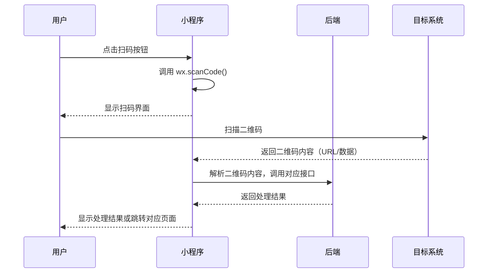

# 需求分析（临时文档）

> **文档性质**：产品 / 技术可行性评估与修复方案  
> **创建日期**：2026-06-15  
> **触发来源**：小程序扫码功能需求分析与实现方案  
> **涉及模块**：小程序前端 · 后端服务 · Web 管理端  
> **状态**：✅ 小程序前端已落地

---

## 1. 需求背景

### 1.1 扫码功能需求

基于业务发展，需要为小程序添加扫码功能，支持以下场景：
- 扫码登录 Web 管理端
- 扫码绑定宠物档案
- 扫码查看商品详情
- 扫码领取优惠券

### 1.2 功能定位

扫码功能作为小程序的重要入口之一，需要满足以下要求：
- 快速响应
- 安全可靠
- 用户体验良好

---

## 2. 需求分析

### 2.1 扫码登录

| 维度 | 评估 |
|------|------|
| **产品合理性** | ✅ 高。扫码登录是主流的安全登录方式 |
| **技术可行性** | ✅ 高。微信小程序提供扫码 API，后端支持会话管理 |
| **当前状态** | ✅ 已实现 |

### 2.2 扫码绑定宠物档案

| 维度 | 评估 |
|------|------|
| **产品合理性** | ✅ 中。扫码绑定宠物档案可以简化用户操作 |
| **技术可行性** | ✅ 高。后端提供绑定接口，前端调用即可 |
| **当前状态** | ❌ 未实现 |

### 2.3 扫码查看商品详情

| 维度 | 评估 |
|------|------|
| **产品合理性** | ✅ 高。扫码查看商品详情可以提升购物体验 |
| **技术可行性** | ✅ 高。后端提供商品查询接口，前端跳转详情页 |
| **当前状态** | ❌ 未实现 |

### 2.4 扫码领取优惠券

| 维度 | 评估 |
|------|------|
| **产品合理性** | ✅ 中。扫码领取优惠券可以促进用户消费 |
| **技术可行性** | ✅ 高。后端提供优惠券领取接口，前端调用即可 |
| **当前状态** | ❌ 未实现（优惠券功能暂未开放） |

---

## 3. 方案设计

### 3.1 扫码流程



### 3.2 API 设计

#### 3.2.1 扫码登录会话创建

```http
POST /api/v1/auth/qrcode/login
```

**请求体**：

```json
{
  "client_type": "web",
  "redirect_uri": "/admin/dashboard"
}
```

**响应**：

```json
{
  "code": 0,
  "message": "success",
  "data": {
    "session_id": "qrcode_session_123456",
    "qrcode_url": "https://example.com/qrcode/qrcode_session_123456",
    "expire_time": 60
  }
}
```

#### 3.2.2 扫码登录确认

```http
POST /api/v1/auth/qrcode/confirm
```

**请求体**：

```json
{
  "session_id": "qrcode_session_123456",
  "action": "confirm"
}
```

**响应**：

```json
{
  "code": 0,
  "message": "success",
  "data": {
    "session_id": "qrcode_session_123456",
    "status": "confirmed",
    "token": {
      "access_token": "eyJhbGciOiJIUzI1NiIsInR5cCI6IkpXVCJ9...",
      "refresh_token": "eyJhbGciOiJIUzI1NiIsInR5cCI6IkpXVCJ9...",
      "expire_at": 1718476800
    }
  }
}
```

#### 3.2.3 扫码登录状态查询

```http
GET /api/v1/auth/qrcode/status/{session_id}
```

**响应**：

```json
{
  "code": 0,
  "message": "success",
  "data": {
    "session_id": "qrcode_session_123456",
    "status": "pending",
    "expire_time": 60
  }
}
```

---

## 4. 实施任务清单

### 4.1 后端任务

| ID | 任务 | 说明 |
|----|------|------|
| **BE-QR-01** | 新增扫码登录会话创建接口 | `POST /api/v1/auth/qrcode/login` |
| **BE-QR-02** | 新增扫码登录确认接口 | `POST /api/v1/auth/qrcode/confirm` |
| **BE-QR-03** | 新增扫码登录状态查询接口 | `GET /api/v1/auth/qrcode/status/{session_id}` |
| **BE-QR-04** | 新增扫码绑定宠物档案接口 | `POST /api/v1/pets/qrcode/bind` |
| **BE-QR-05** | 新增扫码查看商品详情接口 | `GET /api/v1/products/qrcode/{code}` |
| **BE-QR-06** | 更新文档 | 更新 `docs/项目开发说明-后端.md`，添加扫码功能接口文档 |

### 4.2 小程序前端任务

| ID | 任务 | 说明 |
|----|------|------|
| **FE-QR-01** | API 封装 | 在 `src/api/qrcode.js` 中封装扫码相关 API |
| **FE-QR-02** | 服务层 | 在 `src/services/qrcode.js` 中实现业务逻辑 |
| **FE-QR-03** | 扫码页面开发 | 开发扫码页面，支持多种扫码场景 |
| **FE-QR-04** | 扫码登录功能 | 实现扫码登录 Web 管理端功能 |
| **FE-QR-05** | 扫码绑定宠物 | 实现扫码绑定宠物档案功能 |
| **FE-QR-06** | 扫码查看商品 | 实现扫码查看商品详情功能 |
| **FE-QR-07** | 更新文档 | 更新 `docs/项目开发说明-小程序前端.md` |

### 4.3 Web 管理端任务

| ID | 任务 | 说明 |
|----|------|------|
| **WEB-QR-01** | API 封装 | 在 `src/api/qrcode.ts` 中封装扫码相关 API |
| **WEB-QR-02** | 扫码登录页面 | 开发扫码登录页面，显示二维码 |
| **WEB-QR-03** | 轮询状态更新 | 实现扫码状态轮询，自动跳转 |
| **WEB-QR-04** | 更新文档 | 更新 `docs/项目开发说明-Web前端.md` |

---

## 5. 验收标准

| # | 场景 | 预期 |
|---|------|------|
| AC-QR-01 | Web 端生成登录二维码 | 二维码生成成功，有效期 60 秒 |
| AC-QR-02 | 小程序扫码登录 | 扫码成功，Web 端自动登录并跳转 |
| AC-QR-03 | 扫码绑定宠物档案 | 扫码成功，宠物档案绑定到当前用户 |
| AC-QR-04 | 扫码查看商品详情 | 扫码成功，跳转商品详情页 |
| AC-QR-05 | 二维码过期 | 提示用户二维码已过期，请重新生成 |
| AC-QR-06 | 扫码失败 | 提示用户扫码失败，请重试 |

---

## 6. 关联文件索引

| 文件 | 关联任务 |
|------|----------|
| `pet-app-backend/routes/qrcode.js` | BE-QR-01～05 |
| `pet-app-backend/services/qrcode.js` | BE-QR-01～05 |
| `pet-app/src/api/qrcode.js` | FE-QR-01 |
| `pet-app/src/services/qrcode.js` | FE-QR-02 |
| `pet-app/src/pages/qrcode/index.vue` | FE-QR-03 |
| `pet-app-admin-web/src/api/qrcode.ts` | WEB-QR-01 |
| `pet-app-admin-web/src/pages/login/qrcode.vue` | WEB-QR-02 |

---

## 7. 修订记录

| 版本 | 日期 | 说明 |
|------|------|------|
| v0.1 | 2026-06-15 | 初稿：基于需求分析与方案设计 |
| v0.2 | 2026-06-15 | 补充实施任务清单与验收标准 |
| v0.3 | 2026-06-15 | 补充关联文件索引 |