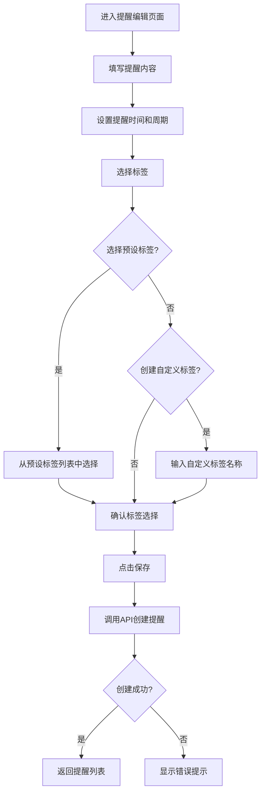
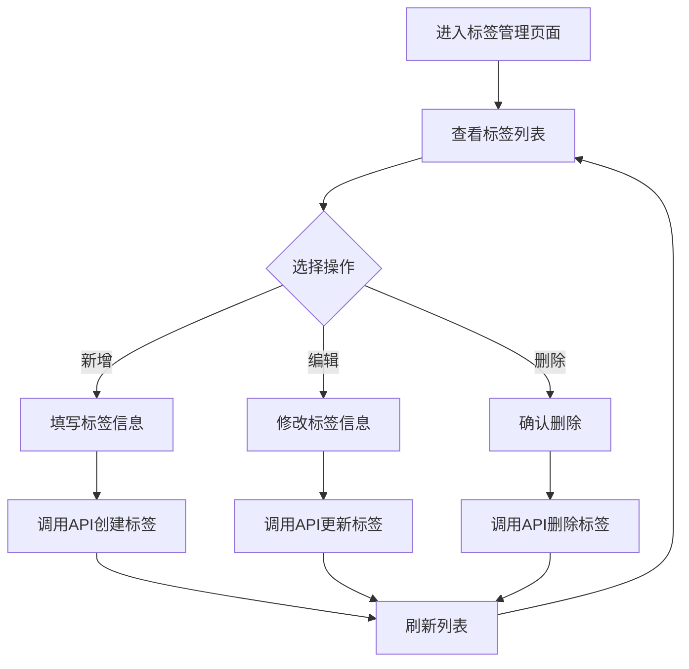

# 需求分析：日常提醒标签功能

**文档版本**：v1.0  
**编制日期**：2026-07-07  
**适用范围**：`pet-app` 微信端、`pet-app-backend` 后端服务、`pet-app-admin-web` 管理端  
**状态**：草稿

**核心目标**：为日常提醒功能添加标签管理功能，支持用户为提醒设置标签，便于分类管理和快速筛选。

---

## 1. 需求背景与目标

### 1.1 需求背景

随着用户创建的日常提醒数量增多，需要一种方式来对提醒进行分类管理。标签功能可以帮助用户快速识别和筛选提醒，提升使用体验。

### 1.2 需求目标

- 支持为提醒添加标签
- 提供预设标签供用户选择
- 支持自定义标签
- 支持按标签筛选提醒
- 管理端可以管理预设标签

---

## 2. 功能需求分析

### 2.1 标签管理

| 需求编号 | 需求描述 | 优先级 | 来源 |
|----------|----------|--------|------|
| T-01 | 用户可以为提醒添加标签 | P0 | pet-app |
| T-02 | 用户可以选择预设标签 | P0 | pet-app |
| T-03 | 用户可以创建自定义标签 | P1 | pet-app |
| T-04 | 用户可以删除自己创建的标签 | P1 | pet-app |
| T-05 | 用户可以按标签筛选提醒 | P0 | pet-app |

### 2.2 预设标签管理（管理端）

| 需求编号 | 需求描述 | 优先级 | 来源 |
|----------|----------|--------|------|
| PT-01 | 管理端可以新增预设标签 | P0 | pet-app-admin-web |
| PT-02 | 管理端可以编辑预设标签 | P0 | pet-app-admin-web |
| PT-03 | 管理端可以删除预设标签 | P0 | pet-app-admin-web |
| PT-04 | 管理端可以对预设标签进行分类 | P1 | pet-app-admin-web |
| PT-05 | 管理端可以对预设标签进行排序 | P1 | pet-app-admin-web |

---

## 3. 技术方案设计

### 3.1 数据库设计

#### 3.1.1 提醒标签字典表 (`reminder_tag_dict`)

| 字段名 | 类型 | 约束 | 说明 |
|--------|------|------|------|
| id | BIGINT | PRIMARY KEY, AUTO_INCREMENT | 主键 |
| name | VARCHAR(64) | NOT NULL | 标签名称 |
| category | VARCHAR(32) | NULL | 分类 |
| sort_order | INT | NOT NULL, DEFAULT 0 | 排序 |
| is_active | BOOLEAN | NOT NULL, DEFAULT TRUE | 是否启用 |
| icon | VARCHAR(32) | NULL | 图标 |
| create_time | DATETIME | NOT NULL, DEFAULT CURRENT_TIMESTAMP | 创建时间 |
| update_time | DATETIME | NOT NULL, DEFAULT CURRENT_TIMESTAMP ON UPDATE CURRENT_TIMESTAMP | 更新时间 |

**索引设计**：
- `idx_category_sort` (category, sort_order)

#### 3.1.2 用户自定义标签表 (`user_reminder_tag`)

| 字段名 | 类型 | 约束 | 说明 |
|--------|------|------|------|
| id | BIGINT | PRIMARY KEY, AUTO_INCREMENT | 主键 |
| user_id | BIGINT | NOT NULL | 用户ID |
| name | VARCHAR(64) | NOT NULL | 标签名称 |
| color | VARCHAR(16) | NULL | 标签颜色 |
| create_time | DATETIME | NOT NULL, DEFAULT CURRENT_TIMESTAMP | 创建时间 |

**索引设计**：
- `idx_user_id` (user_id)

#### 3.1.3 提醒表增强

在 `reminders` 表中添加 `tags` 字段：

| 字段名 | 类型 | 约束 | 说明 |
|--------|------|------|------|
| tags | JSON | NULL | 标签列表 |

### 3.2 API 接口设计

#### 3.2.1 C端接口

| API路径 | HTTP方法 | 所属文件 | 功能描述 |
|---------|----------|----------|----------|
| /api/v1/reminder/tags | GET | pet-app-backend/routes/reminder.js | 查询标签列表（预设标签 + 用户自定义标签） |
| /api/v1/reminder/tags | POST | pet-app-backend/routes/reminder.js | 创建用户自定义标签 |
| /api/v1/reminder/tags/:id | DELETE | pet-app-backend/routes/reminder.js | 删除用户自定义标签 |
| /api/v1/reminder | GET | pet-app-backend/routes/reminder.js | 查询提醒列表，支持按标签筛选 |
| /api/v1/reminder | POST | pet-app-backend/routes/reminder.js | 创建提醒，支持添加标签 |
| /api/v1/reminder/:id | PUT | pet-app-backend/routes/reminder.js | 更新提醒，支持修改标签 |

#### 3.2.2 管理端接口

| API路径 | HTTP方法 | 所属文件 | 功能描述 |
|---------|----------|----------|----------|
| /api/v1/admin/reminder/tags | POST | pet-app-backend/routes/admin/reminder.js | 创建预设标签 |
| /api/v1/admin/reminder/tags | GET | pet-app-backend/routes/admin/reminder.js | 查询预设标签列表 |
| /api/v1/admin/reminder/tags/:id | GET | pet-app-backend/routes/admin/reminder.js | 查询单个预设标签 |
| /api/v1/admin/reminder/tags/:id | PUT | pet-app-backend/routes/admin/reminder.js | 更新预设标签 |
| /api/v1/admin/reminder/tags/:id | DELETE | pet-app-backend/routes/admin/reminder.js | 删除预设标签 |

---

## 4. 前端实现方案

### 4.1 小程序端

#### 4.1.1 提醒编辑页面增强

**提醒编辑页面** (`pages/reminder/edit.vue`)

| 区域 | 功能描述 |
|------|----------|
| 标签选择区域 | 显示预设标签列表和用户自定义标签 |
| 标签搜索 | 支持搜索标签 |
| 添加标签 | 点击标签添加到提醒 |
| 移除标签 | 点击已添加的标签移除 |
| 自定义标签输入 | 输入自定义标签名称 |

#### 4.1.2 提醒列表页面增强

**提醒列表页面** (`pages/reminder/list.vue`)

| 区域 | 功能描述 |
|------|----------|
| 标签筛选栏 | 显示常用标签，点击筛选 |
| 提醒卡片 | 显示提醒的标签 |

#### 4.1.3 交互设计

| 交互场景 | 设计说明 |
|----------|----------|
| 选择标签 | 点击标签，标签变为选中状态 |
| 取消选择 | 点击已选中的标签，取消选中 |
| 添加自定义标签 | 输入标签名称，点击添加 |
| 按标签筛选 | 在列表页点击标签，只显示带该标签的提醒 |

### 4.2 管理端

#### 4.2.1 标签管理页面

| 区域 | 功能描述 |
|------|----------|
| 顶部操作栏 | 提供新增标签按钮 |
| 标签列表 | 显示所有预设标签，支持分页和搜索 |
| 操作列 | 提供编辑、删除操作按钮 |
| 新增/编辑弹窗 | 表单填写标签信息 |

#### 4.2.2 交互设计

| 交互场景 | 设计说明 |
|----------|----------|
| 新增标签 | 点击新增按钮，弹出表单弹窗，填写信息后保存 |
| 编辑标签 | 点击编辑按钮，弹出表单弹窗，修改信息后保存 |
| 删除标签 | 点击删除按钮，弹出确认弹窗，确认后删除 |
| 分类筛选 | 在列表页选择分类，只显示该分类的标签 |

---

## 5. 数据模型设计

### 5.1 提醒数据模型

```json
{
  "id": "rm_abc123",
  "enabled": true,
  "status": "active",
  "cycle": "daily",
  "time": "20:00",
  "content": "记录毛孩子今日饮食与体重",
  "tags": ["喂食", "记录"],
  "once_date": null,
  "weekday": null,
  "month_day": null,
  "last_fired_at": null,
  "create_time": "2026-07-07T10:00:00+08:00",
  "update_time": "2026-07-07T10:00:00+08:00"
}
```

### 5.2 预设标签数据模型

```javascript
// pet-app-backend/models/ReminderTagDict.js
class ReminderTagDict extends Model {
  static init(sequelize) {
    return super.init({
      id: { type: DataTypes.BIGINT, primaryKey: true, autoIncrement: true },
      name: { type: DataTypes.STRING(64), allowNull: false },
      category: { type: DataTypes.STRING(32) },
      sort_order: { type: DataTypes.INTEGER, defaultValue: 0 },
      is_active: { type: DataTypes.BOOLEAN, defaultValue: true },
      icon: { type: DataTypes.STRING(32) },
      create_time: { type: DataTypes.DATE, defaultValue: DataTypes.NOW },
      update_time: { type: DataTypes.DATE, defaultValue: DataTypes.NOW }
    }, {
      sequelize,
      tableName: 'reminder_tag_dict',
      timestamps: false
    });
  }
}
```

### 5.3 用户自定义标签数据模型

```javascript
// pet-app-backend/models/UserReminderTag.js
class UserReminderTag extends Model {
  static init(sequelize) {
    return super.init({
      id: { type: DataTypes.BIGINT, primaryKey: true, autoIncrement: true },
      user_id: { type: DataTypes.BIGINT, allowNull: false },
      name: { type: DataTypes.STRING(64), allowNull: false },
      color: { type: DataTypes.STRING(16) },
      create_time: { type: DataTypes.DATE, defaultValue: DataTypes.NOW }
    }, {
      sequelize,
      tableName: 'user_reminder_tag',
      timestamps: false
    });
  }
}
```

---

## 6. 接口详细设计

### 6.1 C端接口

#### 6.1.1 查询标签列表

**请求**：
```
GET /api/v1/reminder/tags
```

**响应**：
```json
{
  "code": 0,
  "message": "success",
  "data": {
    "preset_tags": [
      {
        "id": 1,
        "name": "喂食",
        "category": "日常",
        "icon": "🍚",
        "is_active": true
      },
      {
        "id": 2,
        "name": "运动",
        "category": "健康",
        "icon": "🏃",
        "is_active": true
      }
    ],
    "user_tags": [
      {
        "id": 101,
        "name": "洗澡",
        "color": "#FF6B6B"
      }
    ]
  }
}
```

#### 6.1.2 创建用户自定义标签

**请求**：
```
POST /api/v1/reminder/tags
```

**请求体**：
```json
{
  "name": "洗澡",
  "color": "#FF6B6B"
}
```

**响应**：
```json
{
  "code": 0,
  "message": "success",
  "data": {
    "id": 101,
    "name": "洗澡",
    "color": "#FF6B6B",
    "create_time": "2026-07-07 10:00:00"
  }
}
```

#### 6.1.3 删除用户自定义标签

**请求**：
```
DELETE /api/v1/reminder/tags/101
```

**响应**：
```json
{
  "code": 0,
  "message": "success"
}
```

#### 6.1.4 创建提醒（含标签）

**请求**：
```
POST /api/v1/reminder
```

**请求体**：
```json
{
  "enabled": true,
  "cycle": "daily",
  "time": "20:00",
  "content": "记录毛孩子今日饮食与体重",
  "tags": ["喂食", "记录"]
}
```

**响应**：
```json
{
  "code": 0,
  "message": "success",
  "data": {
    "id": "rm_abc123",
    "enabled": true,
    "status": "active",
    "cycle": "daily",
    "time": "20:00",
    "content": "记录毛孩子今日饮食与体重",
    "tags": ["喂食", "记录"],
    "create_time": "2026-07-07 10:00:00",
    "update_time": "2026-07-07 10:00:00"
  }
}
```

#### 6.1.5 查询提醒列表（按标签筛选）

**请求**：
```
GET /api/v1/reminder?tag=喂食
```

**响应**：
```json
{
  "code": 0,
  "message": "success",
  "data": {
    "list": [
      {
        "id": "rm_abc123",
        "enabled": true,
        "status": "active",
        "cycle": "daily",
        "time": "20:00",
        "content": "记录毛孩子今日饮食与体重",
        "tags": ["喂食", "记录"]
      }
    ],
    "total": 1
  }
}
```

### 6.2 管理端接口

#### 6.2.1 创建预设标签

**请求**：
```
POST /api/v1/admin/reminder/tags
```

**请求体**：
```json
{
  "name": "美容",
  "category": "护理",
  "sort_order": 5,
  "icon": "💅"
}
```

**响应**：
```json
{
  "code": 0,
  "message": "success",
  "data": {
    "id": 3,
    "name": "美容",
    "category": "护理",
    "sort_order": 5,
    "icon": "💅",
    "is_active": true,
    "create_time": "2026-07-07 10:00:00",
    "update_time": "2026-07-07 10:00:00"
  }
}
```

#### 6.2.2 查询预设标签列表

**请求**：
```
GET /api/v1/admin/reminder/tags?category=日常
```

**响应**：
```json
{
  "code": 0,
  "message": "success",
  "data": {
    "list": [
      {
        "id": 1,
        "name": "喂食",
        "category": "日常",
        "sort_order": 1,
        "icon": "🍚",
        "is_active": true
      }
    ],
    "total": 1
  }
}
```

#### 6.2.3 更新预设标签

**请求**：
```
PUT /api/v1/admin/reminder/tags/1
```

**请求体**：
```json
{
  "name": "喂饭",
  "sort_order": 0
}
```

**响应**：
```json
{
  "code": 0,
  "message": "success",
  "data": {
    "id": 1,
    "name": "喂饭",
    "category": "日常",
    "sort_order": 0,
    "icon": "🍚",
    "is_active": true,
    "create_time": "2026-07-07 09:00:00",
    "update_time": "2026-07-07 11:00:00"
  }
}
```

#### 6.2.4 删除预设标签

**请求**：
```
DELETE /api/v1/admin/reminder/tags/1
```

**响应**：
```json
{
  "code": 0,
  "message": "success"
}
```

---

## 7. 业务流程

### 7.1 创建提醒（含标签）流程



### 7.2 标签管理流程（管理端）



---

## 8. 安全与权限

### 8.1 C端权限

| 接口 | 权限要求 |
|------|----------|
| 查询标签列表 | 登录用户 |
| 创建自定义标签 | 登录用户，只能为自己创建 |
| 删除自定义标签 | 登录用户，只能删除自己创建的 |
| 创建提醒 | 登录用户，只能为自己创建 |
| 查询提醒 | 登录用户，只能查询自己的提醒 |
| 更新提醒 | 登录用户，只能更新自己的提醒 |

### 8.2 管理端权限

| 接口 | 权限要求 |
|------|----------|
| 创建预设标签 | 管理员权限 |
| 查询预设标签 | 管理员权限 |
| 更新预设标签 | 管理员权限 |
| 删除预设标签 | 管理员权限 |

---

## 9. 异常处理

### 9.1 C端异常

| 异常场景 | 处理方式 |
|----------|----------|
| 参数校验失败 | 返回400错误，提示具体错误信息 |
| 标签不存在 | 返回404错误，提示"标签不存在" |
| 无权限操作 | 返回403错误，提示"无权限操作" |
| 服务器错误 | 返回500错误，提示"服务器内部错误" |

### 9.2 管理端异常

| 异常场景 | 处理方式 |
|----------|----------|
| 参数校验失败 | 返回400错误，提示具体错误信息 |
| 预设标签不存在 | 返回404错误，提示"预设标签不存在" |
| 无管理员权限 | 返回403错误，提示"无权限操作" |
| 服务器错误 | 返回500错误，提示"服务器内部错误" |

---

## 10. 版本迭代计划

| 版本 | 迭代内容 | 预计时间 |
|------|----------|----------|
| v1.0 | 基础标签功能，支持预设标签选择和标签筛选 | 2026-07 |
| v1.1 | 用户自定义标签功能 | 2026-08 |
| v1.2 | 管理端标签管理功能 | 2026-09 |
| v2.0 | 标签统计功能，展示各标签的提醒数量 | 2026-10 |