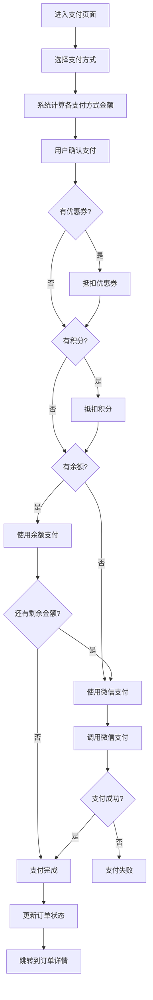

# 需求分析：混合支付功能

**文档版本**：v1.0  
**编制日期**：2026-07-07  
**适用范围**：`pet-app` 微信端、`pet-app-backend` 后端服务  
**状态**：草稿

**核心目标**：实现混合支付功能，支持用户在同一订单中使用多种支付方式（如微信支付、余额支付、优惠券等）进行支付，提升支付灵活性和用户体验。

---

## 1. 需求背景与目标

### 1.1 需求背景

随着业务发展，用户对支付方式的需求越来越多样化。单一支付方式已无法满足用户需求，需要支持多种支付方式组合使用，如：
- 微信支付 + 余额支付
- 优惠券 + 微信支付
- 优惠券 + 余额支付 + 微信支付

### 1.2 需求目标

- 支持多种支付方式组合使用
- 实现支付金额自动拆分计算
- 支持部分支付（先付一部分，后续再付）
- 记录每笔支付的详细信息

---

## 2. 功能需求分析

### 2.1 支付方式管理

| 需求编号 | 需求描述 | 优先级 | 来源 |
|----------|----------|--------|------|
| PM-01 | 支持微信支付 | P0 | pet-app |
| PM-02 | 支持余额支付 | P0 | pet-app |
| PM-03 | 支持优惠券抵扣 | P0 | pet-app |
| PM-04 | 支持积分抵扣 | P1 | pet-app |

### 2.2 混合支付流程

| 需求编号 | 需求描述 | 优先级 | 来源 |
|----------|----------|--------|------|
| HP-01 | 用户可以选择多种支付方式组合支付 | P0 | pet-app |
| HP-02 | 系统自动计算各支付方式的金额 | P0 | pet-app-backend |
| HP-03 | 支持部分支付，订单状态变为"部分支付" | P0 | pet-app-backend |
| HP-04 | 部分支付后可以继续支付剩余金额 | P0 | pet-app |
| HP-05 | 所有支付方式都完成后，订单状态变为"已支付" | P0 | pet-app-backend |

### 2.3 支付记录

| 需求编号 | 需求描述 | 优先级 | 来源 |
|----------|----------|--------|------|
| PR-01 | 记录每笔支付的详细信息（支付方式、金额、时间等） | P0 | pet-app-backend |
| PR-02 | 用户可以查看订单的支付记录 | P0 | pet-app |

---

## 3. 技术方案设计

### 3.1 数据库设计

#### 3.1.1 支付记录表 (`payment_log`)

| 字段名 | 类型 | 约束 | 说明 |
|--------|------|------|------|
| id | BIGINT | PRIMARY KEY, AUTO_INCREMENT | 主键 |
| order_id | BIGINT | NOT NULL | 订单ID |
| pay_channel | VARCHAR(32) | NOT NULL | 支付渠道（wechat/balance/coupon/points） |
| pay_amount | DECIMAL(10,2) | NOT NULL | 支付金额（元） |
| pay_time | DATETIME | NULL | 支付时间 |
| transaction_id | VARCHAR(64) | NULL | 第三方支付交易ID |
| status | VARCHAR(32) | NOT NULL, DEFAULT 'pending' | 支付状态（pending/success/failed/refunded） |
| create_time | DATETIME | NOT NULL, DEFAULT CURRENT_TIMESTAMP | 创建时间 |
| update_time | DATETIME | NOT NULL, DEFAULT CURRENT_TIMESTAMP ON UPDATE CURRENT_TIMESTAMP | 更新时间 |

**索引设计**：
- `idx_order_id` (order_id)
- `idx_transaction_id` (transaction_id)

#### 3.1.2 订单表增强

在 `orders` 表中添加以下字段：

| 字段名 | 类型 | 约束 | 说明 |
|--------|------|------|------|
| paid_amount | DECIMAL(10,2) | NOT NULL, DEFAULT 0 | 已支付金额（元） |
| pay_status | VARCHAR(32) | NOT NULL, DEFAULT 'unpaid' | 支付状态（unpaid/partial/paid） |

### 3.2 API 接口设计

#### 3.2.1 支付接口

| API路径 | HTTP方法 | 所属文件 | 功能描述 |
|---------|----------|----------|----------|
| /api/v1/payment/create | POST | pet-app-backend/routes/payment.js | 创建支付请求 |
| /api/v1/payment/wechat/callback | POST | pet-app-backend/routes/payment.js | 微信支付回调 |
| /api/v1/payment/balance | POST | pet-app-backend/routes/payment.js | 余额支付 |
| /api/v1/payment/query | GET | pet-app-backend/routes/payment.js | 查询支付状态 |

#### 3.2.2 支付记录接口

| API路径 | HTTP方法 | 所属文件 | 功能描述 |
|---------|----------|----------|----------|
| /api/v1/payment/logs | GET | pet-app-backend/routes/payment.js | 查询支付记录列表 |
| /api/v1/payment/logs/:id | GET | pet-app-backend/routes/payment.js | 查询单个支付记录 |

---

## 4. 前端实现方案

### 4.1 小程序端

#### 4.1.1 支付页面设计

**支付页面** (`pages/payment/index.vue`)

| 区域 | 功能描述 |
|------|----------|
| 订单信息 | 显示订单金额、商品信息等 |
| 支付方式选择 | 支持选择微信支付、余额支付、优惠券等 |
| 金额拆分 | 显示各支付方式的金额 |
| 支付按钮 | 点击后发起支付 |

#### 4.1.2 交互设计

| 交互场景 | 设计说明 |
|----------|----------|
| 选择支付方式 | 勾选要使用的支付方式，系统自动计算金额 |
| 修改支付金额 | 用户可以手动调整各支付方式的金额（总额不变） |
| 发起支付 | 点击支付按钮，按顺序发起各支付方式的支付 |
| 支付结果 | 显示支付结果，成功后跳转订单详情 |

---

## 5. 核心业务逻辑

### 5.1 支付金额计算

```javascript
function calculatePaymentAmount(order, paymentMethods) {
  let totalAmount = order.total_amount;
  let paidAmount = 0;
  const paymentDetails = [];

  // 先抵扣优惠券
  if (paymentMethods.coupon && order.coupon_id) {
    const couponAmount = Math.min(order.coupon_discount, totalAmount);
    paymentDetails.push({
      channel: 'coupon',
      amount: couponAmount
    });
    totalAmount -= couponAmount;
    paidAmount += couponAmount;
  }

  // 再抵扣积分（如果有）
  if (paymentMethods.points && order.points_discount > 0) {
    const pointsAmount = Math.min(order.points_discount, totalAmount);
    paymentDetails.push({
      channel: 'points',
      amount: pointsAmount
    });
    totalAmount -= pointsAmount;
    paidAmount += pointsAmount;
  }

  // 再使用余额支付
  if (paymentMethods.balance && order.user_balance > 0) {
    const balanceAmount = Math.min(order.user_balance, totalAmount);
    paymentDetails.push({
      channel: 'balance',
      amount: balanceAmount
    });
    totalAmount -= balanceAmount;
    paidAmount += balanceAmount;
  }

  // 最后使用微信支付剩余金额
  if (totalAmount > 0) {
    paymentDetails.push({
      channel: 'wechat',
      amount: totalAmount
    });
    paidAmount += totalAmount;
  }

  return {
    paymentDetails,
    totalAmount: order.total_amount,
    paidAmount
  };
}
```

### 5.2 支付完成逻辑

```javascript
async function completePayment({ outTradeNo, transactionId, payAmountYuan, payChannel }) {
  return sequelize.transaction(async (transaction) => {
    const order = await OrderMain.findOne({
      where: { out_trade_no: outTradeNo },
      lock: transaction.LOCK.UPDATE,
      transaction,
    });

    if (!order) {
      throw new Error('订单不存在');
    }

    const existingPayment = await PaymentLog.findOne({
      where: { order_id: order.id, transaction_id: transactionId },
      transaction,
    });

    if (existingPayment) {
      return { order, payment: existingPayment, duplicated: true, completed: existingPayment.status === 'success' };
    }

    const payment = await PaymentLog.create({
      order_id: order.id,
      pay_channel: payChannel,
      pay_amount: payAmountYuan,
      pay_time: new Date(),
      transaction_id: transactionId,
      status: 'success'
    }, { transaction });

    const currentPaid = Number(order.paid_amount || 0) + payAmountYuan;
    await order.update({ paid_amount: currentPaid }, { transaction });

    const payAmount = getPayAmount(order);
    
    if (currentPaid >= payAmount && order.order_status === ORDER_STATUS.pending) {
      await order.update({ 
        order_status: ORDER_STATUS.ship, 
        pay_time: new Date() 
      }, { transaction });
      
      return { order, payment, duplicated: false, completed: true };
    }

    if (currentPaid > 0 && currentPaid < payAmount) {
      await order.update({ pay_status: 'partial' }, { transaction });
    }

    return { order, payment, duplicated: false, completed: false };
  });
}
```

---

## 6. 业务流程

### 6.1 混合支付流程



---

## 7. 安全与权限

### 7.1 支付安全

| 安全措施 | 说明 |
|----------|------|
| 支付签名 | 使用微信支付签名验证 |
| 金额校验 | 支付金额必须与订单金额匹配 |
| 订单状态校验 | 只能支付待支付状态的订单 |
| 幂等性校验 | 同一交易ID只能处理一次 |

### 7.2 权限要求

| 接口 | 权限要求 |
|------|----------|
| 创建支付请求 | 登录用户，只能支付自己的订单 |
| 余额支付 | 登录用户，余额必须足够 |
| 查询支付状态 | 登录用户，只能查询自己订单的支付状态 |

---

## 8. 异常处理

| 异常场景 | 处理方式 |
|----------|----------|
| 订单不存在 | 返回404错误，提示"订单不存在" |
| 订单状态错误 | 返回400错误，提示"订单状态不允许支付" |
| 余额不足 | 返回400错误，提示"余额不足" |
| 优惠券已使用 | 返回400错误，提示"优惠券已使用" |
| 支付金额不匹配 | 返回400错误，提示"支付金额不匹配" |
| 重复支付 | 返回400错误，提示"订单已支付" |
| 服务器错误 | 返回500错误，提示"服务器内部错误" |

---

## 9. 版本迭代计划

| 版本 | 迭代内容 | 预计时间 |
|------|----------|----------|
| v1.0 | 支持微信支付 + 余额支付 + 优惠券组合 | 2026-07 |
| v1.1 | 支持积分抵扣 | 2026-08 |
| v1.2 | 支持部分支付和续支付 | 2026-09 |
| v2.0 | 添加支付失败重试机制 | 2026-10 |