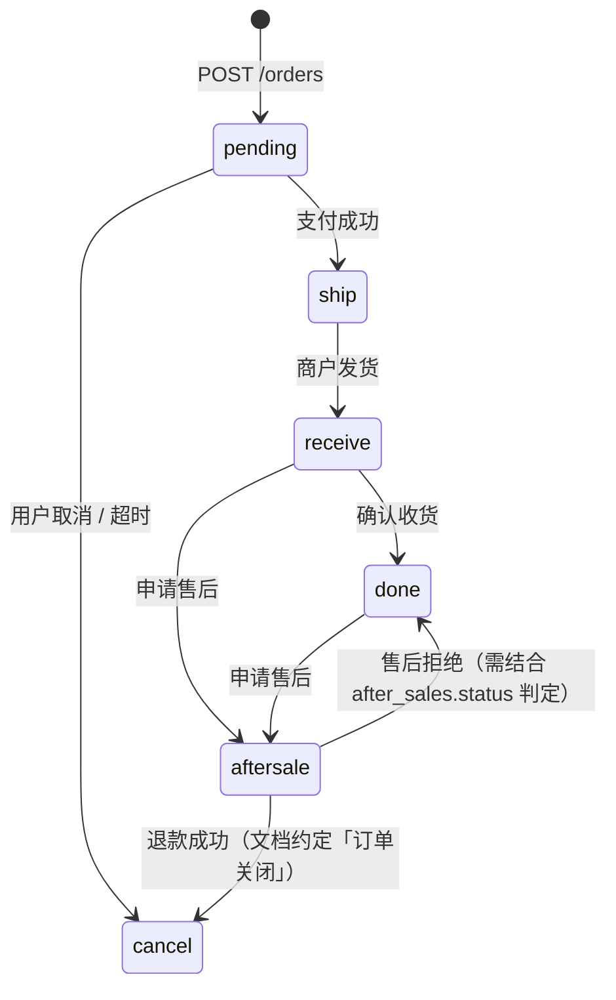

# 需求分析（临时文档）

> **文档性质**：产品 / 技术可行性评估与方案建议  
> **创建日期**：2026-06-15  
> **触发来源**：订单 Tab 状态体系、筛选项覆盖、终态订单/反馈是否支持用户删除  
> **涉及模块**：小程序 `src/constants/order.js` · `src/pages/order/order.vue` · `src/api/order.js` · `src/services/order.js` · `src/services/review.js` · `src/pages/feedback/history.vue`；后端 `order_main` · `after_sales` · `order_review` · `user_feedback`（见 [项目开发说明-后端.md](./项目开发说明-后端.md)）  
> **状态**：✅ 方案已纳入 [项目开发说明-小程序前端.md §7.6](./项目开发说明-小程序前端.md#76-交易与用户反馈--回收站与评价修改中期--已备案) · §1.5.3（2026-06-15 修订：回收站 + 评价 24h 单次修改）

---

## 1. 执行摘要

| 问题 | 结论（一句话） |
|------|----------------|
| 订单有多少种状态？ | **6 种业务态**：待支付 / 待发货 / 待收货 / 已完成 / 已关闭 / 售后中（后端数值码 10–60） |
| 订单 Tab 是否有对应筛选项？ | **5/6 有独立 Tab**；**「已关闭/已取消」无独立 Tab**，仅在「全部」中可见 |
| 已完成/已关闭订单能否删除？ | **不能**；仅有「取消待付款订单」（状态变为已关闭，非删除） |
| 已完成的反馈能否删除？ | **不能**；用户反馈与订单评价均无 DELETE 接口与 UI |

**核心判断**：当前缺口并非「漏做按钮」，而是产品未定义「用户侧删除/隐藏」能力，后端以**交易留痕**为优先，C 端列表以**全量展示 + 状态筛选**为主。若用户期望「清理列表」，建议采用**软删除（用户隐藏）**而非物理删除。

---

## 2. 订单状态全量对照

### 2.1 后端 `order_main.order_status`

依据 [项目开发说明-后端.md §4.2.4](./项目开发说明-后端.md) 与 [商户管理端-需求分析与方案.md 附录 A](./商户管理端-需求分析与方案.md)：

| 数值码 | 后端语义 | 前端别名 | 前端展示文案 | 典型进入方式 |
|--------|----------|----------|--------------|--------------|
| **10** | 待支付 | `pending` | 待付款 | 下单成功 |
| **20** | 待发货 | `ship` | 待发货 | 支付成功（含 mock 支付） |
| **30** | 待收货 | `receive` | 待收货 | 商户录入物流 / 发货 |
| **40** | 已完成 | `done` | 已完成 | 用户确认收货 |
| **50** | **已关闭** | `cancel` | **已取消** | 用户取消待付款；支付超时（42210）；售后退款成功等 |
| **60** | 售后中 | `aftersale` | 售后中 | 用户申请售后（关联 `after_sales` 表） |

> **命名差异**：后端与管理端称 **50 = 已关闭**，小程序 C 端称 **已取消**（`ORDER_STATUS_MAP.cancel.text`）。二者指同一状态，需在需求沟通中统一口径，避免「已关闭」与「已取消」被理解为两种状态。

### 2.2 状态流转（简化）



### 2.3 前端映射代码（权威来源）

```23:31:src/constants/order.js
/** 后端 order_status 数值 → 前端 status */
export const ORDER_STATUS_FROM_API = {
  10: 'pending',
  20: 'ship',
  30: 'receive',
  40: 'done',
  50: 'cancel',
  60: 'aftersale',
}
```

---

## 3. 订单 Tab 筛选项覆盖分析

### 3.1 当前筛选项

```4:11:src/constants/order.js
export const ORDER_STATUS_TABS = [
  { id: 'all', name: '全部' },
  { id: 'pending', name: '待付款' },
  { id: 'ship', name: '待发货' },
  { id: 'receive', name: '待收货' },
  { id: 'done', name: '已完成' },
  { id: 'aftersale', name: '售后中' },
]
```

| 筛选项 | 对应状态 | 是否与后端 `GET /orders?status=` 一致 | 角标计数 |
|--------|----------|--------------------------------------|----------|
| 全部 | 不过滤 | ✅ | 全部订单数 |
| 待付款 | `pending` / 10 | ✅ | ✅ 本地计数 |
| 待发货 | `ship` / 20 | ✅ | ✅ |
| 待收货 | `receive` / 30 | ✅ | ✅ |
| 已完成 | `done` / 40 | ✅ | ✅ |
| 售后中 | `aftersale` / 60 | ✅（后端查 `after_sales` 关联） | ✅ |
| **已关闭/已取消** | `cancel` / 50 | ❌ **无 Tab** | ❌ |

### 3.2 列表加载与过滤机制

订单 Tab **每次 `onShow` 拉取全量列表**（`status: 'all'`），切换 Tab 时在客户端 `computed.filteredOrders` 过滤，**不会**按 Tab 重新请求 API：

```240:244:src/pages/order/order.vue
    async loadOrders() {
      ...
        const { list } = await fetchOrders({ status: 'all' })
        this.allOrders = list
```

**影响**：

1. **已取消订单**：会出现在「全部」，但无法一键筛到；卡片上仍显示「已取消」状态色，**无操作按钮**（`buildDefaultActions` 对 `cancel` 走 `default → []`）。
2. **角标准确性**：各 Tab 角标基于当前已加载的全量列表本地统计，与后端分页无关（当前未做分页 UI）。
3. **静态 Mock 缺口**：`MOCK_ORDERS` 共 6 条示例，**不含 `cancel` 态**，联调/离线时难以感知「已取消」展示效果。

### 3.3 缺口成因（为何没有「已取消」Tab）

| 因素 | 说明 |
|------|------|
| **产品原型对齐** | `prototype/order-tab-prototype.html` 与现网一致，仅 6 个 Tab（含全部），未含已取消 |
| **主路径优先** | 待付款/待发货/待收货/已完成/售后中覆盖用户高频跟进场景；已取消属终态，访问量低 |
| **横向空间** | 6 Tab 已需横向滚动；再加 Tab 加剧拥挤（可通过「更多」或合并终态缓解） |
| **语义混用风险** | 后端叫「已关闭」，C 端叫「已取消」，产品未单独定义 Tab 文案 |

---

## 4. 订单删除能力分析

### 4.1 现状：无「删除订单」，仅有「取消待付款」

**后端已暴露的订单写接口**（[§5.7](./项目开发说明-后端.md)）：

| 方法 | 路径 | 作用 | 是否删除 |
|------|------|------|----------|
| POST | `/orders` | 创建订单 | — |
| PUT | `/orders/{id}/cancel` | 取消待付款 → **50 已关闭** | ❌ 非删除 |
| PUT | `/orders/{id}/confirm-receipt` | 确认收货 → 40 | — |
| PUT | `/orders/{id}/address` | 待付款改址 | — |

**不存在** `DELETE /orders/{id}` 或 `user_hidden` 类字段。

**前端** `src/api/order.js` 仅封装上述接口，订单列表/详情页**无「删除订单」按钮**（全目录检索无匹配）。

### 4.2 「取消」与「删除」的用户感知差异

| 操作 | 用户理解 | 系统实际行为 |
|------|----------|--------------|
| 取消订单 | 不要这笔未付款交易 | `order_status: 10 → 50`，回滚库存，写 `order_cancelled` 消息 |
| 删除订单 | 从列表消失，不再看到 | **未实现**；记录仍在 DB，仍在「全部」列表 |

用户若将「取消成功」理解为「订单已删除」，会在「全部」中再次看到该单，产生**预期落差**。

### 4.3 为何行业上很少对 C 端做物理删除

| 约束 | 说明 |
|------|------|
| **财务与对账** | `payment_log`、退款、发票、商户结算依赖订单主从表 |
| **售后与纠纷** | 已完成订单在售后窗口内仍可关联；删除主单破坏链路 |
| **监管与审计** | 电商交易记录通常需保留一定期限 |
| **数据统计** | 管理端仪表盘 `today_order_count` 等已约定「排除待支付/已关闭」规则，物理删除会干扰统计口径 |
| **客服上下文** | 在线客服 `OrderPicker`、反馈关联 `order_id` 需可查历史单 |

因此主流做法（淘宝、京东、拼多多等）是 **「删除 = 用户侧隐藏」**，后台与商户端仍可查。

---

## 5. 「反馈」与「评价」删除能力分析

需区分两个不同模块，避免需求歧义：

### 5.1 用户反馈（`pages/feedback/*` · `user_feedback` 表）

**能力**：提交 `POST /feedback`、列表 `GET /feedback`、详情 `GET /feedback/{id}`。

**处理状态**（`constants/feedback.js`）：

| status | 展示 |
|--------|------|
| `pending` | 待处理 |
| `processing` | 处理中 |
| `resolved` | 已处理 |
| `closed` | 已关闭 |

**删除能力**：❌ 无 `DELETE /feedback/{id}`；`history.vue` 仅展示列表 + 点击弹窗查看，**无删除入口**。

**成因**：

- 反馈是**工单型**数据，Admin 需留痕回复（§5.26 管理端处理 `admin_reply`）。
- 用户删除后，运营无法追溯同一问题的处理历史。
- 当前 MVP 聚焦「提交 + 查看进度」，未规划用户侧清理。

### 5.2 订单评价（`pages/order/review` · `order_review` 表）

**能力**：`POST /orders/{id}/reviews`（提交）、草稿 `GET/PUT …/review-draft`。

**规则**：仅 `order_status=40` 可评；**一单一次**（42214 已评价不可重复）。

**删除能力**：❌ 无 `DELETE …/reviews`；评价提交后不可撤回/删除。

**成因**：

- 评价影响商品口碑、商户运营与潜在展示（未来商详评价墙）。
- 允许随意删除易导致「差评后删评」操纵评分。
- 匿名评价（`anonymous: true`）删除后更难审计。

### 5.3 用户问「已完成的反馈」时如何理解

| 用户表述 | 更可能指 | 当前能否删除 |
|----------|----------|--------------|
| 设置页「我的反馈」里已处理的记录 | `user_feedback` · `resolved`/`closed` | ❌ |
| 订单完成后写的「评价」 | `order_review` | ❌ |

建议在需求评审时**先澄清对象**，再定方案。

---

## 6. 用户诉求的可行性评估

### 6.1 订单 Tab 增加「已取消/已关闭」筛选项

| 维度 | 评估 |
|------|------|
| **技术难度** | 🟢 低：前端 Tab +1，`fetchOrders({ status: 'cancel' })` 或继续全量拉取后过滤 |
| **后端改动** | 🟢 无或极小：`GET /orders?status=cancel` 已在 §5.7 约定 |
| **产品价值** | 🟡 中：帮助用户定位取消/超时单，减少「全部」列表噪音 |
| **风险** | Tab 过多；需统一文案「已取消」vs「已关闭」 |

**结论**：✅ **可行，建议 P2 小改**。

### 6.2 用户删除（隐藏）已完成 / 已关闭订单

| 维度 | 评估 |
|------|------|
| **物理 DELETE** | 🔴 **不建议**：破坏交易链路与合规 |
| **软删除（用户隐藏）** | 🟢 **推荐**：`order_main.user_hidden_at` 或 `user_order_visibility` 关联表 |
| **后端工作量** | 🟡 中：迁移 + `DELETE` 或 `PUT …/hide` + 列表默认 `WHERE user_hidden IS NULL` |
| **前端工作量** | 🟡 中：列表左滑/详情「删除订单」+ 二次确认文案 |
| **门禁建议** | 仅允许 `done(40)`、`cancel(50)`；**禁止** `pending/ship/receive/aftersale` |

**结论**：✅ **可行（软隐藏）**；❌ **物理删除不可行**。

### 6.3 用户删除已处理的用户反馈

| 维度 | 评估 |
|------|------|
| **物理 DELETE** | 🟡 可行但损失运营追溯 |
| **软删除** | 🟢 推荐：`user_feedback.user_deleted_at`，Admin 仍可见 |
| **门禁** | 建议仅 `resolved` / `closed` 可删；`pending` / `processing` 不可（避免工单丢失） |

**结论**：✅ **可行（软删除）**，优先级低于订单隐藏。

### 6.4 用户删除已提交订单评价

| 维度 | 评估 |
|------|------|
| **完全删除** | 🔴 不推荐（评分操纵、商详数据一致性） |
| **限时修改/删除** | 🟡 可选：提交后 24h 内可改，超时只读 |
| **匿名评价删除** | 🟡 更敏感，需更强风控 |

**结论**：⚠️ **需产品定规**；默认建议**不支持删除**，或仅支持**未公开展示前的草稿删除**（已有草稿 API）。

---

## 7. 专业建议与推荐方案

### 7.1 短期（不改后端，1–2 人日）

| 编号 | 动作 | 说明 |
|------|------|------|
| **FE-O1** | 订单 Tab 增加「已取消」筛选项 | `ORDER_STATUS_TABS` 追加 `{ id: 'cancel', name: '已取消' }`；Mock 补 1 条 cancel 样例 |
| **FE-O2** | 已取消订单空态与文案 | 与「已完成」区分 emptyHint |
| **FE-O3** | 取消成功 Toast 文案优化 | 由「订单已取消」补充「可在「全部」中查看」或引导新 Tab |
| **DOC-O1** | 统一术语表 | 对内：50=已关闭；对 C 端：已取消；文档/接口注释对齐 |

### 7.2 中期（已备案 · 见开发说明 §7.6）

> **2026-06-15 评审修订**：在「软删除」基础上增加 **订单回收站** 与 **反馈回收站**；用户不可彻底删除；评价改为 **提交后 24h 内可修改一次**。

**权威任务清单与接口约定** → [项目开发说明-小程序前端.md §7.6](./项目开发说明-小程序前端.md#76-交易与用户反馈--回收站与评价修改中期--已备案)

| 能力 | 要点 |
|------|------|
| 订单回收站 | `user_recycled_at` 软标记；`PUT …/recycle` · `restore`；`GET /orders?recycled=1` |
| 反馈回收站 | 同上模式；仅 `resolved`/`closed` 可移入 |
| 评价修改 | `PUT …/reviews`；24h 窗口 · `edit_count` 最多 1 次 |
| 禁止项 | 全站无「彻底删除」；后端/DB 不物理删主数据 |

### 7.3 长期（归档与性能）

| 项 | 建议 |
|----|------|
| 订单保留策略 | 后台 cron：超 N 年归档冷存储，而非 C 端物理删 |
| 列表性能 | 订单量增大后，Tab 切换改为服务端分页 + `status` 参数，避免全量拉取 |

### 7.4 不建议的做法

1. ❌ C 端或后端 **物理 DELETE** `order_main` / `user_feedback` / `order_review`  
2. ❌ 回收站提供「彻底删除」入口  
3. ❌ 隐藏/回收进行中订单（待发货/售后中），导致用户找不到维权入口  
4. ❌ 允许回收 `pending`/`processing` 反馈，导致 Admin 工单悬空  
5. ❌ 评价允许删除或 24h 外多次修改  

---

## 8. 任务拆分（供排期参考 · 已迁移至开发说明 §7.6）

> 完整可勾选清单见 [项目开发说明-小程序前端.md §7.6.4](./项目开发说明-小程序前端.md#764-任务清单可勾选)。

| ID 前缀 | 域 | 概要 |
|---------|-----|------|
| BE-O-RB* | 订单回收站 | `user_recycled_at` · recycle/restore API |
| BE-F-RB* | 反馈回收站 | 同上 |
| BE-R-ED* | 评价修改 | `editable_until` · `edit_count` · `PUT …/reviews` |
| MP-O-RB* | 小程序订单 | 删除/恢复 · `pages/order/recycle` |
| MP-F-RB* | 小程序反馈 | 删除/恢复 · `pages/feedback/recycle` |
| MP-R-ED* | 小程序评价 | 24h 内修改模式 · 错误码 UX |

---

## 9. 附录：相关代码与文档索引

| 类型 | 路径 |
|------|------|
| 状态枚举 | `src/constants/order.js` |
| 订单 Tab 页 | `src/pages/order/order.vue` |
| 订单 API | `src/api/order.js` |
| 列表服务 | `src/services/order.js` · `buildDefaultActions` |
| 评价服务 | `src/services/review.js` |
| 反馈历史 | `src/pages/feedback/history.vue` |
| 后端订单 §5.7 | [项目开发说明-后端.md](./项目开发说明-后端.md) |
| 后端评价 §5.7a | 同上 |
| 后端反馈 §5.10a | 同上 |
| 测试清单 O-03 | [小程序前端-微信开发工具测试任务清单.md](./小程序前端-微信开发工具测试任务清单.md) |

---

## 10. 结论

1. **订单共 6 种状态**（10/20/30/40/50/60），前后端映射一致；C 端将 50 展示为「已取消」，后端称「已关闭」。  
2. **订单 Tab 有 6 个筛选项（含全部）**，覆盖 5 种进行中/终态业务态，**缺少「已取消/已关闭」独立 Tab**；已取消单仅在「全部」可见且无操作按钮。  
3. **当前不支持**用户删除已完成/已关闭订单或已处理反馈；**已备案方案**（§7.6）为软删除 + 双回收站，不可彻底删除。  
4. **评价**：已备案 **24h 内单次修改**；不支持删除。  
5. **实施入口**：[项目开发说明-小程序前端.md §7.6](./项目开发说明-小程序前端.md#76-交易与用户反馈--回收站与评价修改中期--已备案)

---

*本文档为临时需求分析；方案已纳入小程序开发说明 §7.6。实施前请产品确认：①「已取消」与「已关闭」对外文案；② 回收站入口位置（订单 Tab / 设置页统一入口）。*